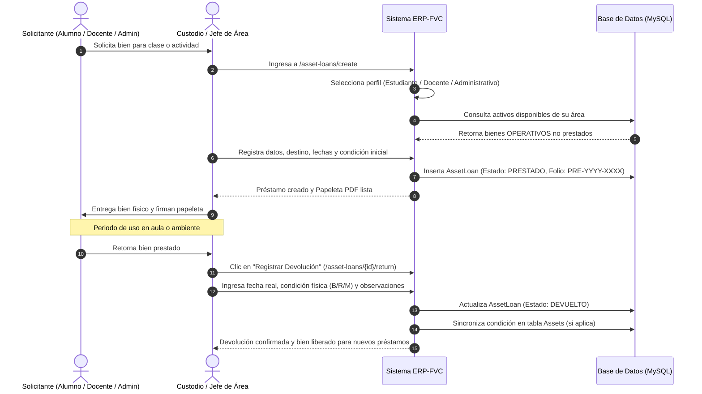
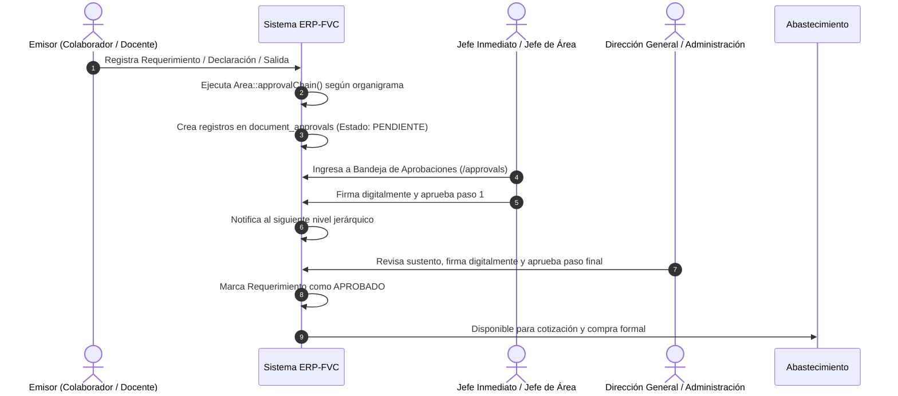

# DOCUMENTO DE DEFINICIÓN Y REQUISITOS DE PRODUCTO (PDR)
## ERP-FVC: Sistema Integral de Gestión Empresarial, Facturación Electrónica, Patrimonio y Trámites Institucionales

---

### Control del Documento
- **Proyecto:** ERP-FVC
- **Versión del Sistema:** 2.5 (Producción / Enterprise)
- **Fecha de Emisión:** 23 de Septiembre de 2026
- **Tecnología Base:** Laravel 10.x / PHP 8.3 / MySQL / Bootstrap 5 (SB Admin Pro) / DomPDF / Facturación SUNAT

---

## 1. INTRODUCCIÓN Y VISIÓN DEL PRODUCTO

### 1.1 Propósito
El presente documento describe de forma exhaustiva los requerimientos funcionales, arquitectura técnica, especificaciones de procesos de negocio, modelo de datos y estándares operativos del sistema **ERP-FVC**.

### 1.2 Visión General
**ERP-FVC** es una solución informática integral desarrollada para centralizar la gestión de tres grandes frentes operativos:
1. **Frente Comercial y Facturación Electrónica SUNAT:** Control de ventas por mostrador (POS), facturación electrónica con estándares UBL 2.1 (Boletas, Facturas, Notas de Crédito, Notas de Débito), Guías de Remisión Electrónicas (GRE Remitente), cotizaciones, notas de venta, compras a proveedores fiscales, gestión multi-almacén y control de stock valorizado.
2. **Frente de Trámites Internos y Aprobaciones Jerárquicas:** Gestión digitalizada de requerimientos de bienes y servicios, declaraciones juradas de gastos, papeletas de salida de personal, salidas de vehículos, solicitudes de vacaciones y control de combustible, con firma digital y flujos de aprobación basados en el organigrama institucional.
3. **Frente de Control Patrimonial y Activos Fijos:** Inventario técnico y físico de bienes patrimoniales conforme al catálogo oficial de bienes muebles (SBN), rotulado vectorial mediante códigos QR, actas de verificación anual auditadas con firma digital, y el subsistema de **Préstamos de Bienes** para estudiantes, docentes y personal administrativo.

---

## 2. ARQUITECTURA TÉCNICA Y STACK TECNOLÓGICO

```
+-------------------------------------------------------------------------+
|                        CAPA DE PRESENTACIÓN (CLIENTE)                   |
|  Blade Engine + Bootstrap 5 (SB Admin Pro) + Yajra DataTables           |
|  Responsive Design (Mobile, Tablet, Desktop)                            |
+-------------------------------------------------------------------------+
                                    |
                                    v (HTTP / HTTPS / REST)
+-------------------------------------------------------------------------+
|                        CAPA DE CONTROL Y RUTEO                          |
|  Laravel 10 HTTP Kernel + Middleware (Auth, Spatie RBAC, AssetAccess)  |
|  Form Requests Validation (AssetLoanValidate, AssetValidate, etc.)      |
+-------------------------------------------------------------------------+
                                    |
                                    v
+-------------------------------------------------------------------------+
|                     CAPA DE LÓGICA DE NEGOCIO Y SERVICIOS               |
|  - Controladores MVC (AssetLoanController, BillingController, etc.)     |
|  - Cadena de Aprobación Jerárquica (Area::approvalChain)                |
|  - DomPDF Service (Papeletas de Préstamo, Actas, Requerimientos)        |
|  - Excel Import/Export Engine (Maatwebsite / PhpSpreadsheet)            |
|  - Simple QrCode Generator (SVG vectorizado para rotulado patrimonial)   |
|  - SUNAT Electronic Invoicing (UBL 2.1, XML Signing, GRE API)           |
+-------------------------------------------------------------------------+
                                    |
                                    v
+-------------------------------------------------------------------------+
|                     CAPA DE PERSISTENCIA Y MODELOS                      |
|  Eloquent ORM + SoftDeletes + Casts + Scopes                            |
|  MySQL 8.0+ (InnoDB, Foreign Keys, UUIDs, Índices Compuestos)          |
+-------------------------------------------------------------------------+
```

### 2.1 Especificación Tecnológica
- **Lenguaje:** PHP 8.1+ (Entorno objetivo PHP 8.3.6 NTS).
- **Framework Web:** Laravel Framework 10.50.2.
- **Motor de Base de Datos:** MySQL 8.0 / MariaDB 10.6+ con soporte transaccional InnoDB.
- **Frontend & Maquetación:** Blade Templates, Bootstrap 5.2+, SB Admin Pro Architecture, Vanilla CSS optimizado, sin degradados ni decoraciones innecesarias.
- **Librerías Clave:**
  - `spatie/laravel-permission`: Control de acceso basado en roles y permisos granulares.
  - `yajra/laravel-datatables-oracle`: Motor server-side para listados con ordenamiento y filtros en tiempo real.
  - `barryvdh/laravel-dompdf`: Renderizado de documentos oficiales, comprobantes y formatos de inventario en PDF.
  - `maatwebsite/excel`: Exportación e importación masiva de activos y stock.
  - `simplesoftwareio/simple-qrcode`: Generación de códigos QR vectoriales para verificación móvil.
  - `luecano/numero-a-letras`: Conversión de montos financieros a texto para comprobantes legales.

---

## 3. GESTIÓN DE SEGURIDAD Y MATRIZ DE ROLES (RBAC)

El sistema implementa seguridad basada en roles (Role-Based Access Control) mediante Spatie Permission y middleware personalizado a nivel de ruta y departamento.

### 3.1 Roles Predefinidos del Sistema
1. **SUPERADMIN:** Acceso irrestricto a todas las configuraciones, auditorías, bases de datos y módulos.
2. **ADMIN:** Administración general de operaciones de la institución/empresa.
3. **PATRIMONIO:** Gestión técnica del inventario de bienes muebles, rotulación QR, actas de verificación y supervisión global de préstamos.
4. **ABASTECIMIENTO:** Gestión de compras, proveedores, órdenes de ingreso y tramitación de requerimientos aprobados.
5. **DIRECTOR_GENERAL:** Máxima autoridad institucional; supervisión integral, reportes ejecutivos y última firma de actas de inventario y requerimientos de alta prioridad.
6. **ADMINISTRACION:** Jefatura administrativa y financiera; revisión de caja, presupuestos y aprobaciones intermedias.
7. **JEFE_AREA:** Responsable directo de un departamento/área; administra activos asignados, autoriza requerimientos y préstamos de bienes de su custodia.
8. **COORDINADOR / COORD_PE:** Coordinadores de programas de estudios o áreas operativas.
9. **JEFE_INMEDIATO:** Nivel de supervisión primaria en la cadena de aprobaciones de personal.
10. **TRAMITE_DOCUMENTARIO:** Recepción, derivación y seguimiento documental.
11. **UNIDAD_ACADEMICA:** Supervisión de actividades formativas, docentes y aulas.
12. **DOCENTE:** Personal docente; solicitante de bienes patrimoniales para clases y generador de requerimientos de aula.
13. **CHOFER:** Asignado a salidas vehiculares y receptor de vales de combustible.
14. **VENDEDOR:** Atención en punto de venta (POS), emisión de cotizaciones y notas de venta.
15. **CAJERO:** Operador de caja física, cobro de comprobantes y registro de ingresos/egresos en efectivo.
16. **CONTABILIDAD:** Consulta y descarga de registros de compras, ventas y reportes tributarios SUNAT.

### 3.2 Middleware de Autorización por Departamento (`CheckAssetAccess`)
Para garantizar la integridad y privacidad departamental, los usuarios no supervisores solo pueden gestionar bienes y préstamos de las áreas a las que están asignados (donde figuran como jefe en `areas.head_user_id` o como miembros en `employee_area_details`). El middleware detecta si la ruta opera sobre inventarios (`inventory/*`) o préstamos (`asset-loans/*`) y resuelve la pertenencia del recurso antes de otorgar acceso.

---

## 4. ESPECIFICACIÓN DETALLADA DE MÓDULOS DEL SISTEMA

---

### MÓDULO 1: BIENES PATRIMONIALES Y ACTIVOS FIJOS

#### 1.1 Inventario de Bienes Patrimoniales
- **Rutas:** `/inventory`, `/inventory/create`, `/inventory/{id}/edit`, `/inventory/{id}`, `/inventory/pdf`
- **Controlador:** `AssetController`
- **Modelo:** `Asset` (Tabla: `assets`)
- **Proceso:**
  1. Registro de activos asignados a un área física con código institucional correlativo (`orden`).
  2. Clasificación técnica: Código de catálogo SBN (`codigo_producto`), código interno (`codigo`), descripción detallada, marca, modelo, número de serie.
  3. Datos financieros: Costo de adquisición, tipo de adquisición (`C: Compra`, `D: Donación`), fecha y año de adquisición.
  4. Estado y conservación: Condición física (`B: Bueno`, `R: Regular`, `M: Malo`, `BAJA: De Baja`), estado operativo (`OPERATIVO`, `EN_REPARACION`, `INOPERATIVO`, `DE_BAJA`).
  5. Auditoría física (Reconciliación): Marcado rápido del activo como auditado físicamente en campo (`is_reconciled`, `reconciled_at`, `reconciled_by`).
  6. Importación y Exportación: Carga masiva mediante plantilla oficial en Excel (.xlsx) y generación de formato oficial institucional en PDF apaisado A4.

#### 1.2 Rótulos y Verificación Pública QR
- **Rutas:** `/inventory/qr-labels`, `/inventory/qr-svg/{uuid}`, `/inventory/verify/{uuid}`
- **Proceso:**
  1. Cada activo posee un identificador universal único (`uuid`).
  2. Generación de código QR en formato vectorial SVG con URL pública de verificación (`/inventory/verify/{uuid}`).
  3. Hoja de rótulos lista para impresión térmica o en papel adhesivo conteniendo código QR, código patrimonial, descripción y departamento.
  4. Al escanear el QR con un teléfono móvil, el sistema muestra la ficha pública de validación de autenticidad del activo sin requerir inicio de sesión.

#### 1.3 Actas Departamentales de Inventario Anual
- **Rutas:** `/asset-inventories/store`, `/asset-inventories/{id}`
- **Controlador:** `AssetInventoryController`
- **Modelo:** `AssetInventory`, `DocumentApproval`
- **Proceso:**
  1. Apertura de acta de inventario anual para un departamento y periodo fiscal.
  2. Congelamiento del estado de los bienes del área al momento de la apertura.
  3. Circuito de firmas digitales: Firma del Responsable del Área, firma de la Unidad de Patrimonio, y firma de conformidad de la Dirección General.

#### 1.4 Préstamos de Bienes Patrimoniales (Loans)
- **Rutas:**
  - `GET /asset-loans`: Panel general de préstamos con tarjetas KPI, filtros y DataTables.
  - `GET /asset-loans/get`: Endpoint JSON server-side para listado con paginación y búsqueda.
  - `GET /asset-loans/create`: Formulario de emisión de nuevo préstamo.
  - `GET /asset-loans/assets-by-area`: Endpoint AJAX para cargar bienes disponibles por área seleccionada.
  - `POST /asset-loans/store`: Almacena el préstamo y bloquea el bien para evitar doble asignación.
  - `GET /asset-loans/quick-detail/{id}`: Modal de vista rápida en JSON con datos del bien, solicitante y plazos.
  - `GET /asset-loans/{id}/edit`: Formulario de edición integral y retorno.
  - `PUT /asset-loans/{id}`: Actualiza registro y procesa retorno si aplica.
  - `POST /asset-loans/{id}/return`: Endpoint AJAX de devolución rápida desde la tabla.
  - `POST /asset-loans/delete`: Eliminación lógica (SoftDelete) del registro.
  - `GET /asset-loans/{id}/pdf`: Emisión de la Papeleta Oficial de Préstamo en PDF.
- **Controlador:** `AssetLoanController`
- **Modelo:** `AssetLoan` (Tabla: `asset_loans`)
- **Perfiles de Solicitante:**
  1. **Estudiante / Alumno (`STUDENT`):** Registra nombre completo, DNI/CE, código de estudiante/matrícula, programa de estudios/carrera, teléfono y correo electrónico.
  2. **Docente / Profesor (`FACULTY`):** Permite seleccionar opcionalmente de los usuarios registrados del sistema o registrar manualmente código docente, departamento académico, teléfono y correo.
  3. **Personal Administrativo (`ADMINISTRATIVE`):** Permite vincular a un usuario interno o registrar código de personal, oficina/unidad administrativa, teléfono y correo.
- **Control de Disponibilidad:**
  - Solo se pueden prestar bienes en estado `OPERATIVO` que no tengan un préstamo activo en estado `PRESTADO`.
  - El modelo `Asset` cuenta con los atributos y relaciones `loans()`, `activeLoan()` y `is_on_loan`.
- **Estados del Préstamo:**
  - `PRESTADO`: Préstamo en curso dentro del plazo establecido.
  - `VENCIDO`: Calculado automáticamente cuando `status == 'PRESTADO'` y `expected_return_date < now()`.
  - `DEVUELTO`: Bien retornado conforme.
  - `DEVUELTO_OBSERVADO`: Bien retornado con observaciones de desgaste o avería.
  - `EXTRAVIADO`: Bien no devuelto / reportado como dañado o perdido.
- **Flujo de Devolución:**
  - Se registra la fecha y hora real de devolución, condición física recibida (`B`, `R`, `M`, `BAJA`), observaciones de retorno y usuario que recepciona.
  - Opción de sincronización automática para actualizar la condición física del activo en el inventario general si sufrió desgaste o avería durante el uso.
- **Papeleta de Préstamo (PDF):**
  - Documento formal A4 vertical con membrete institucional, datos del solicitante, especificaciones técnicas del activo, plazos de uso, cláusula de compromiso y tres casillas de firma:
    1. Firma y DNI del Solicitante / Prestatario.
    2. Firma del Responsable que Entrega (Custodio).
    3. Firma de Conformidad de Recepción al Retorno.

---

### MÓDULO 2: TRÁMITES INTERNOS Y CADENA DE APROBACIONES

#### 2.1 Cadena de Aprobación Jerárquica (`Area::approvalChain`)
El sistema no utiliza listas fijas de aprobadores; en su lugar, asciende por la estructura arbórea de la tabla `areas` (`parent_id`) desde el área del solicitante hasta llegar a la Dirección General.
- Omite áreas marcadas como asesoras (`is_advisory = true`).
- Evita la auto-aprobación si el solicitante es el jefe de una de las áreas intermedias.
- Asigna los pasos de aprobación dinámicamente en la tabla `document_approvals`.

#### 2.2 Requerimientos de Bienes y Servicios
- **Rutas:** `/requisitions/*`
- **Controlador:** `RequisitionController`
- **Modelo:** `Requisition`, `RequisitionItem`
- **Proceso:** Solicitud interna de compras o materiales; especifica justificación, tipo de requerimiento, lista de ítems detallados, cantidades y unidad de medida. Al enviarse, genera la cadena de firmas que avanza conforme cada jefe firma digitalmente.

#### 2.3 Declaraciones Juradas de Gastos
- **Rutas:** `/expense-declarations/*`
- **Controlador:** `ExpenseDeclarationController`
- **Modelo:** `ExpenseDeclaration`, `ExpenseDeclarationItem`
- **Proceso:** Rendición de gastos de movilidad, viáticos y gastos menores sin comprobante fiscal; detalle de fechas, motivos, importes y firma bajo fe de juramento.

#### 2.4 Papeletas de Salida de Personal
- **Rutas:** `/exit-slips/*`
- **Controlador:** `ExitSlipController`
- **Modelo:** `ExitSlip`
- **Proceso:** Autorización de salida temporal durante la jornada laboral por motivos de salud, comisión de servicio o asuntos personales. Registra hora estimada de salida y retorno, y retorno efectivo.

#### 2.5 Papeletas de Salida de Vehículos
- **Rutas:** `/vehicle-exit-slips/*`
- **Controlador:** `VehicleExitSlipController`
- **Modelo:** `VehicleExitSlip`
- **Proceso:** Control de unidades móviles oficiales; conductor asignado, motivo, destino/ruta, kilometraje de salida, kilometraje de llegada y estado del vehículo.

#### 2.6 Papeletas de Vacaciones
- **Rutas:** `/vacation-exit-slips/*`
- **Controlador:** `VacationExitSlipController`
- **Modelo:** `VacationExitSlip`
- **Proceso:** Programación y goce del periodo vacacional anual del personal conforme a la normativa laboral.

#### 2.7 Vales de Control de Combustible
- **Rutas:** `/fuel-control-slips/*`
- **Controlador:** `FuelControlSlipController`
- **Modelo:** `FuelControlSlip`, `FuelControlSlipItem`
- **Proceso:** Despacho y asignación controlada de combustible (Gasolina, Diésel) a unidades móviles o grupos electrógenos.

#### 2.8 Bandeja Centralizada de Aprobaciones
- **Rutas:** `/approvals/*`
- **Controlador:** `DocumentApprovalController`
- **Proceso:** Vista unificada donde directores y jefes visualizan todos los documentos pendientes de su firma. Permite Aprobar (con firma digital), Observar (devolviendo al emisor para corrección) o Rechazar el trámite.

---

### MÓDULO 3: VENTAS Y FACTURACIÓN ELECTRÓNICA (SUNAT)

#### 3.1 Clientes
- **Rutas:** `/clients/*`
- **Controlador:** `ClientController`
- **Modelo:** `Client`
- **Funcionalidad:**
  - Registro con tipos de documento SUNAT: DNI (1), RUC (6), Carné de Extranjería (4), Pasaporte (7).
  - Consulta automática vía API a RENIEC (para DNI) y SUNAT (para RUC) para autocompletar razón social, nombre y dirección fiscal.
  - Gestión de Ubigeo a 6 dígitos (Departamento, Provincia, Distrito).

#### 3.2 Punto de Venta (POS)
- **Rutas:** `/pos/*`
- **Controlador:** `PosController`
- **Funcionalidad:**
  - Interfaz ágil optimizada para mostrador con soporte de lector de código de barras.
  - Selección de cliente rápido (por defecto Cliente Varios / DNI).
  - Búsqueda en vivo de productos con stock disponible en el almacén del usuario.
  - Descuentos por ítem o globales.
  - Cobro mediante múltiples formas de pago (Efectivo, Yape, Plin, Tarjeta, Transferencia).
  - Emisión directa de Boleta Electrónica, Factura Electrónica o Nota de Venta.

#### 3.3 Cotizaciones
- **Rutas:** `/quotes/*`
- **Controlador:** `QuoteController`
- **Modelo:** `Quote`, `DetailQuote`
- **Funcionalidad:** Emisión de propuestas comerciales para clientes, cálculo de IGV, validez de oferta y conversión en un clic a Nota de Venta o Venta Facturada.

#### 3.4 Notas de Venta
- **Rutas:** `/sale-notes/*`
- **Controlador:** `SaleNoteController`
- **Modelo:** `SaleNote`, `DetailSaleNote`, `DetailPayment`
- **Funcionalidad:**
  - Comprobantes internos de venta no tributarios.
  - Soporte de ventas al crédito con cronograma de pagos.
  - Registro de amortizaciones y abonos sucesivos en `DetailPayment`.
  - Impresión en formato Ticket (80mm) y A4.

#### 3.5 Comprobantes de Pago Electrónicos (Billings)
- **Rutas:** `/billings/*`
- **Controlador:** `BillingController`
- **Modelo:** `Billing`, `DetailBilling`
- **Especificaciones SUNAT:**
  - Tipos de Comprobante: Factura (`01`), Boleta (`03`), Nota de Crédito (`07`), Nota de Débito (`08`).
  - Catálogos SUNAT integrados:
    - Tipos de Afectación al IGV: Gravado Operación Onerosa (10), Exonerado (20), Inafecto (30), Exportación (40), Gratuitas.
    - Monedas: Soles (`PEN`), Dólares Americanos (`USD`).
    - Catálogo de motivos de Notas de Crédito y Débito.
  - Trazabilidad y Seguridad:
    - Generación de archivo XML bajo estándar UBL 2.1.
    - Firma digital con certificado PFX o PEM.
    - Envío automático o por lote a los servidores de SUNAT.
    - Recepción de CDR (Constancia de Recepción) y código Hash de respuesta.
    - Generación de código QR tributario impreso en el PDF del comprobante.

#### 3.6 Guías de Remisión Electrónica Remitente (GRE)
- **Rutas:** `/shipment-guides/*`
- **Controlador:** `ShipmentGuideController`
- **Modelo:** `ShipmentGuide`, `ShipmentGuideItem`
- **Especificaciones:**
  - Emisión de GRE Remitente conforme a la normativa vigente.
  - Modalidades de traslado: Transporte Privado (`01`) y Transporte Público (`02`).
  - Motivos de traslado: Venta, Compra, Traslado entre establecimientos de la misma empresa, Traslado de bienes para transformación, Demostración, etc.
  - Registro de datos de la unidad: Placa principal, placa secundaria/carreta, tarjeta de circulación.
  - Registro de conductores: Tipo y número de documento, nombres, licencia de conducir.
  - Registro de transportista (en modalidad pública): RUC, razón social, número de registro MTC.
  - Comunicación con la API REST de SUNAT usando credenciales Client ID y Client Secret.

---

### MÓDULO 4: COMPRAS Y PROVEEDORES

#### 4.1 Proveedores Fiscales
- **Rutas:** `/providers/*`
- **Controlador:** `ProviderController`
- **Modelo:** `Provider` / `Client` (con rol de proveedor)
- **Funcionalidad:** Gestión de personas naturales y jurídicas con RUC/DNI activo para emisión de compras y trazabilidad de costos.

#### 4.2 Registro de Compras (Buys)
- **Rutas:** `/buys/*`
- **Controlador:** `BuyController`
- **Modelo:** `Buy`, `DetailBuy`
- **Funcionalidad:**
  - Registro de facturas y boletas de compra emitidas por proveedores.
  - Asignación de almacén de destino.
  - Incremento automático de stock por almacén para productos físicos.
  - Actualización de costos de compra (costo último / costo promedio).
  - Estado de pago: Contado o Crédito con cuentas por pagar a proveedores.

---

### MÓDULO 5: INVENTARIO, ALMACENES Y KARDEX

#### 5.1 Catálogo de Productos y Servicios
- **Rutas:** `/products/*`
- **Controlador:** `ProductController`
- **Modelo:** `Product`
- **Campos:** Código interno, código de barras EAN/UPC, código SUNAT, descripción, categoría, unidad de medida, precio de compra, precio de venta, precio mínimo, tipo de afectación al IGV, stock mínimo de alerta, indicador de producto físico o servicio.

#### 5.2 Almacenes y Stock Multi-Almacén
- **Rutas:** `/warehouses/*`
- **Controlador:** `WarehouseController`
- **Modelo:** `Warehouse`, `StockProduct`, `UserWarehouse`
- **Funcionalidad:**
  - Soporte de múltiples sucursales o depósitos físicos.
  - Tabla `stock_products`: Controla la cantidad real y stock de reserva de cada producto por almacén individual.
  - Asignación de almacenes permitidos por usuario.

#### 5.3 Órdenes de Traslado entre Almacenes
- **Rutas:** `/transferorders/*`
- **Controlador:** `TransferOrderController`
- **Modelo:** `TransferOrder`, `DetailTransferOrder`
- **Funcionalidad:** Movimiento formal de existencias desde un almacén origen a un almacén destino, rebajando el inventario de salida e incrementando el de llegada tras la confirmación de recepción.

#### 5.4 Kardex Físico y Valorizado
- **Rutas:** `/kardex/*`
- **Controlador:** `KardexController`
- **Funcionalidad:** Trazabilidad cronológica de entradas (compras, traslados recibidos, ajustes positivos) y salidas (ventas en mostrador, facturación, notas de venta, traslados emitidos, mermas), calculando saldo físico acumulado y saldo valorizado.

---

### MÓDULO 6: CAJAS Y TESORERÍA

#### 6.1 Administración de Cajas Físicas
- **Rutas:** `/cashes/*`
- **Controlador:** `CashController`
- **Modelo:** `Cash`
- **Funcionalidad:** Definición de cajas registradoras de ventas y cajas chicas por sucursal.

#### 6.2 Arqueos y Cuadres de Caja (Arching Cash)
- **Rutas:** `/archingcashes/*`
- **Controlador:** `ArchingCashController`
- **Modelo:** `ArchingCash`
- **Funcionalidad:**
  - Apertura de turno con monto inicial en efectivo.
  - Registro de movimientos manuales de ingresos (ingresos extraordinarios) y egresos (gastos de caja chica).
  - Consolidación automática de ventas realizadas durante el turno desglosadas por medio de pago.
  - Cuadre final con cálculo de dinero esperado, dinero contado físicamente, y detección de sobrantes o faltantes.
  - Cierre formal del turno con impresión de reporte de arqueo.

---

### MÓDULO 7: REPORTES Y ANALÍTICA TRIBUTARIA

#### 7.1 Reportes Comerciales
- **Rutas:** `/report-sales/*`, `/report-payments/*`
- **Controlador:** `ReportSalesController`, `ReportPaymentController`
- **Funcionalidad:**
  - Ventas generales filtradas por rango de fecha, almacén, usuario y cliente.
  - Ventas detalladas por producto con márgenes y cantidades colocadas.
  - Reporte de amortizaciones y cobranzas de créditos comerciales.

#### 7.2 Reportes Contables y Fiscales
- **Rutas:** `/billing-reports/*`
- **Controlador:** `BillingReportController`
- **Funcionalidad:**
  - Registro de Ventas e Ingresos formato SUNAT (PLE / Formato oficial para declaración tributaria).
  - Reporte de documentos emitidos (Boletas, Facturas y estados ante SUNAT: Aceptado, Rechazado, Pendiente).
  - Reporte de Notas de Crédito aplicadas sobre comprobantes originales.

---

### MÓDULO 8: CONFIGURACIÓN GENERAL Y PARAMETRIZACIÓN

#### 8.1 Perfil de Empresa Emisora
- **Rutas:** `/business/*`
- **Controlador:** `BusinessController`
- **Modelo:** `Business`
- **Configuración:**
  - Razón social, nombre comercial, RUC, dirección fiscal, teléfono, correo, logotipo.
  - Facturación Electrónica: Usuario SOL SUNAT, clave SOL, certificado digital (.pfx / .pem) con contraseña.
  - Credenciales Guías de Remisión (API SUNAT): `client_id`, `client_secret`.
  - Modo de operación: Pruebas (Beta/Homologación) o Producción.

#### 8.2 Series y Correlativos
- **Rutas:** `/series/*`
- **Controlador:** `SerieController`
- **Modelo:** `Serie`
- **Configuración:** Series por tipo de comprobante (ej: `F001`, `B001`, `FC01`, `BC01`, `T001`, `NV01`), asociadas a almacenes y tipos de documento.

#### 8.3 Áreas y Organigrama
- **Rutas:** `/areas/*`
- **Controlador:** `AreaController`
- **Modelo:** `Area`, `EmployeeAreaDetail`
- **Configuración:** Creación de unidades, departamentos, direcciones y coordinación; asignación del jefe de área (`head_user_id`), nivel jerárquico y marcas de asesoría (`is_advisory`).

---

## 5. MODELO ENTIDAD-RELACIÓN Y BASE DE DATOS

A continuación se detallan las tablas nucleares del sistema:

| Tabla | Descripción | Claves Principales / Relaciones |
|---|---|---|
| `users` | Usuarios del sistema y operadores | `id`, `user`, `idcaja`, `idalmacen`, roles Spatie |
| `areas` | Unidades y departamentos institucionales | `id`, `parent_id` (auto-relación), `head_user_id` |
| `employee_area_details` | Asignación de colaboradores a áreas | `id`, `user_id`, `area_id`, `is_primary` |
| `assets` | Bienes patrimoniales y activos fijos | `id`, `uuid`, `area_id`, `orden`, `codigo`, `condicion` |
| `asset_loans` | Registro de préstamos de bienes | `id`, `uuid`, `loan_code`, `asset_id`, `area_id`, `borrower_type`, `user_id` |
| `asset_inventories` | Actas de inventario patrimonial anual | `id`, `area_id`, `periodo`, `user_id` |
| `requisitions` | Requerimientos internos de bienes y servicios | `id`, `user_id`, `area_id`, `status` |
| `requisition_items` | Detalle de ítems de requerimientos | `id`, `requisition_id`, `descripcion`, `cantidad` |
| `document_approvals` | Firmas y pasos de aprobación jerárquica | `id`, `document_type`, `document_id`, `approver_id`, `status` |
| `clients` | Clientes y terceros tributarios | `id`, `iddoc`, `nro_documento`, `nombres`, `ubigeo` |
| `products` | Catálogo de productos y servicios | `id`, `codigo_barra`, `codigo_sunat`, `idcategoria`, `idunidad` |
| `warehouses` | Almacenes físicos | `id`, `codigo`, `descripcion`, `direccion` |
| `stock_products` | Existencias por almacén | `id`, `idproducto`, `idalmacen`, `stock` |
| `transfer_orders` | Traslados de existencias entre almacenes | `id`, `almacen_origen_id`, `almacen_destino_id`, `user_id` |
| `cashes` | Cajas registradoras | `id`, `nombre`, `estado` |
| `arching_cashes` | Turnos y arqueos de caja chica | `id`, `idcaja`, `idusuario`, `monto_inicial`, `monto_final` |
| `sale_notes` | Notas de venta comerciales | `id`, `idcliente`, `idusuario`, `idalmacen`, `total` |
| `detail_payments` | Amortizaciones y cuotas de crédito | `id`, `sale_note_id`, `monto`, `idforma_pago` |
| `billings` | Comprobantes de pago electrónicos SUNAT | `id`, `idtipo_comprobante`, `serie`, `correlativo`, `cdr_estado` |
| `shipment_guides` | Guías de remisión electrónicas (GRE) | `id`, `serie`, `correlativo`, `modalidad_traslado`, `estado_sunat` |
| `businesses` | Perfil y credenciales tributarias SUNAT | `id`, `ruc`, `razon_social`, `cert_path`, `client_id` |

---

## 6. DIAGRAMAS DE FLUJO DE PROCESOS CLAVE

### 6.1 Flujo de Préstamo y Devolución de Bienes Patrimoniales



### 6.2 Flujo de Aprobación Jerárquica de Documentos Internos



---

## 7. ESPECIFICACIONES DE DISEÑO Y DIRECTRICES DE UI/UX

1. **Estética y Paleta Visual:**
   - Inspirada en la arquitectura limpia de Bootstrap 5 y SB Admin Pro.
   - Colores estructurados y neutrales: Azul Institucional (`#003366`, `#0d6efd`), Gris Fondo (`#f8f9fa`, `#f1f3f5`), Bordes sutiles (`#dee2e6`).
   - Prohibido el uso de degradados multicolores extravagantes, banners publicitarios o animaciones que ralenticen la operativa diaria.
2. **Iconografía Funcional:**
   - Los íconos se reservan para acciones operativas (descargas, filtros, menú lateral).
   - No se deben saturar títulos, encabezados de tarjetas ni botones de formulario con íconos decorativos redundantes.
3. **Controles de Formulario:**
   - Uso de controles segmentados (Segmented Controls) para selección de perfiles en formularios de alta velocidad.
   - Campos numéricos y códigos formateados con tipografía monoespaciada (`font-monospace`).
4. **Respuesta Rápida e Interactividad:**
   - Listados impulsados por Yajra DataTables con carga asíncrona server-side.
   - Modales de retorno rápido y vistas previas técnicas sin recarga completa de página.
   - Alertas y confirmaciones no intrusivas mediante SweetAlert2.

---

## 8. CONCLUSIONES Y HOJA DE RUTA

El sistema **ERP-FVC** conforma una plataforma robusta y preparada para la escala operativa institucional, alineada estrictamente con las regulaciones de la SUNAT para comprobantes electrónicos y con las normativas de control patrimonial y trazabilidad documental para instituciones de educación técnica superior y corporativas.
