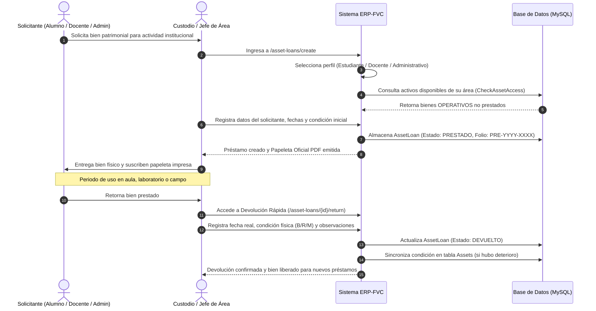
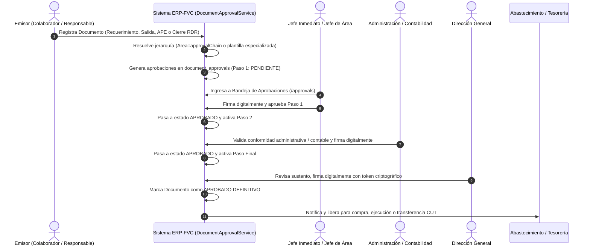
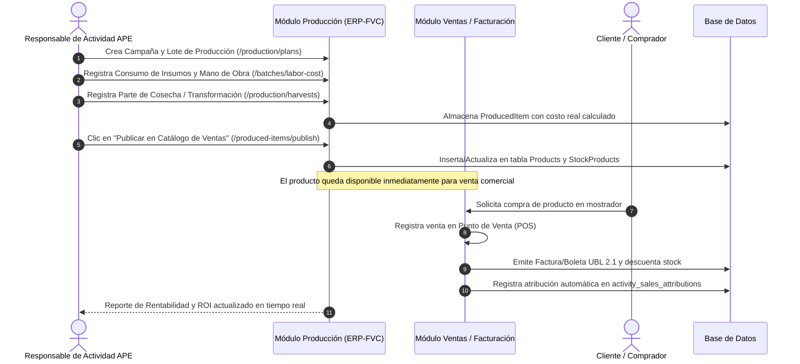
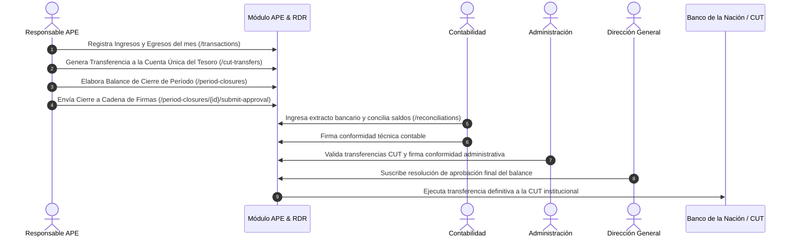
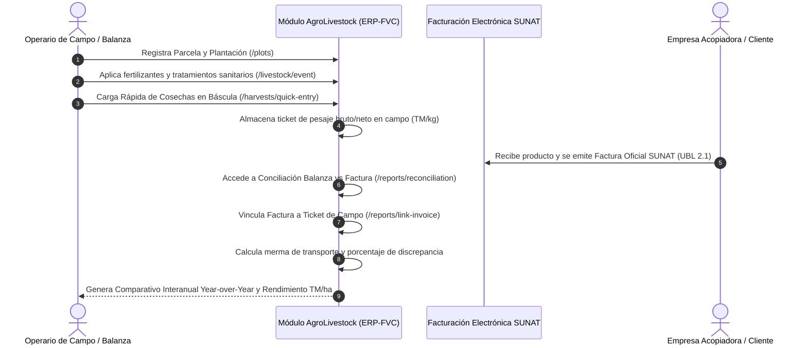

# DOCUMENTO DE DEFINICIÓN Y REQUISITOS DE PRODUCTO (PDR)
## ERP-FVC: Sistema Integral de Gestión Empresarial, Facturación Electrónica, Patrimonio, Trámites Institucionales, Actividades Productivas (APE/RDR) y Producción Agropecuaria

---

### Control del Documento
- **Proyecto:** ERP-FVC
- **Versión del Sistema:** 3.0 (Enterprise / Multi-Módulo Integral)
- **Fecha de Emisión:** 01 de Octubre de 2026
- **Tecnología Base:** Laravel 10.x / PHP 8.3 / MySQL 8.0+ / Bootstrap 5 (SB Admin Pro) / DomPDF / Simple QrCode / Facturación SUNAT UBL 2.1 / Maatwebsite Excel

---

## 1. INTRODUCCIÓN Y VISIÓN DEL PRODUCTO

### 1.1 Propósito
El presente documento describe de forma exhaustiva los requerimientos funcionales, arquitectura técnica, especificaciones de procesos de negocio, modelo de datos y estándares operativos del sistema **ERP-FVC**.

### 1.2 Visión General
**ERP-FVC** es una solución informática integral de nivel corporativo desarrollada para centralizar y articular de manera sinérgica cinco grandes frentes operativos:

1. **Frente Comercial y Facturación Electrónica SUNAT:** Control de ventas por mostrador (POS), facturación electrónica con estándares UBL 2.1 (Boletas de Venta, Facturas, Notas de Crédito, Notas de Débito), Guías de Remisión Electrónicas (GRE Remitente vía API REST), cotizaciones, notas de venta internas con venta a crédito y cronograma de amortizaciones, compras a proveedores fiscales, gestión multi-almacén activa y control de stock valorizado (Kardex).
2. **Frente de Trámites Internos y Aprobaciones Jerárquicas:** Gestión digitalizada de requerimientos de bienes y servicios, declaraciones juradas de gastos, papeletas de salida de personal, papeletas de salida de vehículos oficiales, solicitudes de vacaciones y vales de control de combustible, con firma digital, tokens criptográficos de suscripción y flujos de aprobación basados en el organigrama institucional arbóreo.
3. **Frente de Control Patrimonial y Activos Fijos:** Inventario técnico y físico de bienes patrimoniales conforme al catálogo oficial de bienes muebles (SBN), rotulado vectorial mediante códigos QR para verificación pública móvil, actas de verificación anual auditadas con firma digital, y el subsistema de **Préstamos de Bienes** para estudiantes, docentes y personal administrativo con trazabilidad de estado físico y sincronización de condiciones.
4. **Frente de Actividades Productivas y Empresariales (APE) y Recursos Directamente Recaudados (RDR):** Gestión integral de centros de costos por actividad productiva, tablero analítico matricial (Actividad × Mes) con exportación/importación Excel multi-hoja, registro de ingresos y egresos clasificados jerárquicamente y vinculados sin duplicidad a comprobantes de compras y ventas, control de transferencias a la Cuenta Única del Tesoro (CUT), préstamos internos y habilitaciones de viáticos, conciliaciones bancarias (Banco de la Nación, Cooperativas y Caja) y balances de cierre mensual/anual sujetos a la cadena jerárquica de firmas digitales.
5. **Frente de Producción Industrial, Transformación, Agropecuario y Forestal (AgroLivestock):** Planificación de campañas y lotes de producción, costeo de mano de obra y jornales, catálogo abierto de materias primas e insumos con movimientos de consumo en campo, productos transformados con publicación directa al catálogo de ventas comercial (`/publish`), registro de cosechas y rendimientos, análisis de margen y rentabilidad (ROI), preventas y pedidos comerciales de actividad (`ActivityOrder`), gestión georreferenciada de parcelas con polígonos GeoJSON, plantaciones permanentes y de ciclo corto, viveros forestales y almacigado, manejo zootécnico y pecuario (bovinos, porcinos, cuyes, aves, piscigranjas) con seguimiento de eventos sanitarios y fases de alimentación, carga rápida de cosechas de campo, comparativos interanuales (Year-over-Year), estructura analítica de costos y conciliación técnica entre pesajes de balanza/campo y comprobantes de facturación oficial SUNAT.

---

## 2. ARQUITECTURA TÉCNICA Y STACK TECNOLÓGICO

```
+-----------------------------------------------------------------------------------------------+
|                                CAPA DE PRESENTACIÓN (CLIENTE)                                 |
|  Blade Engine + Bootstrap 5 (SB Admin Pro) + Yajra DataTables Server-Side + SweetAlert2       |
|  Responsive Design (Mobile First, Tablet, Desktop) + Feather Icons & FontAwesome 6            |
+-----------------------------------------------------------------------------------------------+
                                                |
                                                v (HTTP / HTTPS / REST API)
+-----------------------------------------------------------------------------------------------+
|                                CAPA DE CONTROL Y RUTEO                                        |
|  Laravel 10 HTTP Kernel + Web & API Routes                                                    |
|  Middlewares Especializados:                                                                  |
|   - Authenticate & Spatie RBAC (can:* / Roles)                                                |
|   - CheckAssetAccess (Aislamiento de inventario y préstamos por área física)                  |
|   - CheckProductiveActivityAccess (Aislamiento de APE por actividad y permisos supervisores)   |
|   - EnsureWarehouseSelection (Obligatoriedad de selección de almacén operativo asignado)      |
|  Form Requests Validation (25 clases de validación estricta de esquemas y tipos de datos)     |
+-----------------------------------------------------------------------------------------------+
                                                |
                                                v
+-----------------------------------------------------------------------------------------------+
|                             CAPA DE LÓGICA DE NEGOCIO Y SERVICIOS                             |
|  - Controladores MVC Especializados (56 controladores organizados por dominios)               |
|  - DocumentApprovalService (Workflow jerárquico dinámico para 9 tipos de documentos oficiales)|
|  - Ebilling Suite (Generación UBL 2.1, firmado XML XAdES-BES, recepción CDR y API GRE SUNAT)  |
|  - Agro & Production Engine (Costeo de jornales, consumos de insumos, pesajes y cosechas)     |
|  - Cost Center Analytics (Matriz Cross-Tabulation Actividad x Mes y conciliación RDR)         |
|  - DomPDF Service (Papeletas de Préstamo, Actas de Inventario, Requerimientos, Comprobantes)  |
|  - Excel Import/Export Engine (Maatwebsite: reportes multi-hoja, plantillas masivas)          |
|  - Simple QrCode Generator (SVG vectorizado para rotulado patrimonial y verificación pública) |
|  - Conversión Numérica Financiera (luecano/numero-a-letras para comprobantes legales)         |
+-----------------------------------------------------------------------------------------------+
                                                |
                                                v
+-----------------------------------------------------------------------------------------------+
|                             CAPA DE PERSISTENCIA Y MODELOS                                    |
|  Eloquent ORM + SoftDeletes + Accessors/Mutators + Casts + Local/Global Scopes                |
|  MySQL 8.0+ / MariaDB 10.6+ (Transaccional InnoDB, Foreign Keys, UUIDs, Índices Compuestos)  |
|  76 Modelos de Datos Nucleares estructurados por subsistemas interrelacionados               |
+-----------------------------------------------------------------------------------------------+
```

### 2.1 Especificación Tecnológica
- **Lenguaje:** PHP 8.1+ (Entorno objetivo de producción PHP 8.3.6 NTS).
- **Framework Web:** Laravel Framework 10.50.2.
- **Motor de Base de Datos:** MySQL 8.0 / MariaDB 10.6+ con soporte transaccional InnoDB estricto.
- **Frontend & Maquetación:** Blade Templates, Bootstrap 5.2+, SB Admin Pro Architecture, Vanilla CSS optimizado y componentes interactivos asíncronos.
- **Librerías Clave del Ecosistema:**
  - `spatie/laravel-permission`: Control de acceso basado en 18 roles y más de 65 permisos granulares.
  - `yajra/laravel-datatables-oracle`: Motor server-side para listados dinámicos con paginación, filtros multicriterio y ordenamiento asíncrono.
  - `barryvdh/laravel-dompdf`: Renderizado de documentos oficiales, comprobantes electrónicos (A4 y ticket 80mm), papeletas de préstamo y actas de verificación.
  - `maatwebsite/excel`: Exportación e importación masiva de activos, usuarios, inventario, catálogos y reportes económicos detallados multi-hoja.
  - `simplesoftwareio/simple-qrcode`: Generación de códigos QR vectoriales SVG para verificación pública móvil inmediata.
  - `luecano/numero-a-letras`: Conversión formal de importes numéricos a texto legal en comprobantes SUNAT.

---

## 3. GESTIÓN DE SEGURIDAD Y MATRIZ DE ROLES (RBAC)

El sistema implementa un esquema integral de seguridad basado en roles (Role-Based Access Control) mediante Spatie Permission, complementado con políticas y middlewares de autorización a nivel de departamento y actividad productiva.

### 3.1 Roles Predefinidos del Sistema (18 Roles)
1. **SUPERADMIN:** Acceso total e irrestricto a todas las configuraciones, parámetros de empresa, auditorías, bases de datos y módulos.
2. **ADMIN:** Administración general de operaciones de la institución/empresa.
3. **DIRECTOR_GENERAL:** Máxima autoridad institucional; supervisión ejecutiva consolidada, reportes globales, suscripción final de actas de inventario patrimonial, autorizaciones de requerimientos y aprobación de cierres de actividad RDR.
4. **ADMINISTRACION:** Jefatura administrativa y financiera; supervisión de cajas, presupuestos, aprobaciones intermedias de trámites y validación de transferencias CUT.
5. **CONTABILIDAD:** Acceso consolidado de auditoría, lectura y cruce contable; consulta de registros de compras y ventas SUNAT, verificación de márgenes de producción y conciliación de extractos bancarios en el módulo RDR.
6. **PATRIMONIO:** Gestión técnica del inventario de bienes muebles, rotulación QR, actas de verificación departamental y supervisión global de préstamos.
7. **ABASTECIMIENTO:** Gestión de compras, órdenes de ingreso de mercadería, catálogo de proveedores fiscales y tramitación logística de requerimientos aprobados.
8. **JEFE_AREA:** Responsable directo de un departamento/área; administra los activos asignados a su unidad, autoriza préstamos de bienes bajo su custodia, visa requerimientos de su personal y supervisa las actividades productivas de su ámbito.
9. **RESPONSABLE_ACTIVIDAD:** Responsable técnico y operativo de una Actividad Productiva y Empresarial (APE); gestiona planes de producción, registra compras y consumos de insumos, monitorea labores de campo/lote, captura rendimientos de cosechas, gestiona transacciones económicas y elabora el balance de cierre mensual para aprobación institucional.
10. **COORDINADOR:** Coordinación de unidades funcionales o proyectos especiales.
11. **COORD_PE:** Coordinadores de programas de estudios; primer eslabón en la cadena de visación de requerimientos académicos y declaraciones juradas de su especialidad.
12. **JEFE_INMEDIATO:** Nivel de supervisión primaria en la cadena de aprobaciones de personal (papeletas de salida y permisos).
13. **TRAMITE_DOCUMENTARIO:** Recepción, registro, derivación y seguimiento del flujo documentario institucional.
14. **UNIDAD_ACADEMICA:** Supervisión de actividades formativas, personal docente, infraestructura de aulas y visación de papeletas de vacaciones docentes.
15. **DOCENTE:** Personal formativo; solicitante de bienes patrimoniales para prácticas pedagógicas y generador de requerimientos de materiales didácticos.
16. **CHOFER:** Conductor oficial asignado a unidades móviles; suscribe papeletas de salida vehicular y receptor de vales de combustible.
17. **VENDEDOR:** Atención en punto de venta (POS), emisión de cotizaciones y notas de venta comerciales.
18. **CAJERO:** Operador de caja física asignada, cobro de comprobantes en ventanilla y registro de movimientos de ingresos y egresos de efectivo.

### 3.2 Middlewares Especializados de Seguridad

#### 3.2.1 `CheckAssetAccess` (`asset.access`)
Garantiza la privacidad departamental del inventario físico. Los usuarios que no ostentan roles de supervisión global solo pueden consultar o registrar préstamos y activos de las áreas donde figuran como jefe en `areas.head_user_id` o como miembros en `employee_area_details`.

#### 3.2.2 `CheckProductiveActivityAccess` (`activity.access`)
Garantiza el aislamiento técnico y financiero de las Actividades Productivas y Empresariales (APE). Los roles operativos (`RESPONSABLE_ACTIVIDAD`, colaboradores asignados en `activity_collaborators` o jefes de área correspondientes) solo pueden acceder y mutar datos de las actividades asignadas bajo su custodia. Los roles `SUPERADMIN`, `ADMIN`, `DIRECTOR_GENERAL`, `ADMINISTRACION` y `CONTABILIDAD` disponen de acceso consolidado institucional.

#### 3.2.3 `EnsureWarehouseSelection`
Exige y valida que los usuarios que posean uno o más almacenes asignados mantengan seleccionada de manera explícita su sucursal/almacén activo en sesión antes de realizar operaciones de venta en POS, traslados, compras o emisión de comprobantes, previniendo inconsistencias de stock físico.

---

## 4. ESPECIFICACIÓN DETALLADA DE MÓDULOS DEL SISTEMA

---

### MÓDULO 1: BIENES PATRIMONIALES Y ACTIVOS FIJOS

#### 1.1 Inventario de Bienes Patrimoniales
- **Rutas:** `/inventory`, `/inventory/create`, `/inventory/{id}/edit`, `/inventory/{id}`, `/inventory/pdf`, `/inventory/upload-excel`
- **Controlador:** `AssetController`
- **Modelo:** `Asset` (Tabla: `assets`)
- **Proceso y Reglas de Negocio:**
  1. Registro de activos asignados a un área física con código institucional correlativo (`orden`).
  2. Clasificación técnica: Código de catálogo SBN (`codigo_producto`), código patrimonial interno (`codigo`), descripción detallada, marca, modelo, número de serie.
  3. Datos financieros: Costo de adquisición, tipo de adquisición (`C: Compra`, `D: Donación`), fecha y año fiscal de ingreso.
  4. Estado y conservación: Condición física (`B: Bueno`, `R: Regular`, `M: Malo`, `BAJA: De Baja`), estado operativo (`OPERATIVO`, `EN_REPARACION`, `INOPERATIVO`, `DE_BAJA`).
  5. Auditoría física en campo (Reconciliación): Marcado rápido del activo como inspeccionado físicamente (`is_reconciled`, `reconciled_at`, `reconciled_by`).
  6. Importación y Exportación: Carga masiva mediante plantilla oficial en Excel (`AssetsImport`) y generación de formato oficial institucional en PDF apaisado A4 con cálculo de totales por área.

#### 1.2 Rótulos y Verificación Pública QR
- **Rutas:** `/inventory/qr-labels`, `/inventory/qr-svg/{uuid}`, `/inventory/verify/{uuid}`
- **Proceso:**
  1. Cada activo posee un identificador universal único (`uuid`).
  2. Generación de código QR en formato vectorial SVG con URL pública de verificación (`/inventory/verify/{uuid}`).
  3. Hoja de rótulos lista para impresión térmica o en papel adhesivo conteniendo código QR, código patrimonial, descripción y departamento.
  4. Al escanear el QR con un teléfono móvil, el sistema muestra la ficha pública de validación de autenticidad del activo sin requerir inicio de sesión.

#### 1.3 Actas Departamentales de Inventario Anual
- **Rutas:** `/asset-inventories/store`, `/asset-inventories/{id}`
- **Controlador:** `AssetInventoryController`
- **Modelo:** `AssetInventory`, `DocumentApproval`
- **Proceso:** Apertura de acta de inventario anual por área y periodo fiscal, congelamiento del estado de los bienes del área al momento de la apertura y circuito de firmas digitales: Responsable del Área, Abastecimiento, Administración y Dirección General.

#### 1.4 Préstamos de Bienes Patrimoniales (Loans)
- **Rutas:** `/asset-loans`, `/asset-loans/get`, `/asset-loans/create`, `/asset-loans/assets-by-area`, `/asset-loans/store`, `/asset-loans/quick-detail/{id}`, `/asset-loans/{id}/edit`, `/asset-loans/{id}`, `/asset-loans/{id}/return`, `/asset-loans/{id}/pdf`, `/asset-loans/delete`
- **Controlador:** `AssetLoanController`
- **Modelo:** `AssetLoan` (Tabla: `asset_loans`)
- **Perfiles de Solicitante:** Estudiante (`STUDENT`), Docente (`FACULTY`), Personal Administrativo (`ADMINISTRATIVE`).
- **Control de Disponibilidad:** Exige estado `OPERATIVO` y ausencia de préstamo activo en estado `PRESTADO` (`is_on_loan = false`).
- **Devolución:** Registro de fecha y hora real de devolución, condición física recibida (`B`, `R`, `M`, `BAJA`), observaciones de retorno y sincronización opcional con el estado del activo en el inventario general.
- **Papeleta de Préstamo (PDF):** Formato oficial A4 con membrete institucional, especificaciones del activo, plazos, cláusula de custodia y 3 casillas de firma (Solicitante, Custodio que Entrega, Receptor al Retorno).

---

### MÓDULO 2: TRÁMITES INTERNOS Y CADENA DE APROBACIONES

#### 2.1 Cadena de Aprobación Jerárquica (`Area::approvalChain` & `DocumentApprovalService`)
El sistema utiliza un motor de flujos dinámicos que asciende por la estructura arbórea de la tabla `areas` (`parent_id`) desde el área de origen hasta Dirección General, omitiendo áreas asesoras (`is_advisory = true`) y asignando los pasos en `document_approvals`.

El servicio `DocumentApprovalService` gestiona actualmente **9 tipos de documentos institucionales**:
1. `Requisition`: Requerimientos de compras y servicios.
2. `ExpenseDeclaration`: Declaraciones juradas de gastos y viáticos.
3. `ExitSlip`: Papeletas de salida de personal.
4. `VehicleExitSlip`: Papeletas de salida de vehículos oficiales.
5. `VacationExitSlip`: Solicitudes y papeletas de vacaciones anuales.
6. `FuelControlSlip`: Vales de control y despacho de combustible.
7. `AssetInventory`: Actas departamentales de inventario anual.
8. `ProductiveActivity`: Apertura y formalización de Actividades Productivas APE.
9. `ActivityPeriodClosure`: Cierres mensuales y balances anuales de actividades RDR.

#### 2.2 Bandeja Centralizada de Aprobaciones (`/approvals`)
- **Controlador:** `DocumentApprovalController`
- **Funcionalidad:** Vista unificada con contador badge en tiempo real en la barra lateral para directores y jefaturas. Permite Aprobar (con generación de token criptográfico y estampado de firma digital), Observar (devolución para subsanación) o Rechazar el trámite de forma irrevocable.

---

### MÓDULO 3: VENTAS Y FACTURACIÓN ELECTRÓNICA (SUNAT)

#### 3.1 Clientes y Proveedores Fiscales
- **Rutas:** `/clients/*`, `/providers/*`
- **Controlador:** `ClientController`, `ProviderController`
- **Modelo:** `Client`, `Provider`
- **Especificaciones:**
  - Tipos de documento SUNAT: DNI (1), RUC (6), Carné de Extranjería (4), Pasaporte (7).
  - Consulta automática vía API a RENIEC (para DNI) y SUNAT (para RUC) para autocompletar razón social, nombre y dirección fiscal.
  - Gestión de Ubigeo a 6 dígitos (Departamento, Provincia, Distrito) y validación de duplicados.

#### 3.2 Punto de Venta (POS)
- **Rutas:** `/pos`, `/pos/crear`, `/pos/get`, `/pos/save-sale`
- **Controlador:** `PosController`
- **Funcionalidad:** Interfaz ágil para mostrador con soporte de lectores de códigos de barras, selección de cliente rápido, búsqueda en vivo de productos con stock en el almacén del usuario, cobro con múltiples formas de pago (Efectivo, Yape, Plin, Tarjeta, Transferencia) y emisión directa de Boleta Electrónica, Factura Electrónica o Nota de Venta.

#### 3.3 Comprobantes Electrónicos SUNAT (Billings)
- **Rutas:** `/billings`, `/billings/credit-notes`, `/billings/debit-notes`, `/billings/{id}/credit-note`, `/billings/{id}/debit-note`, `/billings/{id}/dispatch`, `/billings/{id}/xml`, `/billings/{id}/cdr`
- **Controlador:** `BillingController`, `Api\SunatDispatchController`, `Api\SunatValidationController`
- **Modelo:** `Billing`, `DetailBilling`, `CreditNoteType`, `DebitNoteType`
- **Especificaciones Tributarias UBL 2.1:**
  - Factura (`01`), Boleta de Venta (`03`), Nota de Crédito (`07`), Nota de Débito (`08`).
  - Catálogo SUNAT de tipos de afectación al IGV: Gravado (10), Exonerado (20), Inafecto (30), Exportación (40), Gratuitas.
  - Catálogo de motivos oficiales para Notas de Crédito y Débito.
  - Firma digital XML con certificado digital (PFX / PEM).
  - Envío automático o diferido a servidores SUNAT vía SOAP/REST.
  - Descarga y almacenamiento de CDR (Constancia de Recepción) y código Hash.
  - Impresión en formato Ticket (80mm) y A4 conteniendo código QR tributario reglamentario.

#### 3.4 Guías de Remisión Electrónica (GRE Remitente)
- **Rutas:** `/shipment-guides/*`
- **Controlador:** `ShipmentGuideController`
- **Modelo:** `ShipmentGuide`, `ShipmentGuideItem`
- **Especificaciones:** Modalidad de transporte público (`02`) y privado (`01`), placas primarias y secundarias (carretas), datos de conductor (licencia MTC), transportista y comunicación con la API REST de SUNAT (Client ID / Client Secret).

#### 3.5 Cotizaciones y Notas de Venta
- **Rutas:** `/quotes/*`, `/sale-notes/*`
- **Controlador:** `QuoteController`, `SaleNoteController`
- **Modelos:** `Quote`, `DetailQuote`, `SaleNote`, `DetailSaleNote`, `DetailPayment`
- **Funcionalidad:** Propuestas comerciales convertibles en un clic a venta; notas de venta no tributarias con soporte de venta al crédito, cronograma de vencimientos y registro sucesivo de amortizaciones en cuotas.

---

### MÓDULO 4: COMPRAS Y GESTIÓN DE PROVEEDORES

#### 4.1 Compras Fiscales (Buys)
- **Rutas:** `/buys`, `/buys/create`, `/buys/get`, `/buys/store`, `/buys/save`
- **Controlador:** `BuyController`
- **Modelo:** `Buy`, `DetailBuy`
- **Funcionalidad:**
  - Registro de facturas y boletas de compras emitidas por proveedores fiscales.
  - Asignación de almacén destino con incremento automático de existencias físicas.
  - Actualización automática de costos de compra (costo último / costo promedio ponderado).
  - Trazabilidad de compras a crédito y generación de cuentas por pagar a proveedores.

---

### MÓDULO 5: INVENTARIO, MULTI-ALMACÉN Y KARDEX

#### 5.1 Catálogo Central de Productos y Servicios
- **Rutas:** `/products/*`, `/categories/*`
- **Controlador:** `ProductController`, `CategoryController`
- **Modelo:** `Product`, `Category`, `Unit`
- **Funcionalidad:** Código de barras EAN/UPC, código SUNAT, categoría, unidad de medida, precios diferenciados (compra, venta, mínimo), tipo de afectación al IGV e importación/exportación masiva vía Excel.

#### 5.2 Multi-Almacén y Selector Activo
- **Rutas:** `/warehouses/*`, `/establishment`
- **Controlador:** `WarehouseController`, `WarehouseSelectorController`
- **Modelo:** `Warehouse`, `StockProduct`, `UserWarehouse`
- **Funcionalidad:** Control de stock independiente por almacén (`stock_products`), asignación de almacenes permitidos por colaborador (`user_warehouse`) y selector obligatorio de establecimiento activo con middleware `EnsureWarehouseSelection`.

#### 5.3 Órdenes de Traslado y Kardex
- **Rutas:** `/transferorders/*`, `/kardex/*`
- **Controlador:** `TransferOrderController`, `KardexController`
- **Modelo:** `TransferOrder`, `DetailTransferOrder`
- **Funcionalidad:** Transferencia de mercancías entre almacenes con rebaja en origen y confirmación de recepción en destino. Kardex físico y valorizado con trazabilidad cronológica de entradas y salidas.

---

### MÓDULO 6: CAJAS Y TESORERÍA OPERATIVA

#### 6.1 Cajas y Arqueos (Arching Cash)
- **Rutas:** `/cashes/*`, `/archingcash/*`
- **Controlador:** `CashController`, `ArchingCashController`
- **Modelo:** `Cash`, `ArchingCash`, `PayMode`
- **Funcionalidad:** Apertura de turnos con fondo inicial en efectivo, registro de depósitos extraordinarios y retiros de gastos menores, consolidación automática de cobros realizados en POS agrupados por medio de pago, cuadre final con detección de sobrantes y faltantes, y reporte formal de cierre impreso.

---

### MÓDULO 7: REPORTES COMERCIALES Y CONTABLES

#### 7.1 Reportes Comerciales y Financieros
- **Rutas:** `/reportes/ventas`, `/reportes/pagos`, `/by-product`
- **Controlador:** `ReportSalesController`, `ReportPaymentController`
- **Funcionalidad:** Ventas por rango de fechas, almacén, vendedor, cliente, margen por producto y reporte de cobranzas por medios de pago.

#### 7.2 Reportes Tributarios SUNAT
- **Rutas:** `/billings/reports/sales-register`, `/billings/reports/billing-documents`, `/billings/reports/credit-notes`
- **Controlador:** `BillingReportController`
- **Funcionalidad:** Registro de Ventas e Ingresos formato SUNAT oficial (PLE / PDF / Excel), reporte de documentos emitidos con estados de CDR (Aceptado, Rechazado, Pendiente) y consolidado de notas de crédito emitidas.

---

### MÓDULO 8: CONFIGURACIÓN GENERAL Y PARAMETRIZACIÓN

#### 8.1 Perfil de Empresa Emisora
- **Rutas:** `/business/*`
- **Controlador:** `BusinessController`
- **Modelo:** `Business`
- **Configuración:** Razón social, RUC, dirección fiscal, logotipo, credenciales SOL (usuario y clave), certificado digital tributario (.pfx / .pem) y credenciales de API SUNAT para Guías de Remisión Electrónicas (Client ID / Client Secret).

#### 8.2 Series, Correlativos y Organigrama
- **Rutas:** `/series/*`, `/areas/*`, `/users/*`, `/roles/*`
- **Controlador:** `SerieController`, `AreaController`, `UserController`, `RoleController`
- **Configuración:** Series por tipo de documento y almacén, estructura arbórea de áreas institucionales con jefaturas designadas, administración de usuarios y asignación de roles RBAC Spatie.

---

### MÓDULO 9: ACTIVIDADES PRODUCTIVAS Y EMPRESARIALES (APE) Y CENTRO DE COSTOS

#### 9.1 Catálogo y Ficha de Actividades Productivas
- **Rutas:**
  - `GET /productive-activities`: Panel general con tarjetas KPI (total actividades, activas, cerradas, en mantenimiento, % de avance promedio) y DataTables.
  - `GET /productive-activities/get`: Endpoint JSON server-side con filtros por área, tipo y estado.
  - `GET /productive-activities/create`: Formulario de apertura de actividad productiva.
  - `POST /productive-activities/store`: Registro de actividad con validación estricta (`ProductiveActivityValidate`).
  - `GET /productive-activities/{id}`: Ficha técnica integral de la actividad, colaboradores asignados y bitácora.
  - `GET /productive-activities/{id}/edit`: Formulario de edición de parámetros y fondos.
  - `PUT /productive-activities/{id}`: Actualización de datos.
  - `POST /productive-activities/delete`: Baja lógica (SoftDelete).
  - `POST /productive-activities/{id}/submit-approval`: Envío formal del expediente de apertura a la cadena de firmas (`DocumentApprovalService`).
  - `POST /productive-activities/{id}/tracking-logs`: Registro de hitos y bitácora de seguimiento con avance porcentual (`ActivityTrackingLog`).
- **Controlador:** `ProductiveActivityController`
- **Modelos:** `ProductiveActivity`, `ProductiveUnit`, `ActivityTrackingLog`, `ActivityCollaborator`
- **Tipos de Actividad Soportados:**
  - `AGRICULTURAL`: Cultivos agrícolas tradicionales y no tradicionales.
  - `FORESTRY`: Plantaciones y viveros forestales.
  - `AQUACULTURE`: Piscigranjas y producción acuícola.
  - `LIVESTOCK`: Unidades de producción pecuaria y zootécnica.
  - `INSTITUTIONAL`: Producción institucional y talleres de formación.
  - `SERVICES`: Servicios profesionales, consultoría y centro de idiomas.

#### 9.2 Tablero de Centro de Costos y Matriz Analítica
- **Rutas:**
  - `GET /productive-activities/cost-center`: Tablero interactivo con filtros por ejercicio fiscal, tipo de actividad y fuente de financiamiento.
  - `GET /productive-activities/cost-center/data`: Endpoint JSON para renderizado de gráficos y matrices.
  - `GET /productive-activities/cost-center/export-excel`: Descarga del consolidado económico oficial en Excel (`ActivityIncomeExpenseExport`).
  - `GET /productive-activities/cost-center/export-detailed`: Descarga del informe económico detallado multi-hoja con libro mayor de cada actividad (`ActivityDetailedReportExport`).
  - `POST /productive-activities/cost-center/import-excel`: Importación masiva de datos históricos de informes económicos en Excel (`EconomicReportHistoricalImport`).
- **Controlador:** `CostCenterDashboardController`
- **Funcionalidad:**
  - Construcción de matriz de doble entrada **Actividad × Mes (Enero a Diciembre)** con cálculo en tiempo real de Ingresos Totales, Gastos Totales y Saldo Neto Acumulado.
  - Gráficos interactivos de distribución de gastos por categoría y comparativas de liquidez.

#### 9.3 Registro y Clasificación de Ingresos y Egresos (Transacciones APE)
- **Rutas:**
  - `GET /productive-activities/transactions`: Panel de transacciones financieras con métricas resumen.
  - `GET /productive-activities/transactions/get`: Listado server-side con DataTables.
  - `POST /productive-activities/transactions/store`: Registro de movimiento validado por `ActivityTransactionValidate`.
  - `PUT /productive-activities/transactions/{id}`: Modificación de transacción.
  - `POST /productive-activities/transactions/delete`: Anulación del movimiento.
  - `GET /productive-activities/transactions/search-core`: Búsqueda asistida de comprobantes del ERP core (Facturas, Boletas, Compras o Notas de Venta) para asociar el gasto o ingreso a la actividad productiva sin duplicar datos ni saldos de caja.
- **Controlador:** `ActivityTransactionController`
- **Modelos:** `ActivityTransaction`, `ActivityTransactionCategory`, `FundSource`
- **Especificaciones:**
  - Clasificación mediante árbol de categorías de ingresos y egresos (`activity_transaction_categories`).
  - Imputación a fuentes de financiamiento (`fund_sources`): Banco de la Nación, Cooperativa Tocache, Caja Chica, Cuenta Única del Tesoro (CUT).
  - Trazabilidad de tipo de comprobante físico: Factura, Boleta, Recibo de Ingreso/Egreso, Declaración Jurada, Voucher de Depósito.

#### 9.4 Subsistema RDR y Tesorería Institucional
- **Rutas:**
  - `GET /productive-activities/rdr`: Panel central de tesorería y conciliación RDR.
  - `POST /productive-activities/rdr/cut-transfers`: Registro y tramitación de transferencias a la Cuenta Única del Tesoro (CUT).
  - `POST /productive-activities/rdr/internal-loans`: Registro de préstamos internos y habilitaciones de fondos para viáticos/operaciones de campo.
  - `POST /productive-activities/rdr/internal-loans/{id}/repay`: Registro de devoluciones y amortizaciones de préstamos internos.
  - `POST /productive-activities/rdr/reconciliations`: Conciliación bancaria mensual entre extractos bancarios y saldos del sistema ERP.
  - `POST /productive-activities/rdr/period-closures`: Elaboración del balance y cierre mensual de actividad.
  - `POST /productive-activities/rdr/period-closures/{id}/submit-approval`: Envío formal del cierre a la cadena jerárquica de firmas digitales.
- **Controlador:** `RdrModuleController`
- **Modelos:** `RdrCutTransfer`, `RdrInternalLoan`, `RdrBankReconciliation`, `ActivityPeriodClosure`
- **Cadena de Aprobación del Cierre RDR:**
  1. Responsable del Cierre (Generador de la liquidación).
  2. Jefatura de Contabilidad (Auditoría contable y liquidación de comprobantes).
  3. Jefatura de Administración (Conformidad presupuestal y financiera).
  4. Dirección General (Aprobación final ejecutiva mediante firma digital y cierre del ejercicio).

---

### MÓDULO 10: PRODUCCIÓN INDUSTRIAL, TRANSFORMACIÓN Y COMERCIALIZACIÓN

#### 10.1 Planes y Campañas de Producción
- **Rutas:** `/production/plans/*`
- **Controlador:** `ProductionPlanController`
- **Modelo:** `ProductionCampaign` (Tabla: `production_campaigns`)
- **Funcionalidad:** Apertura de campañas productivas vinculadas a una actividad APE, código único correlativo (`campaign_code`), metas físicas cuantitativas (`target_quantity`, `target_unit`), fechas estimadas de inicio y término, y presupuesto asignado (`budget_allocated`).

#### 10.2 Fases, Lotes de Producción y Costeo de Mano de Obra
- **Rutas:** `/production/batches/*`, `/production/batches/labor-cost/store`, `/production/batches/labor-cost/delete`
- **Controlador:** `ProductionBatchController`
- **Modelo:** `ProductionBatch`, `ProductionLaborCost`
- **Funcionalidad:**
  - Subdivisión de la campaña en fases y lotes específicos (`batch_code`, `phase_name`, `phase_type`: inicio, crecimiento, engorde, siembra, mantenimiento, cosecha).
  - Módulo de costeo de mano de obra (`production_labor_costs`): Registro de jornales, tareas realizadas, operario, horas trabajadas y tarifa por hora para cálculo exacto del costo de mano de obra directa.

#### 10.3 Catálogo Abierto de Insumos y Materias Primas
- **Rutas:** `/production/raw-materials/*`
- **Controlador:** `ProductionRawMaterialController`
- **Modelo:** `ProductionRawMaterial` (Tabla: `production_raw_materials`)
- **Funcionalidad:** Catálogo no restringido a inventarios comerciales para la definición de insumos agrícolas y pecuarios: fertilizantes, enmiendas, semillas, medicamentos veterinarios, alimentos balanceados, insecticidas, fungicidas y materiales de empaque.

#### 10.4 Movimientos y Consumo de Insumos en Campo/Taller
- **Rutas:** `/production/input-movements/*`
- **Controlador:** `ProductionInputMovementController`
- **Modelo:** `ProductionInputMovement` (Tabla: `production_input_movements`)
- **Funcionalidad:** Registro de ingresos por compras y egresos por aplicación directa o consumo en lote/fase, calculando el costo total y afectando el costo acumulado de la campaña productiva.

#### 10.5 Productos Producidos y Publicación al Catálogo Central de Ventas
- **Rutas:** `/production/produced-items/*`, `/production/produced-items/publish`
- **Controlador:** `ProducedItemController`
- **Modelo:** `ProducedItem` (Tabla: `produced_items`)
- **Funcionalidad Clave:**
  - Registro de los bienes finales o subproductos generados por la actividad (`name`, `unit_of_measurement`, `standard_cost`).
  - **Función de Publicación Comercial (`publishToSalesCatalog`):** Publica el bien producido hacia la tabla central `products` del ERP, permitiendo su venta inmediata en el Punto de Venta (POS) y emisión de boletas/facturas electrónicas SUNAT, vinculando automáticamente los registros para la atribución de ingresos.

#### 10.6 Cosechas, Partes de Producción y Rendimientos
- **Rutas:** `/production/harvests/*`
- **Controlador:** `ProductionHarvestController`
- **Modelo:** `ProductionHarvest` (Tabla: `production_harvests`)
- **Funcionalidad:** Registro formal de partes de cosecha física (`harvest_date`, `quantity`, `quality_grade`, ticket de báscula de campo `field_ticket_code`, peso de campo `field_weight_kg`), cálculo del costo unitario real y destino de ingreso al almacén físico del ERP (`stock_products`).

#### 10.7 Analítica de Rentabilidad y Retorno de Inversión (ROI)
- **Rutas:** `/production/profitability`
- **Controlador:** `ProductionProfitabilityController`
- **Funcionalidad:** Consolida en un panel analítico: volumen cosechado, costo de insumos consumidos, costo de mano de obra, ingresos por ventas facturadas (vía `DetailBilling` y `DetailSaleNote`), determinando el margen bruto, margen neto y porcentaje de retorno de inversión (ROI) por producto y actividad.

#### 10.8 Comercialización: Preventas y Pedidos de Actividad
- **Rutas:** `/commercialization/orders/*`, `/commercialization/orders/update-status`
- **Controlador:** `ActivityOrderController`
- **Modelo:** `ActivityOrder` (Tabla: `activity_orders`)
- **Funcionalidad:** Captura de preventas y pedidos comerciales de clientes para productos en fase de cosecha, registro de anticipos, control de saldo pendiente de cobro y conversión fluida a notas de venta o facturación electrónica SUNAT al concretarse el despacho físico.

---

### MÓDULO 11: PRODUCCIÓN AGROPECUARIA, FORESTAL Y ZOOTÉCNICA (AGROLIVESTOCK)

#### 11.1 Parcelas, Lotes de Terreno y Plantaciones Agrícolas
- **Rutas:**
  - `GET /agrolivestock/plots`: Panel general de parcelas con métricas de superficie (total hectáreas, en producción, en descanso).
  - `GET /agrolivestock/plots/get`: Listado con DataTables y filtros de búsqueda.
  - `POST /agrolivestock/plots/store`: Registro y edición de parcelas (`AgriculturalPlotValidate`).
  - `GET /agrolivestock/plots/{id}`: Ficha técnica de la parcela y cultivos instalados.
  - `POST /agrolivestock/plots/plantations/store`: Registro de plantación en la parcela.
  - `POST /agrolivestock/plots/plantations/delete`: Eliminación de plantación.
- **Controlador:** `AgroPlotController`
- **Modelos:** `AgriculturalPlot`, `AgriculturalPlantation`
- **Especificaciones:**
  - Datos edafológicos: Superficie en hectáreas (`area_hectares`), topografía (plana, ondulada, colinosa), tipo de suelo (franco-arcilloso, aluvial), coordenadas GPS y polígono georreferenciado en formato GeoJSON.
  - Ficha de Cultivo: Especie (Palma Aceitera, Cacao, Café, Teca, Bolaina), tipo de cultivo (`PERMANENT` o `SHORT_CYCLE`), variedad (Tenera, CCN-51, Catimor), fecha de siembra, número de plantas, distanciamiento métrico, edad cronológica, rendimiento proyectado por hectárea y frecuencia estimada de cosecha.

#### 11.2 Viveros Forestales y Agrícolas
- **Rutas:** `/agrolivestock/nurseries/*`
- **Controlador:** `AgroNurseryController`
- **Modelo:** `AgriculturalNursery` (Tabla: `agricultural_nurseries`)
- **Especificaciones:** Control de producción de plantines y almacigado; especies forestales y agrícolas, etapas de desarrollo (`GERMINATION`, `SEEDLING_CONTAINER`, `HARDENING_ACCLIMATIZATION`, `READY_FOR_FIELD`, `DISPATCHED`), cantidad inicial, cantidad disponible actual, cálculo de tasa de supervivencia (`survival_rate`) y fecha estimada de despacho a campo.

#### 11.3 Manejo Pecuario y Zootécnico
- **Rutas:**
  - `GET /agrolivestock/livestock`: Panel zootécnico con métricas por especie (bovinos, porcinos, cuyes, aves, peces).
  - `GET /agrolivestock/livestock/get`: Consulta server-side.
  - `POST /agrolivestock/livestock/store`: Alta y modificación de unidad pecuaria (`LivestockUnitValidate`).
  - `GET /agrolivestock/livestock/{id}`: Hoja de vida individual o de lote pecuario.
  - `POST /agrolivestock/livestock/event/store`: Registro de evento sanitario/alimentario (`LivestockEventValidate`).
- **Controlador:** `AgroLivestockController`
- **Modelos:** `LivestockUnit`, `LivestockEvent`
- **Especificaciones:**
  - Modalidad de seguimiento individual (arete, tatuaje, genealogía padre/madre) o por lote/poza (`batch_head_count`).
  - Estados zootécnicos: Activo, Gestación, Lactancia, Engorde, Cuarentena, Vendido, Beneficiado, Decomisado, Baja.
  - Eventos de Vida: Tratamientos veterinarios, calendarios de vacunación, pesajes de control, fases de alimentación (`STARTER`, `GROWER`, `FINISHER`, `MAINTENANCE`), consumo de insumos del catálogo de producción y costeo de tratamientos.

#### 11.4 Carga Rápida de Cosechas en Campo
- **Rutas:** `/agrolivestock/harvests/quick-entry`, `/agrolivestock/harvests/get`, `/agrolivestock/harvests/store`
- **Controlador:** `AgroHarvestQuickEntryController`
- **Funcionalidad:** Interfaz optimizada para dispositivos móviles y terminales de pesaje en campo; permite ingresar partes diarios de cosecha vinculando parcela, plantación, ticket de balanza, peso bruto/neto y operario en menos de 30 segundos, alimentando las existencias sin duplicidad.

#### 11.5 Reportes Técnicos y Conciliaciones Agropecuarias
- **Rutas:**
  - `GET /agrolivestock/reports/year-over-year`: Comparativo interanual mensual de rendimiento y cosechas año actual vs año anterior (`yearOverYear`).
  - `GET /agrolivestock/reports/cost-breakdown`: Estructura analítica de costos discriminada por hectárea, insumos y mano de obra (`costBreakdown`).
  - `GET /agrolivestock/reports/reconciliation`: Conciliación Balanza/Campo vs Factura Oficial SUNAT (`reconciliation`).
  - `POST /agrolivestock/reports/link-invoice`: Enlace formal de tickets de balanza de campo con comprobantes electrónicos de venta (`linkInvoice`).
- **Controlador:** `AgroReportsController`
- **Modelo:** `AgriculturalYieldLog`
- **Proceso de Conciliación Balanza/Factura:**
  - Compara el tonelaje pesado físicamente en la balanza de campo (`field_reported_tonnage`) contra el tonelaje formalmente facturado y liquidado al cliente (`invoiced_tonnage`).
  - Determina la diferencia de peso, merma natural de transporte y porcentaje de discrepancia (`discrepancy_percent`).
  - Asigna estado de conciliación (`MATCHED`, `DISCREPANCY`, `PENDING_INVOICE`) y vincula directamente el ID de la factura (`billing_id`) o nota de venta (`sale_note_id`).

---

## 5. MODELO ENTIDAD-RELACIÓN Y ESTRUCTURA DE BASE DE DATOS

A continuación se detallan las entidades nucleares del sistema ERP-FVC:

| Tabla | Dominio Operativo | Descripción y Relaciones Clave |
|---|---|---|
| `users` | Seguridad & Usuarios | Usuarios, colaboradores y operadores del sistema. Claves foráneas: `idcaja`, `idalmacen`. Roles Spatie. |
| `areas` | Organigrama & RRHH | Áreas, direcciones y departamentos. Auto-relación `parent_id`, `head_user_id`, `is_advisory`. |
| `employee_area_details` | Organigrama & RRHH | Asignación de colaboradores a múltiples áreas con indicador `is_primary`. |
| `assets` | Bienes Patrimoniales | Inventario de bienes muebles. `uuid`, `area_id`, `orden`, `codigo`, `condicion`, `estado_operativo`. |
| `asset_loans` | Bienes Patrimoniales | Préstamos de activos fijos. `uuid`, `loan_code`, `asset_id`, `borrower_type`, `user_id`, `status`. |
| `asset_inventories` | Bienes Patrimoniales | Actas departamentales de inventario anual. `area_id`, `periodo`, `user_id`. |
| `document_approvals` | Flujo Documental | Suscripción digital jerárquica para los 9 tipos de documentos. `document_type`, `document_id`, `approver_id`. |
| `requisitions` / `requisition_items` | Trámites Internos | Requerimientos de compras y servicios y detalle de ítems solicitados. |
| `expense_declarations` / `items` | Trámites Internos | Declaraciones juradas de gastos por viáticos y movilidad local sin comprobante fiscal. |
| `exit_slips` | Trámites Internos | Papeletas de salida y permisos de personal durante la jornada laboral. |
| `vehicle_exit_slips` | Trámites Internos | Salidas de vehículos oficiales, asignación de chofer, rutas y kilometraje. |
| `vacation_exit_slips` | Trámites Internos | Solicitudes y programación formal del goce vacacional anual. |
| `fuel_control_slips` / `items` | Trámites Internos | Vales de control de combustible y despacho de galones a unidades y maquinaria. |
| `clients` | Ventas & Facturación | Clientes y proveedores fiscales unificados. `iddoc`, `nro_documento`, `nombres`, `ubigeo`. |
| `billings` / `detail_billings` | Ventas & Facturación | Comprobantes electrónicos UBL 2.1 SUNAT (Factura 01, Boleta 03, NC 07, ND 08). `cdr_estado`, `hash`. |
| `credit_note_types` / `debit_note_types`| Ventas & Facturación | Catálogo oficial de tipos y motivos de notas de crédito y débito SUNAT. |
| `sale_notes` / `detail_sale_notes` | Ventas & Facturación | Notas de venta internas, ventas al crédito con soporte de pagos sucesivos. |
| `detail_payments` | Ventas & Facturación | Amortizaciones y cuotas abonadas a notas de venta a crédito. |
| `quotes` / `detail_quotes` | Ventas & Facturación | Cotizaciones comerciales y propuestas convertibles a comprobantes. |
| `shipment_guides` / `items` | Ventas & Facturación | Guías de remisión electrónicas remitente (GRE) conectadas a la API SUNAT. |
| `businesses` | Parámetros & SUNAT | Datos fiscales de la empresa, credenciales SOL, certificado digital y API GRE. |
| `products` | Almacenes & Kardex | Catálogo central de bienes y servicios comerciales, códigos SUNAT y afectación IGV. |
| `warehouses` | Almacenes & Kardex | Almacenes y depósitos físicos de la institución. |
| `user_warehouse` | Almacenes & Kardex | Asignación de almacenes autorizados por usuario para control de acceso operativo. |
| `stock_products` | Almacenes & Kardex | Control de existencias físicas y reservas por producto y almacén individual. |
| `transfer_orders` / `details` | Almacenes & Kardex | Órdenes de traslado de mercancías entre almacenes con recepción formal. |
| `cashes` / `arching_cashes` | Cajas & Tesorería | Cajas físicas, turnos de recaudación y arqueos de cuadre con medios de pago. |
| `productive_activities` | APE & Centro Costos | Catálogo de actividades productivas institucionales. `type`, `code`, `area_id`, `default_fund_source_id`. |
| `productive_units` | APE & Centro Costos | Sub-unidades operativas o líneas técnicas dentro de una actividad productiva. |
| `activity_collaborators` | APE & Centro Costos | Asignación de colaboradores y responsables técnicos a las actividades APE. |
| `activity_transaction_categories` | APE & Centro Costos | Árbol jerárquico de conceptos de ingresos y gastos de actividades. |
| `fund_sources` | RDR & Tesorería | Cuentas bancarias y fondos recaudadores (Banco de la Nación, Cooperativas, Caja Chica, CUT). |
| `activity_transactions` | APE & Centro Costos | Transacciones financieras de ingresos y egresos imputadas a actividades y fondos. |
| `rdr_cut_transfers` | RDR & Tesorería | Transferencias formales de recaudación hacia la Cuenta Única del Tesoro (CUT). |
| `rdr_internal_loans` | RDR & Tesorería | Préstamos internos y habilitaciones de viáticos con amortizaciones. |
| `rdr_bank_reconciliations` | RDR & Tesorería | Conciliaciones bancarias mensuales de saldos de extracto vs sistema. |
| `activity_period_closures` | RDR & Tesorería | Balances y cierres mensuales/anuales suscritos mediante la cadena de firmas digital. |
| `activity_tracking_logs` | APE & Centro Costos | Bitácora de seguimiento de metas, porcentaje de avance físico y observaciones. |
| `production_campaigns` | Producción & Agro | Planes y campañas de producción con metas cuantitativas y presupuesto. |
| `production_batches` | Producción & Agro | Fases y lotes de producción (siembra, desarrollo, engorde, cosecha). |
| `production_labor_costs` | Producción & Agro | Costeo de jornales y mano de obra directa aplicada en lotes de producción. |
| `production_raw_materials` | Producción & Agro | Catálogo abierto de insumos y materias primas para procesos agropecuarios y talleres. |
| `production_input_movements` | Producción & Agro | Movimientos de compras y consumos en campo/lote de materias primas. |
| `produced_items` | Producción & Agro | Productos obtenidos de la actividad con bandera `is_published_to_sales`. |
| `production_harvests` | Producción & Agro | Partes de cosecha y rendimiento físico con pesaje de balanza y destino de almacén. |
| `activity_orders` | Producción & Comercial | Preventas y pedidos de actividad con anticipos y saldo pendiente. |
| `activity_sales_attributions`| Producción & Comercial | Trazabilidad de ingresos comerciales atribuidos directamente a la actividad APE. |
| `agricultural_plots` | Agro & Forestal | Parcelas y lotes georreferenciados con coordenadas y polígonos GeoJSON. |
| `agricultural_plantations` | Agro & Forestal | Plantaciones agrícolas permanentes y de ciclo corto instaladas en parcelas. |
| `agricultural_nurseries` | Agro & Forestal | Viveros forestales, almacigado y control de supervivencia de plantines. |
| `livestock_units` | Agro & Pecuario | Unidades zootécnicas individuales o por lote (bovinos, porcinos, cuyes, aves, peces). |
| `livestock_events` | Agro & Pecuario | Registro de eventos sanitarios, pesajes y fases de alimentación zootécnica. |
| `agricultural_yield_logs` | Agro & Forestal | Histórico de rendimientos de campo y conciliación balanza vs factura oficial SUNAT. |

---

## 6. DIAGRAMAS DE FLUJO DE PROCESOS CLAVE

### 6.1 Flujo de Préstamo y Devolución de Bienes Patrimoniales


```mermaid
sequenceDiagram
    autonumber
    actor S as Solicitante (Alumno / Docente / Admin)
    actor C as Custodio / Jefe de Área
    participant Sys as Sistema ERP-FVC
    participant DB as Base de Datos (MySQL)

    S->>C: Solicita bien patrimonial para actividad institucional
    C->>Sys: Ingresa a /asset-loans/create
    Sys->>Sys: Selecciona perfil (Estudiante / Docente / Administrativo)
    Sys->>DB: Consulta activos disponibles de su área (CheckAssetAccess)
    DB-->>Sys: Retorna bienes OPERATIVOS no prestados
    C->>Sys: Registra datos del solicitante, fechas y condición inicial
    Sys->>DB: Almacena AssetLoan (Estado: PRESTADO, Folio: PRE-YYYY-XXXX)
    Sys-->>C: Préstamo creado y Papeleta Oficial PDF emitida
    C->>S: Entrega bien físico y suscriben papeleta impresa
    Note over S,C: Periodo de uso en aula, laboratorio o campo
    S->>C: Retorna bien prestado
    C->>Sys: Accede a Devolución Rápida (/asset-loans/{id}/return)
    C->>Sys: Registra fecha real, condición física (B/R/M) y observaciones
    Sys->>DB: Actualiza AssetLoan (Estado: DEVUELTO)
    Sys->>DB: Sincroniza condición en tabla Assets (si hubo deterioro)
    Sys-->>C: Devolución confirmada y bien liberado para nuevos préstamos
```

### 6.2 Flujo de Aprobación Jerárquica de Documentos Internos


```mermaid
sequenceDiagram
    autonumber
    actor Emisor as Emisor (Colaborador / Responsable)
    participant Sys as Sistema ERP-FVC (DocumentApprovalService)
    actor Jefe as Jefe Inmediato / Jefe de Área
    actor Adm as Administración / Contabilidad
    actor Dir as Dirección General
    participant Dest as Abastecimiento / Tesorería

    Emisor->>Sys: Registra Documento (Requerimiento, Salida, APE o Cierre RDR)
    Sys->>Sys: Resuelve jerarquía (Area::approvalChain o plantilla especializada)
    Sys->>Sys: Genera aprobaciones en document_approvals (Paso 1: PENDIENTE)
    Jefe->>Sys: Ingresa a Bandeja de Aprobaciones (/approvals)
    Jefe->>Sys: Firma digitalmente y aprueba Paso 1
    Sys->>Sys: Pasa a estado APROBADO y activa Paso 2
    Adm->>Sys: Valida conformidad administrativa / contable y firma digitalmente
    Sys->>Sys: Pasa a estado APROBADO y activa Paso Final
    Dir->>Sys: Revisa sustento, firma digitalmente con token criptográfico
    Sys->>Sys: Marca Documento como APROBADO DEFINITIVO
    Sys->>Dest: Notifica y libera para compra, ejecución o transferencia CUT
```

### 6.3 Flujo Integral de Producción, Transformación y Publicación Comercial


```mermaid
sequenceDiagram
    autonumber
    actor Resp as Responsable de Actividad APE
    participant Prod as Módulo Producción (ERP-FVC)
    participant POS as Módulo Ventas / Facturación
    actor Cliente as Cliente / Comprador
    participant DB as Base de Datos

    Resp->>Prod: Crea Campaña y Lote de Producción (/production/plans)
    Resp->>Prod: Registra Consumo de Insumos y Mano de Obra (/batches/labor-cost)
    Resp->>Prod: Registra Parte de Cosecha / Transformación (/production/harvests)
    Prod->>DB: Almacena ProducedItem con costo real calculado
    Resp->>Prod: Clic en "Publicar en Catálogo de Ventas" (/produced-items/publish)
    Prod->>DB: Inserta/Actualiza en tabla Products y StockProducts
    Note over Prod,POS: El producto queda disponible inmediatamente para venta comercial
    Cliente->>POS: Solicita compra de producto en mostrador
    POS->>POS: Registra venta en Punto de Venta (POS)
    POS->>DB: Emite Factura/Boleta UBL 2.1 y descuenta stock
    POS->>DB: Registra atribución automática en activity_sales_attributions
    Prod-->>Resp: Reporte de Rentabilidad y ROI actualizado en tiempo real
```

### 6.4 Ciclo Financiero APE / RDR y Cierre Mensual


```mermaid
sequenceDiagram
    autonumber
    actor Resp as Responsable APE
    participant RDR as Módulo APE & RDR
    actor Cont as Contabilidad
    actor Adm as Administración
    actor Dir as Dirección General
    participant Banco as Banco de la Nación / CUT

    Resp->>RDR: Registra Ingresos y Egresos del mes (/transactions)
    Resp->>RDR: Genera Transferencia a la Cuenta Única del Tesoro (/cut-transfers)
    Resp->>RDR: Elabora Balance de Cierre de Período (/period-closures)
    Resp->>RDR: Envía Cierre a Cadena de Firmas (/period-closures/{id}/submit-approval)
    Cont->>RDR: Ingresa extracto bancario y concilia saldos (/reconciliations)
    Cont->>RDR: Firma conformidad técnica contable
    Adm->>RDR: Valida transferencias CUT y firma conformidad administrativa
    Dir->>RDR: Suscribe resolución de aprobación final del balance
    RDR->>Banco: Ejecuta transferencia definitiva a la CUT institucional
```

### 6.5 Ciclo Agropecuario y Conciliación Balanza/Factura Oficial


```mermaid
sequenceDiagram
    autonumber
    actor Campo as Operario de Campo / Balanza
    participant Agro as Módulo AgroLivestock (ERP-FVC)
    participant Fact as Facturación Electrónica SUNAT
    actor Comprador as Empresa Acopiadora / Cliente

    Campo->>Agro: Registra Parcela y Plantación (/plots)
    Campo->>Agro: Aplica fertilizantes y tratamientos sanitarios (/livestock/event)
    Campo->>Agro: Carga Rápida de Cosechas en Báscula (/harvests/quick-entry)
    Agro->>Agro: Almacena ticket de pesaje bruto/neto en campo (TM/kg)
    Comprador->>Fact: Recibe producto y se emite Factura Oficial SUNAT (UBL 2.1)
    Agro->>Agro: Accede a Conciliación Balanza vs Factura (/reports/reconciliation)
    Agro->>Agro: Vincula Factura a Ticket de Campo (/reports/link-invoice)
    Agro->>Agro: Calcula merma de transporte y porcentaje de discrepancia
    Agro-->>Campo: Genera Comparativo Interanual Year-over-Year y Rendimiento TM/ha
```

---

## 7. ESPECIFICACIONES DE DISEÑO Y DIRECTRICES DE UI/UX

1. **Estética y Paleta Visual:**
   - Inspirada en la arquitectura limpia de Bootstrap 5 y SB Admin Pro.
   - Colores estructurados y neutrales: Azul Institucional (`#003366`, `#0d6efd`), Gris Fondo (`#f8f9fa`, `#f1f3f5`), Bordes sutiles (`#dee2e6`).
   - Uso de tarjetas KPI compactas con bordes laterales acentuados (Border Left Card) para síntesis ejecutiva.
   - Prohibido el uso de degradados multicolores extravagantes, animaciones intrusivas o banners que ralenticen la operativa diaria.
2. **Iconografía Funcional:**
   - Íconos semánticos reservados para acciones operativas (descargas, filtros, menú lateral, estados).
   - No se deben saturar títulos, encabezados de tarjetas ni botones de formulario con íconos decorativos redundantes.
3. **Controles de Formulario:**
   - Controles segmentados (Segmented Controls) y selectores con autocompletado para operaciones de alta velocidad.
   - Campos numéricos, monedas y códigos formateados con tipografía monoespaciada (`font-monospace`).
4. **Respuesta Rápida e Interactividad:**
   - Listados impulsados por Yajra DataTables con carga asíncrona server-side.
   - Modales de retorno rápido y vistas previas técnicas sin recarga completa de página.
   - Alertas y confirmaciones no intrusivas mediante SweetAlert2.

---

## 8. CONCLUSIONES Y HOJA DE RUTA

El sistema **ERP-FVC** v3.0 consolida una arquitectura modular madura, escalable y robusta, alineada estrictamente con las regulaciones de la SUNAT para comprobantes electrónicos (UBL 2.1 y GRE), las normativas del Catálogo Nacional de Bienes Muebles (SBN) para control patrimonial, la directiva de Recursos Directamente Recaudados (RDR) y las necesidades de gestión productiva y técnica agropecuaria para instituciones de educación técnica superior y organizaciones corporativas agroindustriales.
