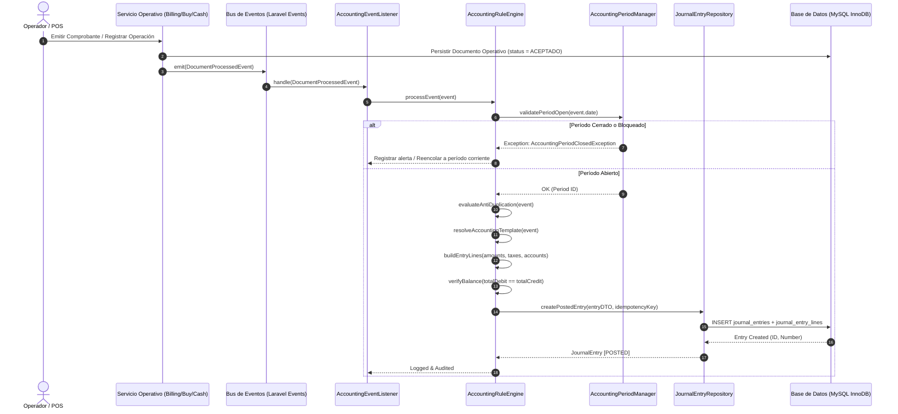

# DISEÑO DE ARQUITECTURA: MÓDULO DE CONTABILIDAD Y TESORERÍA INTEGRAL (ERP-FVC)
**Documento Técnico de Diseño de Arquitectura (Block B0)**  
**Versión:** 1.0  
**Fecha:** Octubre 2026  
**Sistema:** ERP-FVC (Enterprise Multi-Módulo)  
**Marco Metodológico:** *Requisitos $\rightarrow$ Diseño de Alto Nivel $\rightarrow$ Especificación Detallada $\rightarrow$ Escalabilidad & Confiabilidad $\rightarrow$ Trade-offs y Decisiones Abiertas*

---

## 1. INTRODUCCIÓN Y CONTEXTO DEL SISTEMA

El sistema **ERP-FVC** opera actualmente con un núcleo transaccional comercial, operativo y de trámites que incluye:
- **Frente Comercial y Facturación:** `billings` (Boletas, Facturas, Notas de Crédito, Notas de Débito SUNAT UBL 2.1), `sale_notes` (Notas de Venta internas), `buys` (Compras a proveedores).
- **Frente de Tesorería y Fondos:** `cashes`, `arching_cashes` (Aperturas, arqueos y cierres de caja POS), `fund_sources` (Fuentes de financiamiento: Banco de la Nación, Cooperativa Tocache, Caja Chica, CUT).
- **Frente APE y RDR:** `activity_transactions` (Ingresos y egresos clasificados por actividad productiva/centro de costo), `rdr_cut_transfers` (Transferencias a la Cuenta Única del Tesoro), `rdr_internal_loans` (Préstamos internos y habilitaciones de viáticos), `rdr_bank_reconciliations` (Conciliaciones bancarias mensuales), `activity_period_closures` (Cierres mensuales de actividad).
- **Frente de Gobernanza Institucional:** `DocumentApprovalService` (Flujo jerárquico dinámico con firma digital y tokens criptográficos).

### Diagnóstico de Brecha
A la fecha, el ERP registra transacciones operativas y financieras, pero **carece de un motor contable por partida doble**: no existen catálogo de cuentas (PCGE), asientos contables (`journal_entries`), libro diario, libro mayor, ni balances financieros automatizados.

El objetivo del presente diseño es dotar al ERP-FVC de un **Módulo de Contabilidad y Tesorería Corporativa** que enlace de forma desacoplada, automática e inmutable todas las operaciones del negocio con los libros contables oficiales y los estados financieros.

---

## 2. REQUISITOS DEL SISTEMA

### 2.1 Requisitos Funcionales (RF)

1. **Catálogo de Cuentas Jerárquico (PCGE 2019):**
   - Estructura normalizada en elementos (1 dígito), cuentas (2 dígitos), subcuentas (3 dígitos), divisionarias (4 dígitos) y subdivisionarias (5+ dígitos).
   - Control de imputabilidad (`allows_movement`): únicamente las cuentas hoja pueden recibir movimientos contables.
   - Atributos auxiliares obligatorios: requiere tercero (RUC/DNI), requiere centro de costo (actividad productiva), requiere fuente de financiamiento / banco.

2. **Motor de Asientos Contables Automatizados (`AccountingRuleEngine`):**
   - Generación de asientos automáticos ante eventos operativos: emisión de comprobantes de venta, notas de venta, notas de crédito/débito, cobranzas, compras, pagos a proveedores, transferencias CUT, préstamos internos y movimientos de caja.
   - Soporte de asientos contables manuales (apertura, ajustes, provisiones de depreciación, cierre).
   - Asientos de naturaleza por función y por destino (Elementos 6, 7 y 9 del PCGE).

3. **Inmutabilidad y Trazabilidad Estricta:**
   - Todo asiento asentado (`POSTED`) es estrictamente inmutable. Queda prohibida la edición o eliminación física (`UPDATE`/`DELETE`) de asientos asentados.
   - Mecanismo exclusivo de corrección mediante **Asientos de Extorno / Reversión** (`REVERSAL`) con referencia cruzada bidireccional.

4. **Gestión de Períodos Contables y Cierres:**
   - Ejercicios anuales divididos en 12 períodos mensuales más períodos especiales (Período 00: Apertura, Período 13: Ajustes y Cierre).
   - Estados de período: `OPEN` (Abierto), `SOFT_CLOSED` (Pre-cierre contable), `LOCKED` (Bloqueado/Cerrado definitivo).
   - Bloqueo estricto de inserción de asientos en períodos cerrados o bloqueados.

5. **Tesorería y Conciliación Bancaria Avanzada:**
   - Cuentas bancarias institucionales vinculadas a cuentas contables del PCGE (subcuenta 104/107).
   - Registro de movimientos bancarios (extractos) y conciliación contra movimientos contables.
   - Extensión natural del modelo `rdr_bank_reconciliations` hacia la conciliación bancaria integral de la entidad.

6. **Presupuestos y Ejecución Presupuestal:**
   - Formulación presupuestal anual por centro de costo (actividad productiva) y partida contable/gasto.
   - Control de ejecución presupuestal en tiempo real (Comprometido, Devengado, Girado, Pagado).

7. **Libros y Estados Financieros Oficiales:**
   - Libro Diario (Formato SUNAT 5.1).
   - Libro Mayor (Formato SUNAT 6.1).
   - Balance de Comprobación (Hoja de Trabajo de 10 y 12 columnas).
   - Estado de Situación Financiera (Balance General).
   - Estado de Resultados (por Función y por Naturaleza).
   - Estado de Flujos de Efectivo (Método Directo e Indirecto).

---

### 2.2 Requisitos No Funcionales (RNF)

1. **Principio de Cuadratura Universal (Partida Doble Absoluta):**
   - Invariante matemática inquebrantable:
     $$\sum \text{Débito} = \sum \text{Crédito}$$
   - Verificación multinivel: validación en capa de aplicación (Servicio), verificación en transacción atómica de base de datos (`DB::transaction`) y trigger/constraint de base de datos.
   - Manejo de precisión numérica fija: `DECIMAL(18,2)` para moneda nacional (PEN) y cálculo de contravalor `DECIMAL(18,4)` con tipo de cambio oficial SUNAT.

2. **Idempotencia Estricta de Integración:**
   - Toda generación de asiento originada por un evento del sistema debe ser estrictamente idempotente para tolerar reintentos de red, colas o ejecuciones duplicadas sin duplicar la contabilidad.
   - Clave única de idempotencia en base de datos:
     $$\text{idempotency\_key} = \text{MD5}(\text{source\_type} + \text{source\_id} + \text{action} + \text{version})$$

3. **Auditabilidad Completa (SOX / Contraloría Ready):**
   - Trazabilidad integral de cada línea de asiento: usuario creador (`created_by_user_id`), usuario que asienta (`posted_by_user_id`), timestamp de asentado (`posted_at`), IP de origen, User-Agent, y enlace polimórfico al comprobante original.

4. **Rendimiento y Tolerancia a Alta Concurrencia:**
   - Generación de asientos en segundo plano (Event-driven / Queued jobs) sin penalizar la latencia del POS comercial (<200 ms en mostrador).
   - Indexación compuesta optimizada para balances y mayores contables.

---

## 3. DISEÑO DE ALTO NIVEL (COMPONENTES Y FLUJO DE DATOS)

### 3.1 Arquitectura de Componentes

```
+---------------------------------------------------------------------------------------------------------+
|                                      CAPA TRANSACCIONAL OPERATIVA                                       |
|   [Billings / FE]      [SaleNotes / POS]      [Buys / Compras]     [ArchingCash / Caja]   [APE / RDR]  |
+---------------------------------------------------------------------------------------------------------+
                                                     |
                                                     | (Dispara Evento de Dominio)
                                                     v
+---------------------------------------------------------------------------------------------------------+
|                                      CAPA DE INTEGRACIÓN Y EVENTOS                                      |
|    InvoiceIssuedEvent   SaleNoteCreatedEvent   BuyRegisteredEvent   CashSessionClosed   CutTransferEvent|
+---------------------------------------------------------------------------------------------------------+
                                                     |
                                                     v
+---------------------------------------------------------------------------------------------------------+
|                                        ACCOUNTING RULE ENGINE                                           |
|   1. Anti-Duplication Filter: Verifica si el evento ya fue contabilizado o es un proxy APE             |
|   2. Rule Resolver: Mapea (Tipo Documento, Tipo Operación, Medio Pago, Centro Costo, Impuestos)        |
|   3. Balance Checker: Verifica que Sum(Debe) == Sum(Haber) y Tipo de Cambio SUNAT                        |
+---------------------------------------------------------------------------------------------------------+
                                                     |
                                                     v (Genera Asiento)
+---------------------------------------------------------------------------------------------------------+
|                                         MOTOR DE LIBRO MAYOR                                            |
|   [journal_entries] (Cabecera inmutable + Idempotency Key)                                               |
|   [journal_entry_lines] (Cuentas PCGE, Debe/Haber, Tercero, Centro Costo, Fuente Financiamiento)         |
+---------------------------------------------------------------------------------------------------------+
                                                     |
                                                     v
+---------------------------------------------------------------------------------------------------------+
|                                    LIBROS Y REPORTES FINANCIEROS                                        |
|   [Libro Diario 5.1]     [Libro Mayor 6.1]     [Balance Comprobación]     [Estados Financieros EEFF]    |
+---------------------------------------------------------------------------------------------------------+
```

### 3.2 Diagrama de Secuencia del Flujo Contable (Mermaid)



---

## 4. ESPECIFICACIÓN DETALLADA DEL MODELO DE DATOS

A continuación se detalla el esquema relacional con sus campos, tipos de datos, claves primarias, foráneas, restricciones de unicidad e índices para garantizar integridad referencial y alto rendimiento.

```
                      +----------------------+
                      |  accounting_periods  |
                      +----------------------+
                                 | 1
                                 |
                                 | n
+---------------------+ 1    n +----------------------+ 1      n +----------------------+
|  chart_of_accounts  |--------|   journal_entries    |---------|  journal_entry_lines   |
+---------------------+        +----------------------+         +----------------------+
                                         | 1                               | n
                                         |                                 |
                                         | 1 (Extorno)                     |
                                         +------------------+              |
                                                            |              |
+---------------------+ n        1 +-------------------+    |              |
|  budget_lines       |------------|  budgets          |    |              |
+---------------------+            +-------------------+    |              |
                                                            |              |
+---------------------+ 1        n +-------------------+    |              |
|  bank_accounts      |------------|  bank_movements   |    |              |
+---------------------+            +-------------------+    |              |
           | 1                               | n            |              |
           |                                 |              |              |
           | 1                               v              |              |
           |                    +----------------------+    |              |
           +--------------------| bank_reconciliations |    |              |
                                +----------------------+    |              |
                                                            |              |
+---------------------+                                     |              |
|  accounting_rules   | (Reglas y plantillas dinámicas)     |              |
+---------------------+                                     |              |
                                                            v              v
                                             [Polymorphic Source: Billings, Buys,
                                              SaleNotes, Cashes, RdrTransfers]
                                             [CostCenter: productive_activities]
                                             [FundSource: fund_sources]
```

---

### 4.1 Entidades Nucleares

#### 1. `accounting_periods` (Períodos Contables)
Gestiona los ejercicios fiscales y el control de apertura/cierre contable mensual y anual.
```sql
CREATE TABLE `accounting_periods` (
  `id` BIGINT UNSIGNED AUTO_INCREMENT PRIMARY KEY,
  `fiscal_year` INT NOT NULL COMMENT 'Año fiscal (ej. 2026)',
  `month` INT NOT NULL COMMENT 'Mes (1 a 12, 0=Apertura, 13=Cierre)',
  `period_code` VARCHAR(10) NOT NULL UNIQUE COMMENT 'Formato YYYY-MM (ej. 2026-10, 2026-00)',
  `start_date` DATE NOT NULL,
  `end_date` DATE NOT NULL,
  `status` ENUM('OPEN', 'SOFT_CLOSED', 'LOCKED') NOT NULL DEFAULT 'OPEN',
  `closed_by_user_id` INT NULL,
  `closed_at` TIMESTAMP NULL,
  `reopened_by_user_id` INT NULL,
  `reopened_at` TIMESTAMP NULL,
  `notes` TEXT NULL,
  `created_at` TIMESTAMP NULL DEFAULT CURRENT_TIMESTAMP,
  `updated_at` TIMESTAMP NULL DEFAULT CURRENT_TIMESTAMP ON UPDATE CURRENT_TIMESTAMP,
  CONSTRAINT `fk_period_closed_user` FOREIGN KEY (`closed_by_user_id`) REFERENCES `users` (`id`),
  CONSTRAINT `fk_period_reopened_user` FOREIGN KEY (`reopened_by_user_id`) REFERENCES `users` (`id`),
  INDEX `idx_periods_lookup` (`fiscal_year`, `month`, `status`)
) ENGINE=InnoDB DEFAULT CHARSET=utf8mb4 COLLATE=utf8mb4_unicode_ci;
```

#### 2. `chart_of_accounts` (Plan Contable General Empresarial - PCGE)
Catálogo contable normalizado oficial para el registro contable en Perú.
```sql
CREATE TABLE `chart_of_accounts` (
  `id` BIGINT UNSIGNED AUTO_INCREMENT PRIMARY KEY,
  `code` VARCHAR(20) NOT NULL UNIQUE COMMENT 'Código contable oficial (ej. 101, 10411, 1212, 40111, 6011, 70111)',
  `name` VARCHAR(255) NOT NULL COMMENT 'Denominación de la cuenta',
  `element` TINYINT NOT NULL COMMENT 'Elemento del PCGE (1 al 9 y 0)',
  `level` TINYINT NOT NULL COMMENT 'Nivel: 1=Elemento, 2=Cuenta, 3=Subcuenta, 4=Divisionaria, 5=Subdivisionaria',
  `nature` ENUM('DEBIT', 'CREDIT') NOT NULL COMMENT 'Naturaleza saldo deudor o acreedor',
  `classification` ENUM('ACTIVO', 'PASIVO', 'PATRIMONIO', 'GASTOS_NATURALEZA', 'INGRESOS', 'COSTOS_PRODUCCION', 'GASTOS_FUNCION', 'ORDEN') NOT NULL,
  `allows_movement` BOOLEAN NOT NULL DEFAULT FALSE COMMENT 'TRUE si es cuenta de último nivel imputable',
  `requires_third_party` BOOLEAN NOT NULL DEFAULT FALSE COMMENT 'Exige RUC/DNI del cliente o proveedor',
  `requires_cost_center` BOOLEAN NOT NULL DEFAULT FALSE COMMENT 'Exige asignación a Actividad Productiva',
  `requires_fund_source` BOOLEAN NOT NULL DEFAULT FALSE COMMENT 'Exige asignación de cuenta/banco',
  `currency` VARCHAR(3) NOT NULL DEFAULT 'PEN' COMMENT 'PEN o USD',
  `parent_id` BIGINT UNSIGNED NULL COMMENT 'Jerarquía árbol contable',
  `is_active` BOOLEAN NOT NULL DEFAULT TRUE,
  `created_at` TIMESTAMP NULL DEFAULT CURRENT_TIMESTAMP,
  `updated_at` TIMESTAMP NULL DEFAULT CURRENT_TIMESTAMP ON UPDATE CURRENT_TIMESTAMP,
  CONSTRAINT `fk_chart_parent` FOREIGN KEY (`parent_id`) REFERENCES `chart_of_accounts` (`id`) ON DELETE RESTRICT,
  INDEX `idx_account_code_search` (`code`, `allows_movement`),
  INDEX `idx_account_element` (`element`, `classification`)
) ENGINE=InnoDB DEFAULT CHARSET=utf8mb4 COLLATE=utf8mb4_unicode_ci;
```

#### 3. `journal_entries` (Cabecera de Asientos Contables)
Representa el asiento formal en el Libro Diario.
```sql
CREATE TABLE `journal_entries` (
  `id` BIGINT UNSIGNED AUTO_INCREMENT PRIMARY KEY,
  `uuid` CHAR(36) NOT NULL UNIQUE,
  `accounting_period_id` BIGINT UNSIGNED NOT NULL,
  `entry_number` VARCHAR(30) NOT NULL COMMENT 'Correlativo del asiento en el período (ej. 2026-10-000045)',
  `entry_date` DATE NOT NULL COMMENT 'Fecha del devengo contable',
  `entry_type` ENUM('OPENING', 'OPERATING', 'ADJUSTMENT', 'CLOSING', 'REVERSAL') NOT NULL DEFAULT 'OPERATING',
  `concept` VARCHAR(500) NOT NULL COMMENT 'Glosa principal del asiento contable',
  `currency` VARCHAR(3) NOT NULL DEFAULT 'PEN',
  `exchange_rate` DECIMAL(10,4) NOT NULL DEFAULT 1.0000 COMMENT 'Tipo de cambio venta/compra SUNAT',
  `total_debit` DECIMAL(18,2) NOT NULL DEFAULT 0.00,
  `total_credit` DECIMAL(18,2) NOT NULL DEFAULT 0.00,
  `status` ENUM('DRAFT', 'POSTED', 'REVERSED') NOT NULL DEFAULT 'POSTED',
  
  -- Origen Polimórfico (Trazabilidad al núcleo comercial/operativo)
  `source_type` VARCHAR(100) NULL COMMENT 'Modelo origen (App\\Models\\Billing, Buy, SaleNote, etc.)',
  `source_id` BIGINT UNSIGNED NULL COMMENT 'ID del registro en el modelo origen',
  
  -- Idempotencia estricta
  `idempotency_key` VARCHAR(100) NOT NULL UNIQUE COMMENT 'Hash único del evento para prevenir duplicados',
  
  -- Reversión / Extorno
  `reversed_by_entry_id` BIGINT UNSIGNED NULL COMMENT 'ID del asiento que reversa al actual',
  `reverses_entry_id` BIGINT UNSIGNED NULL COMMENT 'ID del asiento original revertido',
  
  -- Auditoría
  `created_by_user_id` INT NOT NULL,
  `posted_by_user_id` INT NOT NULL,
  `posted_at` TIMESTAMP NOT NULL DEFAULT CURRENT_TIMESTAMP,
  `created_at` TIMESTAMP NULL DEFAULT CURRENT_TIMESTAMP,
  `updated_at` TIMESTAMP NULL DEFAULT CURRENT_TIMESTAMP ON UPDATE CURRENT_TIMESTAMP,
  
  CONSTRAINT `fk_entry_period` FOREIGN KEY (`accounting_period_id`) REFERENCES `accounting_periods` (`id`) ON DELETE RESTRICT,
  CONSTRAINT `fk_entry_creator` FOREIGN KEY (`created_by_user_id`) REFERENCES `users` (`id`),
  CONSTRAINT `fk_entry_poster` FOREIGN KEY (`posted_by_user_id`) REFERENCES `users` (`id`),
  CONSTRAINT `fk_entry_reversed_by` FOREIGN KEY (`reversed_by_entry_id`) REFERENCES `journal_entries` (`id`),
  CONSTRAINT `fk_entry_reverses` FOREIGN KEY (`reverses_entry_id`) REFERENCES `journal_entries` (`id`),
  
  INDEX `idx_journal_period_date` (`accounting_period_id`, `entry_date`),
  INDEX `idx_journal_source` (`source_type`, `source_id`),
  INDEX `idx_journal_status` (`status`)
) ENGINE=InnoDB DEFAULT CHARSET=utf8mb4 COLLATE=utf8mb4_unicode_ci;
```

#### 4. `journal_entry_lines` (Líneas / Detalle del Asiento)
Detalle del débito y crédito por cuenta contable, con dimensiones analíticas de gestión.
```sql
CREATE TABLE `journal_entry_lines` (
  `id` BIGINT UNSIGNED AUTO_INCREMENT PRIMARY KEY,
  `journal_entry_id` BIGINT UNSIGNED NOT NULL,
  `line_number` INT NOT NULL COMMENT 'Secuencia ordinal 1, 2, 3...',
  `account_id` BIGINT UNSIGNED NOT NULL COMMENT 'Cuenta PCGE imputable',
  
  -- Importes en Moneda Nacional
  `debit` DECIMAL(18,2) NOT NULL DEFAULT 0.00,
  `credit` DECIMAL(18,2) NOT NULL DEFAULT 0.00,
  
  -- Contravalor en Moneda Extranjera (USD)
  `debit_usd` DECIMAL(18,4) NOT NULL DEFAULT 0.0000,
  `credit_usd` DECIMAL(18,4) NOT NULL DEFAULT 0.0000,
  
  `glosa` VARCHAR(255) NULL COMMENT 'Glosa específica de la línea',
  
  -- Dimensiones Analíticas
  `third_party_type` VARCHAR(50) NULL COMMENT 'clients, providers, users',
  `third_party_id` BIGINT UNSIGNED NULL COMMENT 'ID del tercero asociado',
  `third_party_document` VARCHAR(20) NULL COMMENT 'RUC o DNI denormalizado para reportería rápida',
  
  `cost_center_id` BIGINT UNSIGNED NULL COMMENT 'FK hacia productive_activities.id',
  `fund_source_id` BIGINT UNSIGNED NULL COMMENT 'FK hacia fund_sources.id',
  `bank_account_id` BIGINT UNSIGNED NULL COMMENT 'FK hacia bank_accounts.id (si afecta tesorería)',
  `document_reference` VARCHAR(50) NULL COMMENT 'Serie-Correlativo del comprobante que respalda la línea',
  
  `created_at` TIMESTAMP NULL DEFAULT CURRENT_TIMESTAMP,
  `updated_at` TIMESTAMP NULL DEFAULT CURRENT_TIMESTAMP ON UPDATE CURRENT_TIMESTAMP,
  
  CONSTRAINT `fk_line_entry` FOREIGN KEY (`journal_entry_id`) REFERENCES `journal_entries` (`id`) ON DELETE CASCADE,
  CONSTRAINT `fk_line_account` FOREIGN KEY (`account_id`) REFERENCES `chart_of_accounts` (`id`) ON DELETE RESTRICT,
  CONSTRAINT `fk_line_cost_center` FOREIGN KEY (`cost_center_id`) REFERENCES `productive_activities` (`id`) ON DELETE RESTRICT,
  CONSTRAINT `fk_line_fund_source` FOREIGN KEY (`fund_source_id`) REFERENCES `fund_sources` (`id`) ON DELETE RESTRICT,
  
  UNIQUE KEY `uk_entry_line_number` (`journal_entry_id`, `line_number`),
  INDEX `idx_line_account_period` (`account_id`, `journal_entry_id`),
  INDEX `idx_line_cost_center` (`cost_center_id`),
  INDEX `idx_line_fund_source` (`fund_source_id`),
  INDEX `idx_line_third_party` (`third_party_type`, `third_party_id`)
) ENGINE=InnoDB DEFAULT CHARSET=utf8mb4 COLLATE=utf8mb4_unicode_ci;
```

#### 5. `accounting_rules` (Motor de Reglas y Plantillas Dinámicas)
Mapea eventos del ERP con cuentas contables y comportamientos por defecto.
```sql
CREATE TABLE `accounting_rules` (
  `id` BIGINT UNSIGNED AUTO_INCREMENT PRIMARY KEY,
  `event_code` VARCHAR(50) NOT NULL COMMENT 'SALE_BILLING, SALE_NOTE, BUY_INVOICE, CASH_DEPOSIT, etc.',
  `description` VARCHAR(255) NOT NULL,
  `source_type` VARCHAR(100) NOT NULL,
  `document_type_code` VARCHAR(10) NULL COMMENT '01, 03, 07, 08, 02...',
  `payment_method_id` INT NULL COMMENT 'FK a pay_modes.id',
  
  -- Plantilla JSON de Cuentas y Comportamiento
  `rule_template` JSON NOT NULL COMMENT 'Define esquema Debe/Haber por tipo de impuesto y cuenta',
  
  `is_active` BOOLEAN NOT NULL DEFAULT TRUE,
  `priority` INT NOT NULL DEFAULT 10,
  `created_at` TIMESTAMP NULL DEFAULT CURRENT_TIMESTAMP,
  `updated_at` TIMESTAMP NULL DEFAULT CURRENT_TIMESTAMP ON UPDATE CURRENT_TIMESTAMP,
  
  INDEX `idx_rule_matching` (`event_code`, `document_type_code`, `is_active`)
) ENGINE=InnoDB DEFAULT CHARSET=utf8mb4 COLLATE=utf8mb4_unicode_ci;
```

#### 6. `bank_accounts` (Cuentas Bancarias de Tesorería)
Extiende y formaliza el catálogo bancario vinculado a la contabilidad.
```sql
CREATE TABLE `bank_accounts` (
  `id` BIGINT UNSIGNED AUTO_INCREMENT PRIMARY KEY,
  `fund_source_id` BIGINT UNSIGNED NOT NULL UNIQUE COMMENT 'Enlace 1-a-1 con fund_sources existente',
  `account_number` VARCHAR(50) NOT NULL,
  `cci` VARCHAR(50) NULL,
  `bank_name` VARCHAR(100) NOT NULL,
  `account_type` ENUM('CURRENT', 'SAVINGS', 'CUT', 'COLLECTION') NOT NULL DEFAULT 'CURRENT',
  `currency` VARCHAR(3) NOT NULL DEFAULT 'PEN',
  `accounting_account_id` BIGINT UNSIGNED NOT NULL COMMENT 'Cuenta PCGE 10411, 10412, etc.',
  `initial_balance` DECIMAL(18,2) NOT NULL DEFAULT 0.00,
  `current_balance` DECIMAL(18,2) NOT NULL DEFAULT 0.00,
  `is_active` BOOLEAN NOT NULL DEFAULT TRUE,
  `created_at` TIMESTAMP NULL DEFAULT CURRENT_TIMESTAMP,
  `updated_at` TIMESTAMP NULL DEFAULT CURRENT_TIMESTAMP ON UPDATE CURRENT_TIMESTAMP,
  CONSTRAINT `fk_bank_fund_source` FOREIGN KEY (`fund_source_id`) REFERENCES `fund_sources` (`id`) ON DELETE RESTRICT,
  CONSTRAINT `fk_bank_account_pcge` FOREIGN KEY (`accounting_account_id`) REFERENCES `chart_of_accounts` (`id`) ON DELETE RESTRICT
) ENGINE=InnoDB DEFAULT CHARSET=utf8mb4 COLLATE=utf8mb4_unicode_ci;
```

#### 7. `bank_movements` (Movimientos de Extracto Bancario)
Registro individual de cargos y abonos en cuentas bancarias.
```sql
CREATE TABLE `bank_movements` (
  `id` BIGINT UNSIGNED AUTO_INCREMENT PRIMARY KEY,
  `bank_account_id` BIGINT UNSIGNED NOT NULL,
  `movement_date` DATE NOT NULL,
  `operation_number` VARCHAR(50) NOT NULL COMMENT 'N° Operación bancaria / Voucher',
  `movement_type` ENUM('INFLOW', 'OUTFLOW') NOT NULL,
  `amount` DECIMAL(18,2) NOT NULL,
  `concept` VARCHAR(255) NOT NULL,
  `reconciliation_status` ENUM('PENDING', 'RECONCILED', 'DISCREPANCY') NOT NULL DEFAULT 'PENDING',
  `journal_entry_id` BIGINT UNSIGNED NULL COMMENT 'Asiento contable asociado',
  `created_at` TIMESTAMP NULL DEFAULT CURRENT_TIMESTAMP,
  `updated_at` TIMESTAMP NULL DEFAULT CURRENT_TIMESTAMP ON UPDATE CURRENT_TIMESTAMP,
  CONSTRAINT `fk_mov_bank_acc` FOREIGN KEY (`bank_account_id`) REFERENCES `bank_accounts` (`id`) ON DELETE RESTRICT,
  CONSTRAINT `fk_mov_journal_entry` FOREIGN KEY (`journal_entry_id`) REFERENCES `journal_entries` (`id`) ON DELETE SET NULL,
  INDEX `idx_bank_mov_search` (`bank_account_id`, `movement_date`, `reconciliation_status`)
) ENGINE=InnoDB DEFAULT CHARSET=utf8mb4 COLLATE=utf8mb4_unicode_ci;
```

#### 8. `bank_reconciliations` (Conciliación Bancaria Integral)
Extiende el modelo `rdr_bank_reconciliations` permitiendo conciliar cualquier cuenta bancaria o caja.
```sql
CREATE TABLE `bank_reconciliations` (
  `id` BIGINT UNSIGNED AUTO_INCREMENT PRIMARY KEY,
  `uuid` CHAR(36) NOT NULL UNIQUE,
  `bank_account_id` BIGINT UNSIGNED NOT NULL,
  `accounting_period_id` BIGINT UNSIGNED NOT NULL,
  `statement_closing_date` DATE NOT NULL,
  `bank_statement_balance` DECIMAL(18,2) NOT NULL COMMENT 'Saldo según extracto bancario físico',
  `book_calculated_balance` DECIMAL(18,2) NOT NULL COMMENT 'Saldo contable en Libro Mayor (cta 104)',
  `uncredited_deposits` DECIMAL(18,2) NOT NULL DEFAULT 0.00 COMMENT 'Depósitos en tránsito (+)',
  `outstanding_checks` DECIMAL(18,2) NOT NULL DEFAULT 0.00 COMMENT 'Cheques no cobrados (-)',
  `unrecorded_bank_charges` DECIMAL(18,2) NOT NULL DEFAULT 0.00 COMMENT 'Cargos bancarios no registrados (-)',
  `reconciled_difference` DECIMAL(18,2) NOT NULL DEFAULT 0.00 COMMENT 'Debe tender a 0.00',
  `status` ENUM('DRAFT', 'SUBMITTED', 'APPROVED', 'REJECTED') NOT NULL DEFAULT 'DRAFT',
  `reconciled_by_user_id` INT NOT NULL,
  `approved_by_user_id` INT NULL,
  `notes` TEXT NULL,
  `created_at` TIMESTAMP NULL DEFAULT CURRENT_TIMESTAMP,
  `updated_at` TIMESTAMP NULL DEFAULT CURRENT_TIMESTAMP ON UPDATE CURRENT_TIMESTAMP,
  CONSTRAINT `fk_rec_bank_acc` FOREIGN KEY (`bank_account_id`) REFERENCES `bank_accounts` (`id`) ON DELETE RESTRICT,
  CONSTRAINT `fk_rec_period` FOREIGN KEY (`accounting_period_id`) REFERENCES `accounting_periods` (`id`) ON DELETE RESTRICT,
  CONSTRAINT `fk_rec_user` FOREIGN KEY (`reconciled_by_user_id`) REFERENCES `users` (`id`),
  INDEX `idx_rec_period_acc` (`bank_account_id`, `accounting_period_id`)
) ENGINE=InnoDB DEFAULT CHARSET=utf8mb4 COLLATE=utf8mb4_unicode_ci;
```

#### 9. `budgets` y `budget_lines` (Control Presupuestal)
Articulación del presupuesto anual asignado a las Actividades Productivas.
```sql
CREATE TABLE `budgets` (
  `id` BIGINT UNSIGNED AUTO_INCREMENT PRIMARY KEY,
  `fiscal_year` INT NOT NULL,
  `productive_activity_id` BIGINT UNSIGNED NOT NULL,
  `title` VARCHAR(255) NOT NULL,
  `total_budget_income` DECIMAL(18,2) NOT NULL DEFAULT 0.00,
  `total_budget_expense` DECIMAL(18,2) NOT NULL DEFAULT 0.00,
  `status` ENUM('DRAFT', 'APPROVED', 'IN_EXECUTION', 'CLOSED') NOT NULL DEFAULT 'DRAFT',
  `approved_by_user_id` INT NULL,
  `approved_at` TIMESTAMP NULL,
  `created_at` TIMESTAMP NULL DEFAULT CURRENT_TIMESTAMP,
  `updated_at` TIMESTAMP NULL DEFAULT CURRENT_TIMESTAMP ON UPDATE CURRENT_TIMESTAMP,
  CONSTRAINT `fk_budget_activity` FOREIGN KEY (`productive_activity_id`) REFERENCES `productive_activities` (`id`) ON DELETE RESTRICT,
  UNIQUE KEY `uk_budget_activity_year` (`fiscal_year`, `productive_activity_id`)
) ENGINE=InnoDB DEFAULT CHARSET=utf8mb4 COLLATE=utf8mb4_unicode_ci;

CREATE TABLE `budget_lines` (
  `id` BIGINT UNSIGNED AUTO_INCREMENT PRIMARY KEY,
  `budget_id` BIGINT UNSIGNED NOT NULL,
  `account_id` BIGINT UNSIGNED NOT NULL COMMENT 'Cuenta PCGE vinculada',
  `month` TINYINT NOT NULL COMMENT 'Mes de ejecución (1-12)',
  `planned_amount` DECIMAL(18,2) NOT NULL DEFAULT 0.00,
  `executed_amount` DECIMAL(18,2) NOT NULL DEFAULT 0.00,
  `created_at` TIMESTAMP NULL DEFAULT CURRENT_TIMESTAMP,
  `updated_at` TIMESTAMP NULL DEFAULT CURRENT_TIMESTAMP ON UPDATE CURRENT_TIMESTAMP,
  CONSTRAINT `fk_budget_line_parent` FOREIGN KEY (`budget_id`) REFERENCES `budgets` (`id`) ON DELETE CASCADE,
  CONSTRAINT `fk_budget_line_acc` FOREIGN KEY (`account_id`) REFERENCES `chart_of_accounts` (`id`) ON DELETE RESTRICT,
  UNIQUE KEY `uk_budget_line_item` (`budget_id`, `account_id`, `month`)
) ENGINE=InnoDB DEFAULT CHARSET=utf8mb4 COLLATE=utf8mb4_unicode_ci;
```

---

## 5. MATRIZ DE ASINTOS TIPO (EVENTO $\rightarrow$ ASIENTO PCGE 2019)

A continuación se documentan las dinámicas contables estandarizadas según el Plan Contable General Empresarial (PCGE 2019 modificado) para cada evento operativo del ERP-FVC:

| Evento Operativo | Código Documento | Cuentas en el DEBE | Cuentas en el HABER | Glosa y Reglas de Negocio |
| :--- | :--- | :--- | :--- | :--- |
| **Venta con Factura / Boleta** | `01`, `03` | **1212** Emitidas en cartera (Total) | **40111** IGV - Cuenta propia (18%)<br>**70111** Venta de mercaderías (Base)<br>*(o 702/704 si es producto agropecuario o servicio)* | Provisión de venta comercial. Si la actividad productiva está vinculada, se asocia el `cost_center_id`. |
| **Venta con Nota de Venta** | `02` (Interno) | **1219** Otras facturas por cobrar | **70111** Venta de mercaderías | Venta interna en régimen APE. Sin afectación de IGV tributario fiscal hasta su canje o liquidación. |
| **Canje de Nota de Venta a Factura/Boleta** | Canje `02` $\rightarrow$ `01/03` | **1212** Facturas emitidas (Total Comprobante)<br>**70111** Reversión nota interna | **1219** Cancelación Nota de Venta<br>**40111** IGV Fiscal<br>**70111** Venta fiscal definitiva | Neutraliza la nota de venta y formaliza la venta electrónica SUNAT sin duplicar ingreso. |
| **Nota de Crédito (Anulación / Descuento)** | `07` | **70111** Ventas (Descuento/Devolución)<br>**40111** IGV (Débito Fiscal revertido) | **1212** Facturas emitidas en cartera | Reversión total o parcial de venta. Reduce la cuenta por cobrar y el débito fiscal. |
| **Nota de Débito (Interés / Penalidad)** | `08` | **1212** Facturas por cobrar | **40111** IGV Cuenta propia<br>**772** Rendimientos financieros ganados | Incrementa la cuenta por cobrar y reconoce ingresos financieros. |
| **Cobranza en Mostrador (Efectivo)** | Pago POS | **101** Caja Principal / Caja Chica | **1212** Facturas por cobrar *(o 1219 si fue NV)* | Cancelación inmediata de venta al contado. |
| **Cobranza en Mostrador (Yape / Plin / Tarjeta)** | Pago POS | **10411** Banco de la Nación *(o 1031 Efectivo en tránsito si es POS Niubiz)* | **1212** Facturas por cobrar | Ingreso en cuenta bancaria de recaudación institucional. |
| **Compra a Proveedor (Factura/Boleta)** | `01`, `03` | **6011** Mercaderías / **602** Materias Primas<br>**40111** IGV Crédito Fiscal (18%) | **4212** Facturas emitidas por pagar | Asiento de naturaleza de compras. |
| **Destino de Compra al Almacén** | N/A (Automático) | **20111** Mercaderías en almacén *(o 241 Materias Primas)* | **6111** Variación de existencias | Asiento de destino contable por inventario permanente valorizado. |
| **Pago a Proveedor** | Egreso Tesorería | **4212** Proveedores por pagar | **10411** Cta. Cte. Banco *(o 101 Caja)* | Cancelación de pasivo comercial mediante transferencia o efectivo. |
| **Apertura de Caja (Fondo Fijo)** | `ArchingCash` | **102** Fondos Fijos (Cajero) | **101** Caja Central | Asignación de saldo inicial de apertura para vueltos. |
| **Cierre de Caja: Faltante** | `ArchingCash` | **101** Caja Recaudada<br>**1629** Otras cuentas cobrar a personal | **1212/1219** Cobranzas del turno | Se registra cuenta por cobrar al cajero por el monto faltante determinado en arqueo. |
| **Cierre de Caja: Sobrante** | `ArchingCash` | **101** Caja Recaudada | **1212/1219** Cobranzas del turno<br>**7599** Otros ingresos de gestión | El sobrante no justificado se reconoce como ingreso extraordinario. |
| **Transferencia a la CUT (RDR)** | `rdr_cut_transfers` | **1071** Fondos Sujetos a Restricción (CUT) | **10411** Cta. Cte. Operativa (Banco Nación) | Traslado formal de Recursos Directamente Recaudados a la Cuenta Única del Tesoro. |
| **Préstamo Interno / Viáticos APE** | `rdr_internal_loans` | **1413** Préstamos al personal / Rendiciones | **10411** Banco Nación *(o 101)* | Desembolso de fondos para ejecución de actividad productiva en campo. |
| **Rendición / Devolución Préstamo** | Repayment | **63** Servicios Terceros / **60** Insumos<br>**101/104** Devolución remanente efectivo | **1413** Cancelación del préstamo interno | Liquidación de gastos de campo documentados con facturas/recibos. |
| **Ingreso Directo APE (Sin Comprobante Core)** | `activity_transactions` | **101/104** Caja / Banco de la Actividad | **759** Otros ingresos de gestión (con `cost_center_id`) | Ingreso directo sustentado en recibo interno o donación. |
| **Gasto Directo APE (Declaración Jurada)** | `activity_transactions` | **659** Otros gastos de gestión | **101/104** Caja / Banco de la Actividad | Gastos operativos menores de campo bajo Declaración Jurada institucional. |
| **Extorno / Anulación de Operación** | Reversal | Asiento idéntico al original invirtiendo signos o cuentas con glosa "EXTORNO OPERACIÓN..." | Asiento idéntico al original invirtiendo signos o cuentas | Reversión inmutable con enlace a `reversed_by_entry_id`. |

---

## 6. REGLA ANTI-DUPLICIDAD: `ActivityTransaction` VS COMPROBANTES CORE

### 6.1 Problema Identificado en el Modelo Actual
En el ERP-FVC, una actividad productiva (APE) puede registrar transacciones de dos maneras:
1. **Flujo Integrado Core:** Se emite una Factura/Boleta (`billings`) en el POS comercial, o se registra una Compra a proveedor (`buys`), y simultáneamente el operador vincula esta operación a la actividad productiva mediante `activity_transactions.billing_id` o `activity_transactions.buy_id`.
2. **Flujo Autónomo de Campo:** Se registra un ingreso o gasto directo en `activity_transactions` (ej. jornal de cosecha en campo con Declaración Jurada) que no pasa por el módulo de facturación comercial.

Si el motor contable escuchara tanto los eventos de `billings`/`buys` como los de `activity_transactions`, **las ventas, compras, cuentas por cobrar y disponibilidades se contabilizarían dos veces**.

### 6.2 Regla de Oro de Origen Contable Único (Single Accounting Origin Rule)

$$\text{Regla:} \quad \text{Si } (\text{buy\_id} \neq \text{NULL} \lor \text{billing\_id} \neq \text{NULL} \lor \text{sale\_note\_id} \neq \text{NULL}) \implies \text{No generar asiento en } \text{ActivityTransaction}$$

#### Algoritmo de Decisión en el `AccountingRuleEngine`:

```
                 [Evento: Transacción Registrada]
                                |
                                v
               ¿Viene de ActivityTransaction?
                 /                           \
               SÍ                             NO (Viene de Billing, Buy o SaleNote)
               /                               \
    ¿Tiene billing_id,                         Generar Asiento Contable Primario
    buy_id o sale_note_id?                     (Registra Provisión Comercial, IGV
      /             \                           y Tercero Fiscal).
    SÍ               NO                         * Si tiene productive_activity_id,
    /                 \                           asigna cost_center_id en las
IGNORAR               GENERAR ASIENTO             líneas de gasto o ingreso.
ASIENTO PRIMARIO.     CONTABLE PRIMARIO.
(Ya fue generado      (Operación directa
por el comprobante    autónoma de la
comercial core).      actividad APE).
```

### 6.3 Garantías de Integridad a Nivel de Base de Datos y Código
1. **Generación del `idempotency_key`:**
   - Para un `Billing`: `idempotency_key = MD5('billing_' + billing.id + '_posted')`
   - Para un `Buy`: `idempotency_key = MD5('buy_' + buy.id + '_posted')`
   - Para un `SaleNote`: `idempotency_key = MD5('salenote_' + sale_note.id + '_posted')`
   - Para un `ActivityTransaction` **autónomo**: `idempotency_key = MD5('activity_tx_' + tx.id + '_posted')`
   - Si un `ActivityTransaction` contiene `billing_id = 45`, el servicio comprueba que `billing_45` ya tiene asiento contable y **asigna únicamente el `cost_center_id` al asiento existente** si no lo tenía previamente, denegando la creación de un nuevo asiento de ingreso o gasto.

---

## 7. DECISIONES ABIERTAS Y RECOMENDACIONES TÉCNICAS

### 7.1 Decisión 1: PCGE Completo vs. PCGE Reducido
- **Opción A (PCGE Completo):** Cargar la totalidad de subdivisionarias de la Resolución CNC N° 002-2019-EF/30 (~1,500 cuentas).
- **Opción B (PCGE Reducido / Específico):** Cargar únicamente un subconjunto de ~80 cuentas adaptadas a comercio, servicios educativos y agropecuarios.
- **Recomendación de Arquitectura:** **Enfoque Híbrido Jerárquico Activado por Demanda**.
  - Se debe sembrar en base de datos la estructura troncal oficial de elementos (1 al 9), cuentas (2 dígitos) y subcuentas (3 dígitos) para mantener conformidad con la estructura SUNAT.
  - Para los niveles operativos de 4 y 5 dígitos, se debe precargar un **catálogo optimizado de 120 cuentas clave** para el IESTP "FVC" (Caja, Bancos, Clientes, Cuentas por Cobrar RDR, Existencias de Productos Agropecuarios y Transformados, Activos Biológicos, Tributos SUNAT, Proveedores, Capital y Hacienda Nacional, Ingresos de Gestión y Costos de Producción Elemento 9).
  - Permitir al área de Contabilidad dar de alta nuevas subdivisionarias de 5 dígitos mediante UI sin requerir migraciones de código.

---

### 7.2 Decisión 2: Método de Flujos de Efectivo (Directo vs. Indirecto)
- **Opción A (Método Directo):** Muestra directamente las cobranzas a clientes, pagos a proveedores, transferencias CUT y pagos al personal.
- **Opción B (Método Indirecto):** Parte del resultado neto del ejercicio y lo ajusta por depreciaciones, amortizaciones y variaciones del capital de trabajo.
- **Recomendación de Arquitectura:** **Método Directo como Principal Operativo, con conciliación al Indirecto**.
  - Para la gestión diaria y supervisión de fondos de las Actividades Productivas (RDR), el **Método Directo** es mandatorio: coincide de forma 1-a-1 con las conciliaciones de `fund_sources`, extractos de `bank_accounts` y transferencias a la CUT.
  - El sistema estructurará el Estado de Flujos de Efectivo clasificando las líneas de caja/bancos (cuenta 10) según actividades de Operación, Inversión y Financiamiento. Para el cierre anual contable se dispondrá de la Hoja de Conciliación al Método Indirecto a partir del Balance de Comprobación.

---

### 7.3 Decisión 3: Moneda Funcional y Tratamiento de Diferencia de Cambio
- **Contexto:** El 99% de las operaciones del IESTP FVC se realizan en moneda nacional (PEN - Soles). Sin embargo, ciertos insumos especializados, maquinarias o activos pueden cotizarse en Dólares Americanos (USD).
- **Recomendación de Arquitectura:**
  - **Moneda funcional y de presentación única:** **PEN (Soles)**.
  - Las tablas `journal_entries` y `journal_entry_lines` almacenan siempre el valor contable en PEN en `debit` y `credit`, pero incorporan campos auxiliares `currency`, `exchange_rate`, `debit_usd` y `credit_usd`.
  - Integración automatizada con el API de Tipo de Cambio SUNAT (Compra/Venta del día).
  - Al realizarse pagos o cobranzas en fechas distintas a la emisión en moneda extranjera, el motor contable generará automáticamente el asiento por Diferencia de Cambio:
    - Ganancia: Cuenta **776** (Diferencia en cambio ganada).
    - Pérdida: Cuenta **676** (Diferencia en cambio perdida).

---

### 7.4 Decisión 4: ¿El Cierre Contable debe utilizar `DocumentApprovalService`?
- **Contexto:** Actualmente `activity_period_closures` (cierre de actividades RDR) ya utiliza `DocumentApprovalService` con una cadena de 4 firmas:
  1. Responsable del Cierre (Solicitante).
  2. Jefatura de Contabilidad (Auditoría contable).
  3. Jefatura de Administración (Conformidad presupuestal).
  4. Dirección General (Aprobación ejecutiva y firma digital).
- **Recomendación de Arquitectura:** **SÍ, ABSOLUTAMENTE**.
  - El cierre de período contable general (`accounting_periods`) debe registrarse como un documento auditable en `DocumentApprovalService`.
  - **Ciclo de Cierre Propuesto:**
    1. El Contador General ejecuta el precierre: el período pasa a estado `SOFT_CLOSED` (no se admiten nuevas operaciones comerciales; solo asientos de ajuste y provisiones).
    2. Se genera el balance de comprobación preliminar y se somete formalmente a la cadena jerárquica de firmas.
    3. Al firmar la Dirección General (último escalafón con token criptográfico), se disparará un listener que automáticamente:
       - Transiciona el período contable a estado `LOCKED`.
       - Genera el asiento de cierre de cuentas de resultados (Clase 8: Saldos Intermediarios de Gestión) contra la cuenta 89 (Resultado del ejercicio) y cuenta 59 (Resultados acumulados).
       - Genera el asiento de apertura automático en el Período 00 del ejercicio siguiente.

---

## 8. ESCALABILIDAD, CONFIABILIDAD Y EVOLUCIÓN A FUTURO

A medida que el ERP-FVC procese cientos de miles de transacciones anuales, deberán considerarse las siguientes revisiones de ingeniería:

### 8.1 Procesamiento Asíncrono de Asientos (Event Queues)
- **Fase Actual:** Despacho sincrónico dentro de transacciones de base de datos (`DB::transaction`) para garantizar consistencia inmediata en las pruebas y despliegue inicial.
- **Fase de Escala (100,000+ comprobantes/año):** Migrar el `AccountingEventListener` a colas en segundo plano respaldadas por Redis (`implements ShouldQueue`). De este modo, la emisión de boletas en el POS nunca esperará la inserción de las 6 a 8 líneas contables asociadas.

### 8.2 Balances Pre-agregados (Materialized Balances)
- Consultar el Libro Mayor o Balance de Comprobación recalculando la suma de millones de filas en `journal_entry_lines` degradará la base de datos.
- **Solución:** Crear una tabla de agregación mensual de saldos:
  `account_monthly_balances (account_id, period_id, initial_debit, initial_credit, total_debit, total_credit, final_debit, final_credit)`.
  Actualizada mediante triggers o trabajos cron nocturnos para renderizar balances en <50 milisegundos.

### 8.3 Particionamiento de Base de Datos
- Las tablas `journal_entries` y `journal_entry_lines` son candidatas a particionamiento horizontal por rango en MySQL 8:
  `PARTITION BY RANGE (YEAR(entry_date))`
  Garantizando que las consultas del año corriente no escaneen particiones de años fiscales cerrados.

### 8.4 Integración con SUNAT SIRE y Libros Electrónicos (PLE)
- La arquitectura diseñada con códigos PCGE normalizados, fechas de devengo, tipos de documento y RUCs denormalizados permite implementar generadores de archivos TXT para el Programa de Libros Electrónicos (PLE SUNAT 5.1 y 6.1) y consumo del API SIRE (Sistema Integrado de Registros Electrónicos) sin requerir reestructuración de la base de datos.

---

## 9. CONCLUSIÓN Y HOJA DE RUTA DE IMPLEMENTACIÓN

El diseño arquitectónico propuesto para el Módulo de Contabilidad y Tesorería del ERP-FVC:
1. **Respeta y potencia el ecosistema existente:** Se apoya en las fuentes de financiamiento (`fund_sources`), actividades productivas (`productive_activities`), arqueos de caja (`arching_cashes`) y el motor de firmas (`DocumentApprovalService`).
2. **Elimina de raíz el riesgo de duplicidad:** Mediante la regla de origen contable único e idempotencia algorítmica.
3. **Garantiza inmutabilidad y cumplimiento normativo:** Aplica la estricta partida doble del PCGE 2019 con asientos reversibles y períodos auditados.
4. **Prepara al ERP para la siguiente fase de desarrollo (Block B1 en adelante):** Permitiendo implementar las migraciones, modelos, servicios y controladores contables sobre una base sólida y completamente especificada.
