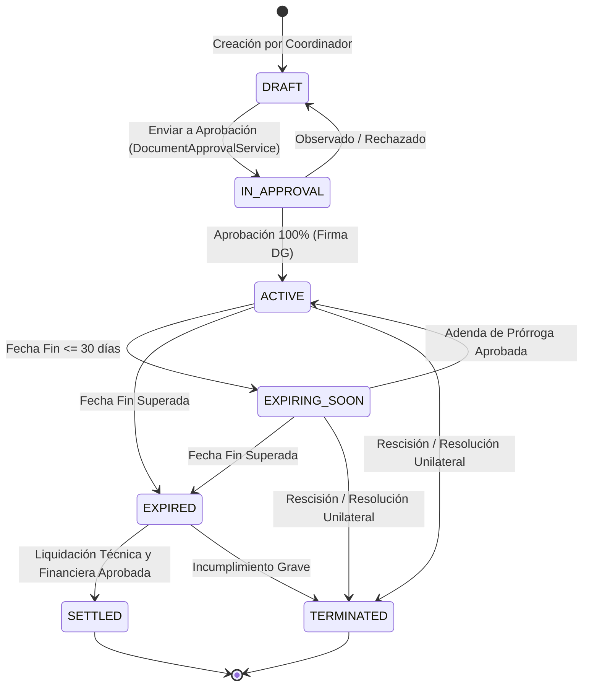
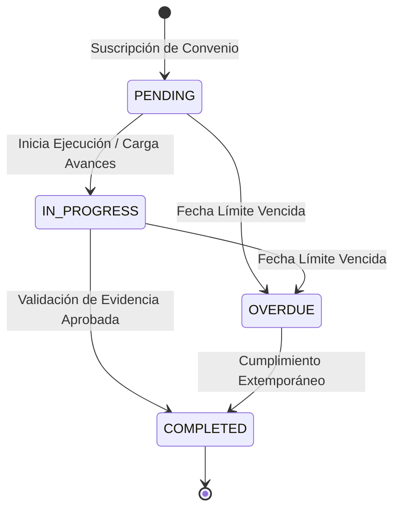
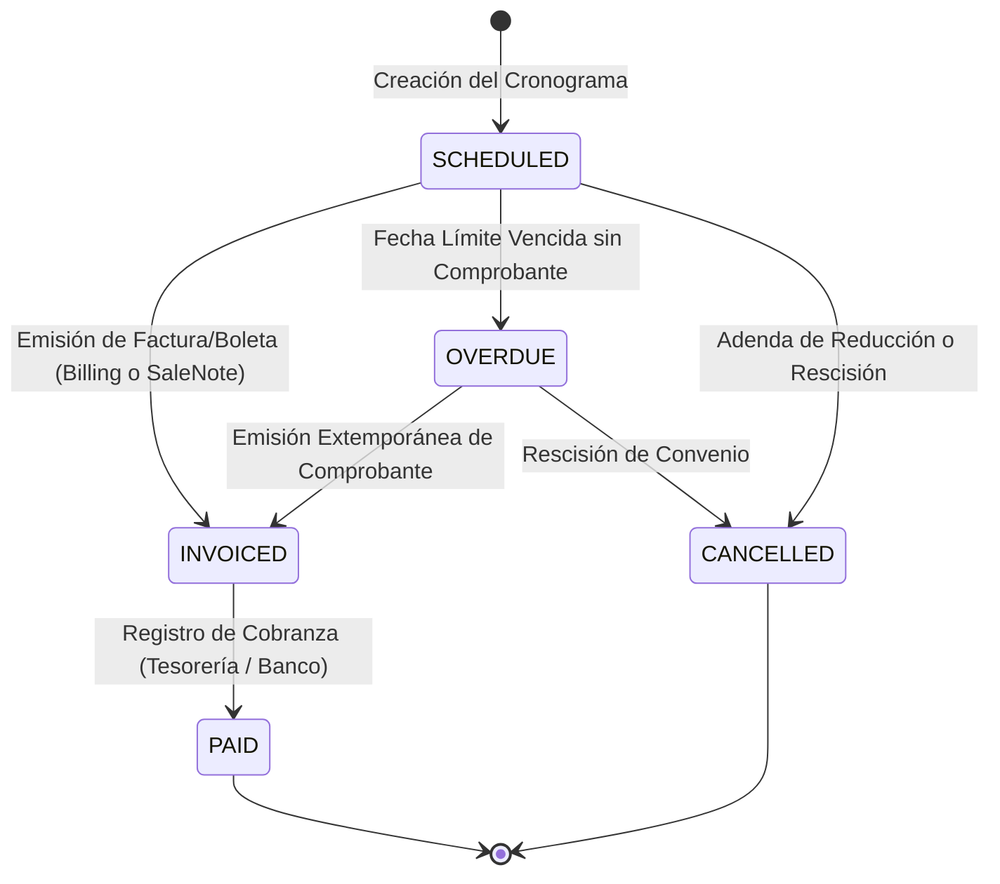

# DISEÑO DE ARQUITECTURA: MÓDULO DE CONVENIOS Y SERVICIOS TECNOLÓGICOS (ERP-FVC)

**Documento Técnico de Diseño de Arquitectura (Block C0)**
**Versión:** 1.0
**Fecha:** Octubre 2026
**Sistema:** ERP-FVC (Enterprise Multi-Módulo)
**Marco Metodológico:** *Requisitos y Casos de Uso $\rightarrow$ Modelo de Datos & DDL $\rightarrow$ Máquinas de Estado $\rightarrow$ Integración de Ingresos Track B & Anti-Duplicidad $\rightarrow$ Reglas de Negocio & Alertas $\rightarrow$ Decisiones Abiertas & Escalabilidad*

---

## 1. INTRODUCCIÓN Y CONTEXTO DEL SISTEMA

El **Instituto de Educación Superior Tecnológico Público "Francisco Vigo Caballero" (IESTP FVC)** gestiona alianzas estratégicas interinstitucionales con entidades públicas (Ministerios, Gobiernos Regionales, Municipalidades), organizaciones de la sociedad civil (ONGs, Cooperativas agrarias) y empresas del sector privado. Asimismo, brinda **servicios tecnológicos especializados** (análisis de suelos, catación y control de calidad de cacao/café, cursos de extensión, consultoría agronómica, mecanización y uso de talleres/laboratorios).

### 1.1 Objetivo del Módulo

El objetivo del **Módulo de Convenios y Servicios Tecnológicos** es centralizar, gobernar y auditar el ciclo de vida completo de:

1. **Convenios Marco y Específicos:** Desde la formulación, dictamen y firma digital, hasta el seguimiento de compromisos mutuos, cronogramas de desembolso, adendas modificatorias y liquidación final.
2. **Servicios Tecnológicos:** Prestación de servicios del catálogo institucional a terceros, ya sea bajo el paraguas de un convenio vigente (con cargo a sus fondos o contrapartidas) o como contratos y órdenes de servicio independientes a clientes externos.
3. **Control Operativo de Ejecución:** Seguimiento estricto de sesiones técnicas, listas de asistencia de participantes y aprobación formal de entregables.
4. **Integración con el Motor Contable y Comercial (Track B):** Facturación electrónica automatizada por hitos/cuotas mediante `billings` y `sale_notes`, imputando ingresos al centro de costo (`productive_activities`) correspondiente sin duplicar transacciones.

### 1.2 Componentes Reutilizados del Ecosistema ERP-FVC

El diseño se apoya e integra de forma nativa con los subsistemas existentes:

| Subsistema Reutilizado                | Modelo / Componente Core                             | Rol en el Módulo de Convenios                                                                                                               |
| :------------------------------------ | :--------------------------------------------------- | :------------------------------------------------------------------------------------------------------------------------------------------- |
| **Contrapartes Comerciales**    | `App\Models\Client` (`clients`)                  | Registro formal de la contraparte institucional o cliente del servicio (RUC, Razón Social, DNI, dirección, contacto).                      |
| **Catálogo de Servicios**      | `App\Models\Product` (`products`)                | Productos con atributo`opcion = 2` (`isService() = true`), afectación IGV, código SUNAT y precio de lista.                             |
| **Facturación y Comprobantes** | `App\Models\Billing`, `App\Models\SaleNote`      | Emisión de Facturas, Boletas SUNAT UBL 2.1 y Notas de Venta internas por cuotas de convenio o liquidaciones de servicio.                    |
| **Centros de Costo (APE)**      | `App\Models\ProductiveActivity`                    | Vinculación del convenio o servicio a la actividad productiva/área generadora de ingresos (ej. Laboratorio, Granja, Cacao).                |
| **Gobernanza y Aprobaciones**   | `App\Services\DocumentApprovalService`             | Flujo de firmas jerárquicas digitales (solicitante, asesoría/coordinación, administración, dirección general) para convenios y adendas. |
| **Estructura Orgánica**        | `App\Models\Area`, `App\Models\User`             | Asignación de unidades ejecutoras, coordinadores de convenio, instructores técnicos y responsables de verificación.                       |
| **Motor Contable (Track B)**    | `App\Services\AccountingService`, `JournalEntry` | Devengo y cobro automático en cuentas del PCGE (Cuentas 1212/1219 contra 7032/7041 y 40111) con imputación a`cost_center_id`.            |
| **Notificaciones del Sistema**  | `Illuminate\Notifications\DatabaseNotification`    | Alertas preventivas y de vencimiento (30, 15 y 7 días) distribuidas a bandejas de usuario y barra de notificaciones del ERP.                |

---

## 2. REQUISITOS DEL SISTEMA Y CASOS DE USO

### 2.1 Requisitos Funcionales (RF)

- **RF-01 (Tipología de Convenios):** Soporte jerárquico para Convenios Marco (alianza general) y Convenios Específicos (con alcance económico y metas operativas), con relación recursiva (`parent_agreement_id`).
- **RF-02 (Gestión de Adendas):** Registro histórico inmutable de adendas de prórroga de plazo, ampliación o reducción presupuestal, y variación de compromisos, recalculando las fechas efectivas sin sobrescribir los valores fundacionales.
- **RF-03 (Obligaciones Bilaterales):** Monitoreo detallado de compromisos asumidos tanto por la Institución (IESTP FVC) como por la Contraparte, con fecha límite, responsable y evidencias de cumplimiento.
- **RF-04 (Cronograma Financiero / Cuotas):** Programación de cuotas o hitos de desembolso (`agreement_installments`) vinculables directamente a la emisión de comprobantes de pago.
- **RF-05 (Catálogo y Contratación de Servicios Tecnológicos):** Prestación de servicios tipificados en el catálogo vinculados a `products` (`opcion = 2`), permitiendo contrataciones:
  - *Dentro de Convenio:* Con cargo a las cuotas o contrapartidas del convenio específico.
  - *Fuera de Convenio:* Servicios puntuales directos a productores, empresas o instituciones sin convenio previo.
- **RF-06 (Sesiones y Control de Asistencia):** Calendarización de talleres, jornadas técnicas o capacitaciones con registro nominal de participantes (`service_attendees`), verificación de asistencia y emisión de constancias.
- **RF-07 (Entregables y Conformidad):** Carga y revisión de informes técnicos, reportes de laboratorio o actas de entrega requeridas para liberar cuotas o cerrar servicios.
- **RF-08 (Cierre y Liquidación):** Procedimiento de balance financiero (facturado vs. pagado) y balance técnico (entregables y obligaciones cumplidas) previo al finiquito del convenio (`SETTLED`).

### 2.2 Requisitos No Funcionales (RNF)

- **RNF-01 (Anti-Duplicidad de Facturación):** Imposibilidad lógica y transaccional de emitir más de un comprobante de pago (`Billing` o `SaleNote`) sobre una misma cuota programada.
- **RNF-02 (Auditabilidad Integral):** Todo cambio de estado, adenda y aprobación debe registrar usuario, IP, marca temporal y token criptográfico en el histórico de aprobaciones.
- **RNF-03 (Automatización de Alertas y Cronjobs):** Detección nocturna de convenios por expirar, cuotas pendientes de facturación y obligaciones vencidas a 30, 15 y 7 días.
- **RNF-04 (Rendimiento en Consultas):** Tiempos de respuesta inferiores a 100 ms para búsquedas de convenios por RUC, estado, rango de fechas y centro de costo.

---

### 2.3 Especificación Detallada de Casos de Uso

```
                      +---------------------------------------+
                      |         ACTORES DEL SISTEMA           |
                      |  [Coordinador]  [Administrador]       |
                      |  [Director]     [Cliente/Contraparte] |
                      +---------------------------------------+
                                          |
          +-------------------------------+-------------------------------+
          |                               |                               |
          v                               v                               v
+--------------------+          +--------------------+          +--------------------+
|  GESTIÓN CONVENIOS |          | SERVICIOS TÉCNICOS |          | FINANZAS & CIERRE  |
| UC-01 Registro     |          | UC-06 Contratación |          | UC-05 Facturación  |
| UC-02 Aprobación   |          | UC-07 Sesiones/Pax |          | UC-08 Entregables  |
| UC-03 Adendas      |          | UC-04 Obligaciones |          | UC-09 Liquidación  |
+--------------------+          +--------------------+          +--------------------+
```

#### UC-01: Formulación y Registro de Convenio

- **Actor Principal:** Coordinador de Convenio / Jefe de Área Académica o de Producción.
- **Precondiciones:** La contraparte debe estar registrada en `clients`. Si es un convenio específico derivado, el convenio marco debe estar en estado `ACTIVE`.
- **Flujo Principal:**
  1. El usuario selecciona el tipo de convenio (`FRAMEWORK` o `SPECIFIC`).
  2. Si es específico, selecciona el convenio marco padre (`parent_agreement_id`).
  3. Ingresa título, objetivo, cliente (contraparte), representante legal de la contraparte, área ejecutora, coordinador responsable y centro de costo (`productive_activity_id`).
  4. Define plazo (fecha de inicio y fin), moneda (PEN/USD), monto total acordado y aportes de contrapartida.
  5. Carga el borrador del documento en PDF (`agreement_documents`).
  6. Guarda en estado `DRAFT` o envía inmediatamente a revisión (`IN_APPROVAL`).

#### UC-02: Aprobación Jerárquica del Convenio (`DocumentApprovalService`)

- **Actores:** Coordinador Solicitante $\rightarrow$ Jefe de Área / Asesoría $\rightarrow$ Jefatura de Administración $\rightarrow$ Dirección General.
- **Precondiciones:** Convenio en estado `DRAFT` con todos los campos obligatorios completos.
- **Flujo Principal:**
  1. El coordinador solicita formalmente la aprobación: el estado pasa a `IN_APPROVAL`.
  2. `DocumentApprovalService` genera la cadena de 4 pasos de visación y firma.
  3. Cada autoridad revisa los antecedentes, informe técnico y cláusulas legales.
  4. Al emitir el visto bueno, el sistema genera el token criptográfico y estampa firma digital en la base de datos.
  5. Con la firma final de la Dirección General:
     - El estado del convenio transiciona automáticamente a `ACTIVE`.
     - Se dispara una notificación a la Contraparte, Administración y Contabilidad.

#### UC-03: Emisión y Registro de Adendas

- **Actor Principal:** Coordinador de Convenio / Administrador.
- **Precondiciones:** Convenio en estado `ACTIVE` o `EXPIRING_SOON`.
- **Flujo Principal:**
  1. El usuario inicia una solicitud de adenda especificando el tipo: `TIME_EXTENSION` (Plazo), `AMOUNT_MODIFICATION` (Monto), `SCOPE_CHANGE` (Alcance) o `MIXED` (Mixta).
  2. El sistema congela en el registro de la adenda los valores actuales del convenio (`previous_end_date`, `previous_total_amount`).
  3. El usuario ingresa la nueva fecha de vigencia propuesta y/o el incremento/reducción de monto (`amount_delta`).
  4. Se adjunta la justificación técnica y el texto de la adenda.
  5. La adenda cursa aprobación mediante `DocumentApprovalService`.
  6. Al aprobarse:
     - Se actualiza `agreements.end_date` al nuevo plazo.
     - Se actualiza `agreements.total_amount = agreements.total_amount + amount_delta`.
     - Si el convenio estaba en `EXPIRING_SOON` y la nueva fecha supera los 30 días, retorna a `ACTIVE`.

#### UC-04: Seguimiento de Obligaciones Bilaterales

- **Actor Principal:** Coordinador de Convenio / Supervisor Institucional.
- **Precondiciones:** Convenio en estado `ACTIVE`.
- **Flujo Principal:**
  1. Durante la vigencia, se consultan las obligaciones tipificadas (`INSTITUTION`, `COUNTERPARTY`, `JOINT`).
  2. Al ejecutar una obligación, el responsable carga la evidencia (informe, fotografías, acta).
  3. El supervisor valida la evidencia y marca la obligación como `COMPLETED`, registrando `completed_at` y `verified_by_user_id`.
  4. Si la fecha límite se supera sin cumplimiento, el sistema marca automáticamente la obligación como `OVERDUE`.

#### UC-05: Facturación de Cuotas del Cronograma

- **Actor Principal:** Tesorero / Cajero / Facturador.
- **Precondiciones:** Cuota en estado `SCHEDULED` o `OVERDUE`, con `billing_id = NULL` y `sale_note_id = NULL`.
- **Flujo Principal:**
  1. El usuario accede al cronograma del convenio y selecciona "Emitir Comprobante" sobre una cuota exigible.
  2. El sistema valida que la cuota no tenga comprobante previo (Regla Anti-Duplicidad).
  3. Se precargan los datos del cliente (`Client`), monto pactado, afectación tributaria (IGV gravado o exonerado según tipo de servicio educativo/técnico) y centro de costo.
  4. El usuario emite la Factura/Boleta (`billings`) o Nota de Venta (`sale_notes`).
  5. En una transacción atómica:
     - Se asocia el comprobante a la cuota: `agreement_installments.billing_id = billing.id`.
     - La cuota transiciona a estado `INVOICED`.
     - El motor contable (Track B) genera el asiento contable por partida doble reconociendo la cuenta por cobrar y el ingreso devengado con su centro de costo.

#### UC-06: Prestación de Servicios Tecnológicos (Dentro y Fuera de Convenio)

- **Actor Principal:** Jefe de Laboratorio / Responsable Técnico.
- **Precondiciones:** Servicio activo en `technological_services` vinculado a un `product_id` (`opcion = 2`).
- **Flujo Principal:**
  1. Se genera una orden de contratación de servicio (`service_engagements`).
  2. Si es *bajo convenio*, se vincula a `agreement_id` (validando que exista saldo disponible en el convenio); si es *directo*, `agreement_id` queda en `NULL`.
  3. Se especifica cliente, actividad productiva, responsable técnico, plazo y precio.
  4. El estado pasa a `IN_PROGRESS`.

#### UC-07: Control de Sesiones y Asistencia

- **Actor Principal:** Instructor Técnico / Docente Capacitador.
- **Precondiciones:** Servicio de modalidad presencial/híbrida en ejecución.
- **Flujo Principal:**
  1. Se programan las sesiones de trabajo o módulos de capacitación (`service_sessions`).
  2. En cada sesión, se pasa lista de asistencia a los participantes (`service_attendees.attended = true`).
  3. Se registran notas de campo y observaciones pedagógicas o técnicas.

#### UC-08: Gestión de Entregables y Conformidad

- **Actor Principal:** Responsable Técnico / Cliente.
- **Precondiciones:** Servicio u obligación que requiere entregable (`requires_deliverable = true`).
- **Flujo Principal:**
  1. El técnico carga el entregable (informe de ensayo de laboratorio, reporte agronómico) en `service_deliverables`.
  2. El cliente o supervisor institucional revisa el documento (`UNDER_REVIEW`).
  3. Si cumple los estándares, emite la conformidad (`APPROVED`). Si presenta observaciones, se rechaza (`REJECTED`) con motivo para subsanación.

#### UC-09: Cierre, Liquidación y Finiquito

- **Actor Principal:** Coordinador de Convenio / Administrador.
- **Precondiciones:** Convenio en estado `EXPIRED` o con todas sus actividades ejecutadas.
- **Flujo Principal:**
  1. El sistema ejecuta el balance de liquidación:
     - **Técnico:** % de obligaciones institucionales y de contraparte cumplidas; 100% de entregables aprobados.
     - **Financiero:** Total programado vs. Total facturado vs. Total recaudado en cuentas bancarias.
  2. Si no existen saldos pendientes ni disputas legales, se genera el Acta de Finiquito y Liquidación (`SETTLED`).
  3. En caso de rescisión unilateral o incumplimiento grave, transiciona a `TERMINATED`.

---

## 3. MODELO DE DATOS DETALLADO (DDL, RELACIONES E ÍNDICES)

A continuación se detalla la arquitectura de persistencia relacional compuesta por **10 tablas**, completamente normalizadas, con claves foráneas, restricciones de integridad referencial e índices optimizados.

```
+--------------------------------------------------------------------------------------------------+
|                                  DIAGRAMA ENTIDAD-RELACIÓN CORE                                  |
+--------------------------------------------------------------------------------------------------+

   [clients] 1 ─────────< [agreements] 1 ───────< [agreement_addenda]
       │                        │  │
       │ (1)                    │  │ (1)
       │                        │  ├─────────< [agreement_obligations]
       │                        │  │ (1)
       │                        │  ├─────────< [agreement_installments] ─── (0..1) [billings/sale_notes]
       │                        │  │ (1)
       │                        │  └─────────< [agreement_documents]
       │                        │
       │ (1)                    │ (0..1)
       v                        v
 [service_engagements] >────────┤
       │ (1)                    │
       ├───────< [service_sessions] ────< [service_attendees]
       │ (1)
       ├───────< [service_deliverables]
       │ (1)
       v
 [technological_services] 1 ────> [products] (opcion = 2)
       │ (1)
       v
 [productive_activities] (Centro de Costo APE / PCGE)
```

---

### 3.1 Tabla: `agreements` (Convenios Marco y Específicos)

Almacena la cabecera de los convenios suscritos por la institución.

```sql
CREATE TABLE `agreements` (
  `id` BIGINT UNSIGNED NOT NULL AUTO_INCREMENT,
  `uuid` CHAR(36) NOT NULL,
  `code` VARCHAR(50) NOT NULL COMMENT 'Ej. CONV-2026-0001',
  `type` ENUM('FRAMEWORK', 'SPECIFIC') NOT NULL DEFAULT 'SPECIFIC' COMMENT 'Marco o Específico',
  `parent_agreement_id` BIGINT UNSIGNED NULL COMMENT 'FK recursiva a convenio marco',
  `title` VARCHAR(255) NOT NULL COMMENT 'Título oficial del convenio',
  `objective` TEXT NOT NULL COMMENT 'Finalidad u objeto institucional',
  `client_id` INT(10) UNSIGNED NOT NULL COMMENT 'Contraparte institucional (clients.id)',
  `counterparty_signatory_name` VARCHAR(150) NOT NULL COMMENT 'Representante legal de la contraparte',
  `counterparty_signatory_role` VARCHAR(100) NOT NULL COMMENT 'Cargo del representante (ej. Alcalde, Gerente)',
  `counterparty_signatory_document` VARCHAR(20) NOT NULL COMMENT 'DNI / Carné de extranjería',
  `area_id` BIGINT UNSIGNED NOT NULL COMMENT 'Área interna responsable (areas.id)',
  `coordinator_user_id` INT(10) UNSIGNED NOT NULL COMMENT 'Usuario coordinador (users.id)',
  `productive_activity_id` BIGINT UNSIGNED NULL COMMENT 'Centro de costo APE asociado',
  `signature_date` DATE NOT NULL COMMENT 'Fecha de suscripción formal',
  `start_date` DATE NOT NULL COMMENT 'Inicio de vigencia',
  `end_date` DATE NOT NULL COMMENT 'Fin de vigencia actual (considerando adendas)',
  `original_end_date` DATE NOT NULL COMMENT 'Fin de vigencia original pactada',
  `currency` VARCHAR(3) NOT NULL DEFAULT 'PEN' COMMENT 'PEN o USD',
  `total_amount` DECIMAL(14,2) NOT NULL DEFAULT 0.00 COMMENT 'Presupuesto total vigente',
  `original_amount` DECIMAL(14,2) NOT NULL DEFAULT 0.00 COMMENT 'Presupuesto original',
  `counterparty_contribution` DECIMAL(14,2) NOT NULL DEFAULT 0.00 COMMENT 'Aporte dinerario/valorizado contraparte',
  `institution_contribution` DECIMAL(14,2) NOT NULL DEFAULT 0.00 COMMENT 'Aporte valorizado IESTP FVC',
  `status` ENUM(
    'DRAFT',
    'IN_APPROVAL',
    'ACTIVE',
    'EXPIRING_SOON',
    'EXPIRED',
    'SETTLED',
    'TERMINATED'
  ) NOT NULL DEFAULT 'DRAFT',
  `requires_financial_settlement` TINYINT(1) NOT NULL DEFAULT 1,
  `resolution_number` VARCHAR(100) NULL COMMENT 'Resolución Directoral de Aprobación',
  `created_by_user_id` INT(10) UNSIGNED NOT NULL,
  `created_at` TIMESTAMP NULL DEFAULT CURRENT_TIMESTAMP,
  `updated_at` TIMESTAMP NULL DEFAULT CURRENT_TIMESTAMP ON UPDATE CURRENT_TIMESTAMP,
  `deleted_at` TIMESTAMP NULL DEFAULT NULL,
  PRIMARY KEY (`id`),
  UNIQUE KEY `uk_agreements_uuid` (`uuid`),
  UNIQUE KEY `uk_agreements_code` (`code`),
  KEY `idx_agreements_parent` (`parent_agreement_id`),
  KEY `idx_agreements_client` (`client_id`),
  KEY `idx_agreements_area` (`area_id`),
  KEY `idx_agreements_coordinator` (`coordinator_user_id`),
  KEY `idx_agreements_cost_center` (`productive_activity_id`),
  KEY `idx_agreements_status_dates` (`status`, `end_date`),
  CONSTRAINT `fk_agreements_parent` FOREIGN KEY (`parent_agreement_id`) REFERENCES `agreements` (`id`) ON DELETE RESTRICT,
  CONSTRAINT `fk_agreements_client` FOREIGN KEY (`client_id`) REFERENCES `clients` (`id`) ON DELETE RESTRICT,
  CONSTRAINT `fk_agreements_area` FOREIGN KEY (`area_id`) REFERENCES `areas` (`id`) ON DELETE RESTRICT,
  CONSTRAINT `fk_agreements_coordinator` FOREIGN KEY (`coordinator_user_id`) REFERENCES `users` (`id`) ON DELETE RESTRICT,
  CONSTRAINT `fk_agreements_cost_center` FOREIGN KEY (`productive_activity_id`) REFERENCES `productive_activities` (`id`) ON DELETE SET NULL,
  CONSTRAINT `fk_agreements_created_by` FOREIGN KEY (`created_by_user_id`) REFERENCES `users` (`id`) ON DELETE RESTRICT
) ENGINE=InnoDB DEFAULT CHARSET=utf8mb4 COLLATE=utf8mb4_unicode_ci;
```

---

### 3.2 Tabla: `agreement_addenda` (Adendas Modificatorias de Convenio)

Registra las ampliaciones de plazo, modificaciones presupuestales o cambios de alcance, garantizando auditoría histórica.

```sql
CREATE TABLE `agreement_addenda` (
  `id` BIGINT UNSIGNED NOT NULL AUTO_INCREMENT,
  `uuid` CHAR(36) NOT NULL,
  `agreement_id` BIGINT UNSIGNED NOT NULL,
  `addendum_number` INT UNSIGNED NOT NULL COMMENT 'Secuencial 1, 2, 3...',
  `code` VARCHAR(60) NOT NULL COMMENT 'Ej. ADD-CONV-2026-0001-01',
  `type` ENUM(
    'TIME_EXTENSION',
    'AMOUNT_MODIFICATION',
    'SCOPE_CHANGE',
    'MIXED'
  ) NOT NULL DEFAULT 'TIME_EXTENSION',
  `resolution_number` VARCHAR(100) NULL COMMENT 'Resolución Directoral que aprueba adenda',
  `justification` TEXT NOT NULL COMMENT 'Sustento técnico y legal',
  `previous_end_date` DATE NOT NULL COMMENT 'Fecha fin anterior a la adenda',
  `new_end_date` DATE NOT NULL COMMENT 'Nueva fecha fin de vigencia',
  `amount_delta` DECIMAL(14,2) NOT NULL DEFAULT 0.00 COMMENT 'Incremento (+) o decremento (-) de monto',
  `previous_total_amount` DECIMAL(14,2) NOT NULL COMMENT 'Monto total previo',
  `new_total_amount` DECIMAL(14,2) NOT NULL COMMENT 'Monto total resultante',
  `signature_date` DATE NOT NULL,
  `document_approval_id` BIGINT UNSIGNED NULL COMMENT 'Vínculo al flujo de aprobación de la adenda',
  `created_by_user_id` INT(10) UNSIGNED NOT NULL,
  `created_at` TIMESTAMP NULL DEFAULT CURRENT_TIMESTAMP,
  `updated_at` TIMESTAMP NULL DEFAULT CURRENT_TIMESTAMP ON UPDATE CURRENT_TIMESTAMP,
  `deleted_at` TIMESTAMP NULL DEFAULT NULL,
  PRIMARY KEY (`id`),
  UNIQUE KEY `uk_addenda_uuid` (`uuid`),
  UNIQUE KEY `uk_addenda_code` (`code`),
  UNIQUE KEY `uk_addenda_agreement_seq` (`agreement_id`, `addendum_number`),
  KEY `idx_addenda_created_by` (`created_by_user_id`),
  CONSTRAINT `fk_addenda_agreement` FOREIGN KEY (`agreement_id`) REFERENCES `agreements` (`id`) ON DELETE CASCADE,
  CONSTRAINT `fk_addenda_created_by` FOREIGN KEY (`created_by_user_id`) REFERENCES `users` (`id`) ON DELETE RESTRICT
) ENGINE=InnoDB DEFAULT CHARSET=utf8mb4 COLLATE=utf8mb4_unicode_ci;
```

---

### 3.3 Tabla: `agreement_obligations` (Obligaciones y Compromisos Bilaterales)

Monitorea las cláusulas operativas comprometidas por cada parte.

```sql
CREATE TABLE `agreement_obligations` (
  `id` BIGINT UNSIGNED NOT NULL AUTO_INCREMENT,
  `uuid` CHAR(36) NOT NULL,
  `agreement_id` BIGINT UNSIGNED NOT NULL,
  `responsible_party` ENUM('INSTITUTION', 'COUNTERPARTY', 'JOINT') NOT NULL DEFAULT 'INSTITUTION',
  `clause_reference` VARCHAR(50) NULL COMMENT 'Ej. Cláusula Quinta, Inciso B',
  `title` VARCHAR(255) NOT NULL,
  `description` TEXT NOT NULL,
  `due_date` DATE NOT NULL COMMENT 'Fecha límite exigible',
  `status` ENUM('PENDING', 'IN_PROGRESS', 'COMPLETED', 'OVERDUE') NOT NULL DEFAULT 'PENDING',
  `completed_at` DATETIME NULL DEFAULT NULL,
  `verified_by_user_id` INT(10) UNSIGNED NULL,
  `evidence_notes` TEXT NULL,
  `created_at` TIMESTAMP NULL DEFAULT CURRENT_TIMESTAMP,
  `updated_at` TIMESTAMP NULL DEFAULT CURRENT_TIMESTAMP ON UPDATE CURRENT_TIMESTAMP,
  `deleted_at` TIMESTAMP NULL DEFAULT NULL,
  PRIMARY KEY (`id`),
  UNIQUE KEY `uk_obligations_uuid` (`uuid`),
  KEY `idx_obligations_agreement_status` (`agreement_id`, `status`),
  KEY `idx_obligations_due_date` (`status`, `due_date`),
  KEY `idx_obligations_verified_by` (`verified_by_user_id`),
  CONSTRAINT `fk_obligations_agreement` FOREIGN KEY (`agreement_id`) REFERENCES `agreements` (`id`) ON DELETE CASCADE,
  CONSTRAINT `fk_obligations_verified_by` FOREIGN KEY (`verified_by_user_id`) REFERENCES `users` (`id`) ON DELETE SET NULL
) ENGINE=InnoDB DEFAULT CHARSET=utf8mb4 COLLATE=utf8mb4_unicode_ci;
```

---

### 3.4 Tabla: `agreement_installments` (Cronograma de Cuotas y Facturación)

Controla los hitos de desembolso y facturación del convenio. **Soporta la regla de oro anti-duplicidad** enlazando directamente al comprobante emitido (`billing_id` o `sale_note_id`).

```sql
CREATE TABLE `agreement_installments` (
  `id` BIGINT UNSIGNED NOT NULL AUTO_INCREMENT,
  `uuid` CHAR(36) NOT NULL,
  `agreement_id` BIGINT UNSIGNED NOT NULL,
  `installment_number` INT UNSIGNED NOT NULL COMMENT 'Número de cuota (1, 2, 3...)',
  `description` VARCHAR(255) NOT NULL COMMENT 'Hito de pago (ej. Entrega de informe final)',
  `due_date` DATE NOT NULL COMMENT 'Fecha programada de facturación/pago',
  `amount` DECIMAL(14,2) NOT NULL COMMENT 'Monto de la cuota',
  `currency` VARCHAR(3) NOT NULL DEFAULT 'PEN',
  `igv_affected` TINYINT(1) NOT NULL DEFAULT 0 COMMENT '0: Exonerado/Inafecto, 1: Gravado 18%',
  `status` ENUM('SCHEDULED', 'INVOICED', 'PAID', 'OVERDUE', 'CANCELLED') NOT NULL DEFAULT 'SCHEDULED',
  `billing_id` INT(10) UNSIGNED NULL COMMENT 'FK al comprobante SUNAT (billings.id)',
  `sale_note_id` INT(10) UNSIGNED NULL COMMENT 'FK a nota de venta interna (sale_notes.id)',
  `invoiced_at` DATETIME NULL DEFAULT NULL,
  `paid_at` DATETIME NULL DEFAULT NULL,
  `payment_reference` VARCHAR(100) NULL COMMENT 'Nro operación bancaria / depósito',
  `notes` TEXT NULL,
  `created_at` TIMESTAMP NULL DEFAULT CURRENT_TIMESTAMP,
  `updated_at` TIMESTAMP NULL DEFAULT CURRENT_TIMESTAMP ON UPDATE CURRENT_TIMESTAMP,
  `deleted_at` TIMESTAMP NULL DEFAULT NULL,
  PRIMARY KEY (`id`),
  UNIQUE KEY `uk_installments_uuid` (`uuid`),
  UNIQUE KEY `uk_installments_agreement_seq` (`agreement_id`, `installment_number`),
  KEY `idx_installments_billing` (`billing_id`),
  KEY `idx_installments_sale_note` (`sale_note_id`),
  KEY `idx_installments_status_due` (`status`, `due_date`),
  CONSTRAINT `fk_installments_agreement` FOREIGN KEY (`agreement_id`) REFERENCES `agreements` (`id`) ON DELETE CASCADE,
  CONSTRAINT `fk_installments_billing` FOREIGN KEY (`billing_id`) REFERENCES `billings` (`id`) ON DELETE RESTRICT,
  CONSTRAINT `fk_installments_sale_note` FOREIGN KEY (`sale_note_id`) REFERENCES `sale_notes` (`id`) ON DELETE RESTRICT
) ENGINE=InnoDB DEFAULT CHARSET=utf8mb4 COLLATE=utf8mb4_unicode_ci;
```

---

### 3.5 Tabla: `agreement_documents` (Repositorio de Documentos Digitales)

Repositorio documental auditable asociado a cada convenio.

```sql
CREATE TABLE `agreement_documents` (
  `id` BIGINT UNSIGNED NOT NULL AUTO_INCREMENT,
  `uuid` CHAR(36) NOT NULL,
  `agreement_id` BIGINT UNSIGNED NOT NULL,
  `document_type` ENUM(
    'SIGNED_AGREEMENT',
    'RESOLUTION',
    'TECHNICAL_REPORT',
    'SETTLEMENT_ACT',
    'ADDENDUM_FILE',
    'OTHER'
  ) NOT NULL DEFAULT 'SIGNED_AGREEMENT',
  `title` VARCHAR(200) NOT NULL,
  `file_path` VARCHAR(500) NOT NULL,
  `file_name` VARCHAR(255) NOT NULL,
  `file_size` INT UNSIGNED NOT NULL,
  `mime_type` VARCHAR(100) NOT NULL,
  `version` INT UNSIGNED NOT NULL DEFAULT 1,
  `uploaded_by_user_id` INT(10) UNSIGNED NOT NULL,
  `created_at` TIMESTAMP NULL DEFAULT CURRENT_TIMESTAMP,
  `updated_at` TIMESTAMP NULL DEFAULT CURRENT_TIMESTAMP ON UPDATE CURRENT_TIMESTAMP,
  PRIMARY KEY (`id`),
  UNIQUE KEY `uk_documents_uuid` (`uuid`),
  KEY `idx_documents_agreement_type` (`agreement_id`, `document_type`),
  KEY `idx_documents_uploaded_by` (`uploaded_by_user_id`),
  CONSTRAINT `fk_documents_agreement` FOREIGN KEY (`agreement_id`) REFERENCES `agreements` (`id`) ON DELETE CASCADE,
  CONSTRAINT `fk_documents_uploaded_by` FOREIGN KEY (`uploaded_by_user_id`) REFERENCES `users` (`id`) ON DELETE RESTRICT
) ENGINE=InnoDB DEFAULT CHARSET=utf8mb4 COLLATE=utf8mb4_unicode_ci;
```

---

### 3.6 Tabla: `technological_services` (Catálogo de Servicios Tecnológicos)

Tipifica los servicios técnicos que el IESTP FVC ofrece al mercado y a los convenios, enlazado directamente a la tabla `products` de inventarios.

```sql
CREATE TABLE `technological_services` (
  `id` BIGINT UNSIGNED NOT NULL AUTO_INCREMENT,
  `uuid` CHAR(36) NOT NULL,
  `code` VARCHAR(50) NOT NULL COMMENT 'Ej. ST-SUELO-01',
  `product_id` INT(10) UNSIGNED NOT NULL COMMENT 'FK a products (donde opcion = 2: servicio)',
  `name` VARCHAR(200) NOT NULL,
  `description` TEXT NULL,
  `area_id` BIGINT UNSIGNED NOT NULL COMMENT 'Área operativa ejecutora',
  `productive_activity_id` BIGINT UNSIGNED NOT NULL COMMENT 'Centro de costo asignado (APE)',
  `category` ENUM(
    'LABORATORY_ANALYSIS',
    'AGRO_CONSULTING',
    'TRAINING_COURSE',
    'WORKSHOP_USE',
    'TECHNICAL_ASSISTANCE'
  ) NOT NULL DEFAULT 'TECHNICAL_ASSISTANCE',
  `delivery_modality` ENUM('IN_PERSON', 'VIRTUAL', 'HYBRID', 'FIELD') NOT NULL DEFAULT 'IN_PERSON',
  `unit_price` DECIMAL(12,2) NOT NULL DEFAULT 0.00,
  `currency` VARCHAR(3) NOT NULL DEFAULT 'PEN',
  `estimated_hours` INT UNSIGNED NULL DEFAULT 0,
  `requires_deliverable` TINYINT(1) NOT NULL DEFAULT 1,
  `is_active` TINYINT(1) NOT NULL DEFAULT 1,
  `created_at` TIMESTAMP NULL DEFAULT CURRENT_TIMESTAMP,
  `updated_at` TIMESTAMP NULL DEFAULT CURRENT_TIMESTAMP ON UPDATE CURRENT_TIMESTAMP,
  `deleted_at` TIMESTAMP NULL DEFAULT NULL,
  PRIMARY KEY (`id`),
  UNIQUE KEY `uk_services_uuid` (`uuid`),
  UNIQUE KEY `uk_services_code` (`code`),
  UNIQUE KEY `uk_services_product` (`product_id`),
  KEY `idx_services_area` (`area_id`),
  KEY `idx_services_cost_center` (`productive_activity_id`),
  CONSTRAINT `fk_services_product` FOREIGN KEY (`product_id`) REFERENCES `products` (`id`) ON DELETE RESTRICT,
  CONSTRAINT `fk_services_area` FOREIGN KEY (`area_id`) REFERENCES `areas` (`id`) ON DELETE RESTRICT,
  CONSTRAINT `fk_services_cost_center` FOREIGN KEY (`productive_activity_id`) REFERENCES `productive_activities` (`id`) ON DELETE RESTRICT
) ENGINE=InnoDB DEFAULT CHARSET=utf8mb4 COLLATE=utf8mb4_unicode_ci;
```

---

### 3.7 Tabla: `service_engagements` (Contrataciones / Órdenes de Servicio)

Instancia la prestación de un servicio tecnológico, ya sea **bajo el marco de un convenio** o de **forma independiente**.

```sql
CREATE TABLE `service_engagements` (
  `id` BIGINT UNSIGNED NOT NULL AUTO_INCREMENT,
  `uuid` CHAR(36) NOT NULL,
  `code` VARCHAR(60) NOT NULL COMMENT 'Ej. ORD-ST-2026-0001',
  `agreement_id` BIGINT UNSIGNED NULL COMMENT 'NULL si es servicio directo externo sin convenio',
  `client_id` INT(10) UNSIGNED NOT NULL COMMENT 'Cliente contratante',
  `technological_service_id` BIGINT UNSIGNED NOT NULL,
  `productive_activity_id` BIGINT UNSIGNED NOT NULL COMMENT 'Centro de costo receptor',
  `responsible_user_id` INT(10) UNSIGNED NOT NULL COMMENT 'Especialista a cargo',
  `description` TEXT NOT NULL,
  `quantity` DECIMAL(10,2) NOT NULL DEFAULT 1.00,
  `unit_price` DECIMAL(12,2) NOT NULL,
  `total_amount` DECIMAL(14,2) NOT NULL,
  `currency` VARCHAR(3) NOT NULL DEFAULT 'PEN',
  `start_date` DATE NOT NULL,
  `expected_delivery_date` DATE NOT NULL,
  `actual_delivery_date` DATE NULL DEFAULT NULL,
  `status` ENUM('DRAFT', 'IN_PROGRESS', 'COMPLETED', 'CANCELLED') NOT NULL DEFAULT 'DRAFT',
  `billing_id` INT(10) UNSIGNED NULL COMMENT 'Comprobante SUNAT (si se factura directamente)',
  `sale_note_id` INT(10) UNSIGNED NULL COMMENT 'Nota de venta (si se emite comprobante interno)',
  `settlement_notes` TEXT NULL,
  `created_at` TIMESTAMP NULL DEFAULT CURRENT_TIMESTAMP,
  `updated_at` TIMESTAMP NULL DEFAULT CURRENT_TIMESTAMP ON UPDATE CURRENT_TIMESTAMP,
  `deleted_at` TIMESTAMP NULL DEFAULT NULL,
  PRIMARY KEY (`id`),
  UNIQUE KEY `uk_engagements_uuid` (`uuid`),
  UNIQUE KEY `uk_engagements_code` (`code`),
  KEY `idx_engagements_agreement` (`agreement_id`),
  KEY `idx_engagements_client` (`client_id`),
  KEY `idx_engagements_service` (`technological_service_id`),
  KEY `idx_engagements_responsible` (`responsible_user_id`),
  KEY `idx_engagements_status` (`status`),
  KEY `idx_engagements_billing` (`billing_id`),
  KEY `idx_engagements_sale_note` (`sale_note_id`),
  CONSTRAINT `fk_engagements_agreement` FOREIGN KEY (`agreement_id`) REFERENCES `agreements` (`id`) ON DELETE RESTRICT,
  CONSTRAINT `fk_engagements_client` FOREIGN KEY (`client_id`) REFERENCES `clients` (`id`) ON DELETE RESTRICT,
  CONSTRAINT `fk_engagements_service` FOREIGN KEY (`technological_service_id`) REFERENCES `technological_services` (`id`) ON DELETE RESTRICT,
  CONSTRAINT `fk_engagements_cost_center` FOREIGN KEY (`productive_activity_id`) REFERENCES `productive_activities` (`id`) ON DELETE RESTRICT,
  CONSTRAINT `fk_engagements_responsible` FOREIGN KEY (`responsible_user_id`) REFERENCES `users` (`id`) ON DELETE RESTRICT,
  CONSTRAINT `fk_engagements_billing` FOREIGN KEY (`billing_id`) REFERENCES `billings` (`id`) ON DELETE SET NULL,
  CONSTRAINT `fk_engagements_sale_note` FOREIGN KEY (`sale_note_id`) REFERENCES `sale_notes` (`id`) ON DELETE SET NULL
) ENGINE=InnoDB DEFAULT CHARSET=utf8mb4 COLLATE=utf8mb4_unicode_ci;
```

---

### 3.8 Tabla: `service_sessions` (Sesiones de Capacitación / Asistencia)

Registra las jornadas o fechas de dictado de cursos o talleres.

```sql
CREATE TABLE `service_sessions` (
  `id` BIGINT UNSIGNED NOT NULL AUTO_INCREMENT,
  `uuid` CHAR(36) NOT NULL,
  `service_engagement_id` BIGINT UNSIGNED NOT NULL,
  `session_number` INT UNSIGNED NOT NULL,
  `topic` VARCHAR(255) NOT NULL,
  `instructor_user_id` INT(10) UNSIGNED NOT NULL,
  `session_date` DATE NOT NULL,
  `start_time` TIME NOT NULL,
  `end_time` TIME NOT NULL,
  `location` VARCHAR(150) NOT NULL COMMENT 'Aula, laboratorio, fundo o link virtual',
  `status` ENUM('SCHEDULED', 'CONDUCTED', 'CANCELLED', 'RESCHEDULED') NOT NULL DEFAULT 'SCHEDULED',
  `observations` TEXT NULL,
  `created_at` TIMESTAMP NULL DEFAULT CURRENT_TIMESTAMP,
  `updated_at` TIMESTAMP NULL DEFAULT CURRENT_TIMESTAMP ON UPDATE CURRENT_TIMESTAMP,
  `deleted_at` TIMESTAMP NULL DEFAULT NULL,
  PRIMARY KEY (`id`),
  UNIQUE KEY `uk_sessions_uuid` (`uuid`),
  KEY `idx_sessions_engagement_date` (`service_engagement_id`, `session_date`),
  KEY `idx_sessions_instructor` (`instructor_user_id`),
  CONSTRAINT `fk_sessions_engagement` FOREIGN KEY (`service_engagement_id`) REFERENCES `service_engagements` (`id`) ON DELETE CASCADE,
  CONSTRAINT `fk_sessions_instructor` FOREIGN KEY (`instructor_user_id`) REFERENCES `users` (`id`) ON DELETE RESTRICT
) ENGINE=InnoDB DEFAULT CHARSET=utf8mb4 COLLATE=utf8mb4_unicode_ci;
```

---

### 3.9 Tabla: `service_attendees` (Participantes y Asistencia Técnica)

Padrón de beneficiarios o alumnos participantes por sesión.

```sql
CREATE TABLE `service_attendees` (
  `id` BIGINT UNSIGNED NOT NULL AUTO_INCREMENT,
  `uuid` CHAR(36) NOT NULL,
  `service_session_id` BIGINT UNSIGNED NOT NULL,
  `service_engagement_id` BIGINT UNSIGNED NOT NULL,
  `full_name` VARCHAR(200) NOT NULL,
  `dni_or_document` VARCHAR(20) NOT NULL,
  `email` VARCHAR(120) NULL,
  `phone` VARCHAR(30) NULL,
  `organization` VARCHAR(150) NULL COMMENT 'Cooperativa, asociación o empresa',
  `attended` TINYINT(1) NOT NULL DEFAULT 0,
  `evaluation_score` DECIMAL(4,2) NULL DEFAULT NULL COMMENT 'Calificación 0 - 20 si aplica',
  `certificate_code` VARCHAR(50) NULL COMMENT 'Código de constancia emitida',
  `notes` TEXT NULL,
  `created_at` TIMESTAMP NULL DEFAULT CURRENT_TIMESTAMP,
  `updated_at` TIMESTAMP NULL DEFAULT CURRENT_TIMESTAMP ON UPDATE CURRENT_TIMESTAMP,
  PRIMARY KEY (`id`),
  UNIQUE KEY `uk_attendees_uuid` (`uuid`),
  UNIQUE KEY `uk_attendees_session_doc` (`service_session_id`, `dni_or_document`),
  KEY `idx_attendees_engagement` (`service_engagement_id`),
  KEY `idx_attendees_document` (`dni_or_document`),
  CONSTRAINT `fk_attendees_session` FOREIGN KEY (`service_session_id`) REFERENCES `service_sessions` (`id`) ON DELETE CASCADE,
  CONSTRAINT `fk_attendees_engagement` FOREIGN KEY (`service_engagement_id`) REFERENCES `service_engagements` (`id`) ON DELETE CASCADE
) ENGINE=InnoDB DEFAULT CHARSET=utf8mb4 COLLATE=utf8mb4_unicode_ci;
```

---

### 3.10 Tabla: `service_deliverables` (Entregables e Informes de Conformidad)

Control de productos tangibles exigibles por cada orden de servicio.

```sql
CREATE TABLE `service_deliverables` (
  `id` BIGINT UNSIGNED NOT NULL AUTO_INCREMENT,
  `uuid` CHAR(36) NOT NULL,
  `service_engagement_id` BIGINT UNSIGNED NOT NULL,
  `deliverable_name` VARCHAR(200) NOT NULL,
  `description` TEXT NOT NULL,
  `due_date` DATE NOT NULL,
  `submission_date` DATE NULL DEFAULT NULL,
  `status` ENUM('PENDING', 'SUBMITTED', 'UNDER_REVIEW', 'APPROVED', 'REJECTED') NOT NULL DEFAULT 'PENDING',
  `file_path` VARCHAR(500) NULL,
  `approved_by_user_id` INT(10) UNSIGNED NULL,
  `approval_date` DATETIME NULL DEFAULT NULL,
  `rejection_reason` TEXT NULL,
  `created_at` TIMESTAMP NULL DEFAULT CURRENT_TIMESTAMP,
  `updated_at` TIMESTAMP NULL DEFAULT CURRENT_TIMESTAMP ON UPDATE CURRENT_TIMESTAMP,
  `deleted_at` TIMESTAMP NULL DEFAULT NULL,
  PRIMARY KEY (`id`),
  UNIQUE KEY `uk_deliverables_uuid` (`uuid`),
  KEY `idx_deliverables_engagement_status` (`service_engagement_id`, `status`),
  KEY `idx_deliverables_approved_by` (`approved_by_user_id`),
  CONSTRAINT `fk_deliverables_engagement` FOREIGN KEY (`service_engagement_id`) REFERENCES `service_engagements` (`id`) ON DELETE CASCADE,
  CONSTRAINT `fk_deliverables_approved_by` FOREIGN KEY (`approved_by_user_id`) REFERENCES `users` (`id`) ON DELETE SET NULL
) ENGINE=InnoDB DEFAULT CHARSET=utf8mb4 COLLATE=utf8mb4_unicode_ci;
```

---

## 4. MÁQUINAS DE ESTADO Y TRANSICIONES DEL CICLO DE VIDA

### 4.1 Máquina de Estados: `Agreement` (Convenio)



#### Matriz de Transiciones de Convenios:

| Estado Inicial                               | Evento / Disparador       | Estado Final      | Condiciones de Guarda (Guards)                                                                         | Efectos Colaterales (Side Effects)                                                            |
| :------------------------------------------- | :------------------------ | :---------------- | :----------------------------------------------------------------------------------------------------- | :-------------------------------------------------------------------------------------------- |
| `DRAFT`                                    | `submit_approval`       | `IN_APPROVAL`   | Campos obligatorios completos; cliente con RUC válido; fechas coherentes (`start_date < end_date`). | Genera cadena en`DocumentApprovalService`; notifica a primera jefatura.                     |
| `IN_APPROVAL`                              | `reject_approval`       | `DRAFT`         | Alguna autoridad observa el expediente.                                                                | Notifica al coordinador con motivo de rechazo; desbloquea edición.                           |
| `IN_APPROVAL`                              | `sign_final_approval`   | `ACTIVE`        | Firma digital de la Dirección General completada.                                                     | Emite token criptográfico; notifica a Administración y Contraparte; activa cronograma.      |
| `ACTIVE`                                   | `cron_check_expiration` | `EXPIRING_SOON` | `CURRENT_DATE >= (end_date - 30 days)`.                                                              | Dispara alerta preventiva a 30 días a los responsables.                                      |
| `EXPIRING_SOON`                            | `approve_addendum`      | `ACTIVE`        | Adenda aprobada extiende`end_date > CURRENT_DATE + 30 days`.                                         | Recalcula vigencia; notifica prórroga acordada.                                              |
| `EXPIRING_SOON` / `ACTIVE`               | `cron_check_expired`    | `EXPIRED`       | `CURRENT_DATE > end_date`.                                                                           | Bloquea nuevas órdenes de servicio; alerta a Dirección y Contabilidad.                      |
| `EXPIRED`                                  | `execute_settlement`    | `SETTLED`       | 100% de cuotas facturadas y pagadas; 100% de obligaciones institucionales cumplidas.                   | Genera Acta de Finiquito; archiva expediente con estatus cerrado.                             |
| `ACTIVE` / `EXPIRING_SOON` / `EXPIRED` | `terminate_agreement`   | `TERMINATED`    | Resolución Directoral formal de rescisión adjunta.                                                   | Cancela cuotas no facturadas; cancela servicios en borrador; marca obligaciones no cumplidas. |

---

### 4.2 Máquina de Estados: `AgreementObligation` (Obligación)



#### Matriz de Transiciones de Obligaciones:

| Estado Inicial                | Evento / Disparador    | Estado Final    | Condiciones de Guarda                                  | Efectos Colaterales                                                                     |
| :---------------------------- | :--------------------- | :-------------- | :----------------------------------------------------- | :-------------------------------------------------------------------------------------- |
| `PENDING`                   | `start_obligation`   | `IN_PROGRESS` | Convenio en estado`ACTIVE`.                          | Permite asociar entregables e informes parciales.                                       |
| `PENDING` / `IN_PROGRESS` | `cron_check_overdue` | `OVERDUE`     | `CURRENT_DATE > due_date` y `status != COMPLETED`. | Alerta roja en dashboard de convenios; notificación al coordinador.                    |
| `IN_PROGRESS` / `OVERDUE` | `verify_completion`  | `COMPLETED`   | Evidencia adjunta; aprobación por usuario supervisor. | Registra`completed_at` y `verified_by_user_id`; recalcula % de avance del convenio. |

---

### 4.3 Máquina de Estados: `AgreementInstallment` (Cuota de Facturación)



---

## 5. INTEGRACIÓN DE INGRESOS CON TRACK B Y REGLA ANTI-DUPLICIDAD

### 5.1 Flujo Completo de Integración Financiera y Contable

La integración contable de los ingresos por convenios y servicios tecnológicos opera bajo el motor contable por partida doble desarrollado en el **Track B**.

```
[Convenio / Servicio Tecnológico]
                │
                ▼
     [Cuota de Facturación] (agreement_installments)
                │
                │ (Acción: Emitir Comprobante)
                ▼
      [Billing / SaleNote] (Factura / Boleta SUNAT o Nota de Venta)
                │
                │ (Dispara Evento de Dominio: BillingCreated / SaleNoteCreated)
                ▼
    [AccountingRuleEngine] (Track B Service)
                │
                ├─────────────────────────────────────────────────┐
                ▼                                                 ▼
      [Asiento de Venta/Devengo]                        [Asiento de Cobranza]
   ┌───────────────────────────────┐                 ┌───────────────────────────────┐
   │ Debe: 1212 Facturas x Cobrar  │                 │ Debe: 10411 Banco Nación      │
   │ Haber: 40111 IGV (18%)        │                 │ Haber: 1212 Facturas x Cobrar │
   │ Haber: 7032/7041 Serv. Técn.  │                 └───────────────────────────────┘
   │   (con cost_center_id = APE)  │
   └───────────────────────────────┘
```

### 5.2 Dinámica de Cuentas Contables (PCGE 2019)

| Operación                                                         | Cuenta Débito (Debe)                                                     | Cuenta Crédito (Haber)                                                                                   | Glosa y Atributos Obligatorios                                                                                    |
| :----------------------------------------------------------------- | :------------------------------------------------------------------------ | :-------------------------------------------------------------------------------------------------------- | :---------------------------------------------------------------------------------------------------------------- |
| **Facturación de Cuota de Convenio (Gravada con IGV)**      | **1212** Facturas por cobrar comerciales (Tercero: RUC Contraparte) | **40111** IGV Cuenta Propia (18%)**7032** Prestación de servicios agrícolas / tecnológicos | `cost_center_id` = Actividad Productiva (`productive_activity_id`). `document_reference` = `F001-000123`. |
| **Facturación de Cuota de Convenio (Exonerada / Inafecta)** | **1212** Facturas por cobrar comerciales (Tercero: RUC Contraparte) | **7041** Prestación de servicios educativos y de extensión técnica                               | Sin IGV.`cost_center_id` = Centro de Costo del convenio.                                                        |
| **Emisión de Nota de Venta Interna por Cuota**              | **1219** Otras cuentas por cobrar comerciales (Nota de Venta)       | **7041** Servicios tecnológicos de extensión                                                      | Venta institucional interna con`cost_center_id`.                                                                |
| **Cobranza Bancaria de Cuota de Convenio**                   | **10411** Banco de la Nación (Cta. Recaudadora RDR)                | **1212** / **1219** Cuentas por cobrar comerciales                                            | Cancelación total o parcial del derecho exigible.                                                                |
| **Orden de Servicio Tecnológico Directo**                   | **1212** Facturas por cobrar                                        | **7032** Servicios tecnológicos de laboratorio / campo                                             | Imputa directamente a la actividad del laboratorio.                                                               |

---

### 5.3 Regla de Oro Anti-Duplicidad de Ingresos

#### El Problema

En el ERP-FVC, las actividades productivas cuentan con el módulo `activity_transactions`. Si un usuario registra una cobranza de convenio como una venta comercial (`billings`) y simultáneamente otro usuario ingresa manualmente un movimiento en `activity_transactions` por el mismo dinero, **el ingreso institucional y el saldo bancario se contabilizarían dos veces**.

#### La Regla de Integración Única

$$
\text{Regla:} \quad \text{El único generador del asiento de ingreso es el comprobante core } (\text{Billing} \lor \text{SaleNote}).
$$

```
                       [Evento: Cobranza o Facturación de Cuota]
                                           │
                                           ▼
                       ¿Proviene de agreement_installments?
                                      /         \
                                    SÍ           NO
                                   /               \
              ¿Tiene billing_id o                   Flujo estándar de POS
              sale_note_id registrado?              o cobranza directa.
                   /              \
                 SÍ                NO
                /                    \
    RECHAZAR NUEVA FACTURACIÓN.      EMITIR COMPROBANTE CORE (Billing o SaleNote).
    (Cuota ya facturada              - Asocia billing_id / sale_note_id a la cuota.
    previamente; previene            - Track B genera Asiento Contable Primario.
    doble cobro y doble              - Imputa cost_center_id al asiento.
    asiento contable).               - Cuota transiciona a INVOICED.
                                     - NO se crea registro manual en activity_transactions.
```

#### Garantías Técnicas de Anti-Duplicidad:

1. **Constraint de Aplicación:** En el controlador y servicio de facturación, la verificación inicial es:
   ```php
   if ($installment->billing_id !== null || $installment->sale_note_id !== null) {
       throw new DomainException("La cuota {$installment->installment_number} ya ha sido facturada previamente.");
   }
   ```
2. **Idempotency Key en Motor Contable:**
   $$
   \text{idempotency\_key} = \text{MD5}('installment\_' + \text{installment.id} + '\_billing\_' + \text{billing.id})
   $$

   Garantiza que llamadas duplicadas o reintentos de red no generen un segundo `journal_entry`.
3. **No-Duplicidad con `ActivityTransaction`:** La cuota facturada actualiza directamente el estado del cronograma. Si se requiere reflejar la estadística en el dashboard del APE, el sistema consulta los asientos contables vinculados por `cost_center_id`, **sin reinyectar registros en `activity_transactions`**.

---

## 6. REGLAS DE NEGOCIO, ADENDAS Y ALERTAS AUTOMATIZADAS

### 6.1 Catálogo de Reglas de Negocio (BR)

- **BR-01 (Bloqueo de Facturación Duplicada):** Una cuota de convenio (`agreement_installments`) sólo puede tener un comprobante fiscal asociado (`billing_id` o `sale_note_id`). Queda prohibida la re-emisión salvo anulación previa del comprobante original mediante Nota de Crédito.
- **BR-02 (Recálculo Dinámico de Vigencia por Adendas):**
  - Al aprobarse una adenda de tipo `TIME_EXTENSION` o `MIXED`:
    $$
    \text{agreement.end\_date} = \text{new\_end\_date de la última adenda aprobada}
    $$
  - El campo `original_end_date` permanece estrictamente inmutable como testimonio del acuerdo original.
- **BR-03 (Recálculo Presupuestal por Adendas):**
  - Al aprobarse una adenda de tipo `AMOUNT_MODIFICATION` o `MIXED`:
    $$
    \text{agreement.total\_amount} = \text{previous\_total\_amount} + \text{amount\_delta}
    $$
  - Se exige el reajuste del cronograma de cuotas (`agreement_installments`) para reflejar la diferencia financiera positiva o negativa.
- **BR-04 (Límite Presupuestal en Servicios bajo Convenio):** La suma total de órdenes de servicio tecnológico (`service_engagements`) vinculadas a un convenio específico no puede exceder el `total_amount` vigente del convenio:
  $$
  \sum \text{service\_engagements.total\_amount} \le \text{agreements.total\_amount}
  $$
- **BR-05 (Requisitos Previos de Liquidación / Finiquito `SETTLED`):**
  Para que un convenio pueda pasar a estado `SETTLED`, el sistema valida automáticamente:
  1. $100\%$ de cuotas facturadas (`status = PAID` o anuladas formalmente).
  2. $0$ obligaciones institucionales en estado `PENDING` o `IN_PROGRESS`.
  3. $100\%$ de entregables técnicos aprobados (`status = APPROVED`).
  4. Carga obligatoria del Acta de Liquidación en `agreement_documents` con tipo `SETTLEMENT_ACT`.

---

### 6.2 Matriz y Automatización de Alertas (30, 15 y 7 Días)

El sistema programa un comando de consola diario (`agreements:check-alerts`) que evalúa vencimientos y despacha notificaciones automáticas (`DatabaseNotification` y correo institucional):

| Entidad Evaluada                        | Ventana de Alerta                              | Severidad              | Destinatarios Notificados                        | Acción Requerida / Impacto                                                     |
| :-------------------------------------- | :--------------------------------------------- | :--------------------- | :----------------------------------------------- | :------------------------------------------------------------------------------ |
| **Convenio (`agreements`)**     | **30 días** antes de `end_date`       | `INFO` (Azul)        | Coordinador del Convenio, Jefe de Área          | Iniciar trámites de adenda de prórroga o preparar plan de cierre.             |
| **Convenio (`agreements`)**     | **15 días** antes de `end_date`       | `WARNING` (Amarillo) | Coordinador, Jefe de Área, Administración      | Si no hay adenda en trámite, transiciona a`EXPIRING_SOON`.                   |
| **Convenio (`agreements`)**     | **7 días** antes de `end_date`        | `DANGER` (Rojo)      | Coordinador, Administración, Dirección General | Notificación de urgencia máxima. Convocatoria a comisión de liquidación.    |
| **Convenio (`agreements`)**     | **Día 0** (`CURRENT_DATE > end_date`) | `CRITICAL` (Negro)   | Todas las jefaturas                              | Transiciona automáticamente a`EXPIRED`. Bloquea nuevas órdenes de servicio. |
| **Cuota (`installments`)**      | **15 días** antes de `due_date`       | `INFO`               | Tesorería, Facturador                           | Proyectar flujo de caja y preparar borrador de comprobante.                     |
| **Cuota (`installments`)**      | **7 días** antes de `due_date`        | `WARNING`            | Tesorería, Coordinador                          | Requerir formalmente a la contraparte el pago o trámite de giro.               |
| **Cuota (`installments`)**      | **Día 0** vencido sin pago              | `DANGER`             | Tesorería, Administración                      | Cuota pasa a`OVERDUE`. Emisión de carta de requerimiento.                    |
| **Obligación (`obligations`)** | **7 días** antes de `due_date`        | `WARNING`            | Responsable de la obligación                    | Alerta de vencimiento próximo de compromiso institucional o externo.           |
| **Obligación (`obligations`)** | **Día 0** vencida sin avance            | `DANGER`             | Coordinador del Convenio                         | Obligación pasa a`OVERDUE`. Afecta el semáforo del convenio.                |

---

## 7. DECISIONES DE ARQUITECTURA, RECOMENDACIONES Y ESCALABILIDAD

### 7.1 Decisión 1: Reconocimiento Contable de Convenios Multianuales e Ingresos Diferidos

- **Contexto:** Muchos convenios específicos abarcan 2 a 3 ejercicios fiscales (ej. 2026 a 2028). La contraparte puede realizar transferencias dinerarias anticipadas al inicio del convenio.
- **Opciones Consideradas:**
  - *Opción A (Reconocimiento en Caja Directa):* Reconocer el ingreso total en la cuenta 70 al recibir la transferencia.
  - *Opción B (Ingresos Diferidos - NIIF 15 / PCGE Cuenta 122 & 491):* Registrar el dinero recibido en cuentas de anticipos/pasivo diferido y devengar a la cuenta 70 únicamente conforme se aprueban los entregables técnicos o se vencen los hitos.
- **Recomendación de Arquitectura (Recomendada):** **Opción B (Enfoque Devengo por Hitos NIIF 15)**.
  - Al recibir fondos globales por adelantado:
    - **Debe:** `10411` Banco de la Nación.
    - **Haber:** `122` Anticipos de clientes / `491` Pasivos diferidos por convenios.
  - Al completarse cada cuota o entregable:
    - **Debe:** `122 / 491` Anticipo liquidado.
    - **Haber:** `7032 / 7041` Ingreso devengado con imputación al centro de costo (`cost_center_id`).
  - Esto evita distorsionar los balances financieros anuales con superávit artificial en el año 1 y déficit operativo en los años 2 y 3.

---

### 7.2 Decisión 2: Tarifario de Servicios Tecnológicos: Tarifa Estándar vs. Tarifa Subvencionada

- **Contexto:** Ciertos convenios con asociaciones de pequeños productores de cacao de Tocache contemplan tarifas preferenciales o donaciones valorizadas de la institución, inferiores al precio de mercado para empresas mineras o agroindustriales.
- **Opciones Consideradas:**
  - *Opción A:* Modificar directamente el campo `unit_price` en el catálogo general `products`.
  - *Opción B:* Mantener el precio de lista en `technological_services.unit_price` y registrar un campo `discount_rate` o `subsidized_price` a nivel de `service_engagements`.
- **Recomendación de Arquitectura:** **Opción B**.
  - El catálogo de servicios mantiene la tarifa oficial aprobada por Resolución Directoral.
  - En la orden de servicio (`service_engagements`), si está vinculada a un convenio con subsidio, se documenta la contrapartida valorizada institucional:
    $$
    \text{Total Cobrado en Efectivo} + \text{Aporte Institucional Valorizado} = \text{Valor Real del Servicio}
    $$
  - Permite reportar a la Contraloría y al MINEDU el monto total del subsidio social otorgado a la comunidad.

---

### 7.3 Decisión 3: Integración de Participantes de Cursos con Certificados Académicos

- **Contexto:** Los servicios tecnológicos de tipo `TRAINING_COURSE` (cursos de extensión técnica) emiten certificados a los participantes registrados en `service_attendees`.
- **Recomendación de Arquitectura:**
  - Incorporar en `service_attendees` un campo `certificate_code` con algoritmo hash único verificable mediante código QR público (`/verificar-certificado/{code}`).
  - Para los estudiantes regulares del instituto que asistan a los cursos, enlazar automáticamente con su récord en el módulo académico (`alumnos`), acreditando horas de prácticas pre-profesionales o educación continua sin duplicar personas.

---

### 7.4 Decisión 4: Protocolo de Escalamiento ante Incumplimiento de la Contraparte

- **Contexto:** Cuando la contraparte no transfiere las cuotas pactadas o incumple sus obligaciones en el plazo fijado.
- **Recomendación de Arquitectura:**
  - Automatizar el estado `OVERDUE` en cuotas y obligaciones.
  - Implementar semáforo de riesgo del convenio:
    - **Verde:** 0 obligaciones vencidas, cuotas al día.
    - **Amarillo:** 1 obligación vencida o retraso de pago < 15 días.
    - **Rojo:** Más de 2 obligaciones vencidas o impago > 30 días.
  - Si un convenio entra en semáforo Rojo, el sistema restringe automáticamente la creación de nuevas órdenes de servicio tecnológico vinculadas a esa contraparte hasta su regularización.

---

### 7.5 Consideraciones para Escalabilidad Futura

1. **Gestión Documental en Cloud Storage (S3 / GCS):**
   - Actualmente los archivos de `agreement_documents` se almacenan en el sistema de archivos local (`storage/app/agreements`).
   - Para la fase de escala institucional, desacoplar el almacenamiento hacia Google Cloud Storage o MinIO con URLs firmadas temporales para lectura de convenios y entregables pesados (>50 MB).
2. **Firma Digital Biométrica SUNAT / RENIEC:**
   - La arquitectura actual de `DocumentApprovalService` implementa tokens criptográficos de hash SHA-256 internos.
   - En una fase futura, el servicio de convenios podrá conectarse vía API con agentes de firma digital acreditados por INDECOPI (Token criptográfico PKI / DNI Electrónico).
3. **Métricas y BI (Dashboard Ejecutivo):**
   - Vistas precalculadas para KPIs de convenios: Tasa de cumplimiento de contrapartidas, Ingresos RDR generados por servicios tecnológicos, Ranking de centros de costo más demandados y Tiempos promedio de liquidación.

---

## 8. CONCLUSIÓN Y HOJA DE RUTA DE IMPLEMENTACIÓN

El presente diseño técnico para el **Módulo de Convenios y Servicios Tecnológicos (BLOCK C0)**:

1. **Unifica y formaliza** las alianzas estratégicas institucionales y la prestación de servicios a terceros en una única plataforma auditable.
2. **Garantiza la consistencia financiera** integrando cada cuota e hito de pago con el motor contable Track B y el subsistema de comprobantes electrónicos, eliminando cualquier posibilidad de doble contabilización.
3. **Establece un marco robusto de control** con máquinas de estado rigurosas, trazabilidad de adendas, seguimiento de obligaciones bilaterales y alertas preventivas multinivel.
4. **Habilita el desarrollo ordenado de los siguientes bloques (C1 en adelante)** con especificaciones precisas de tablas, llaves foráneas, reglas de negocio e interfaces operativas.
